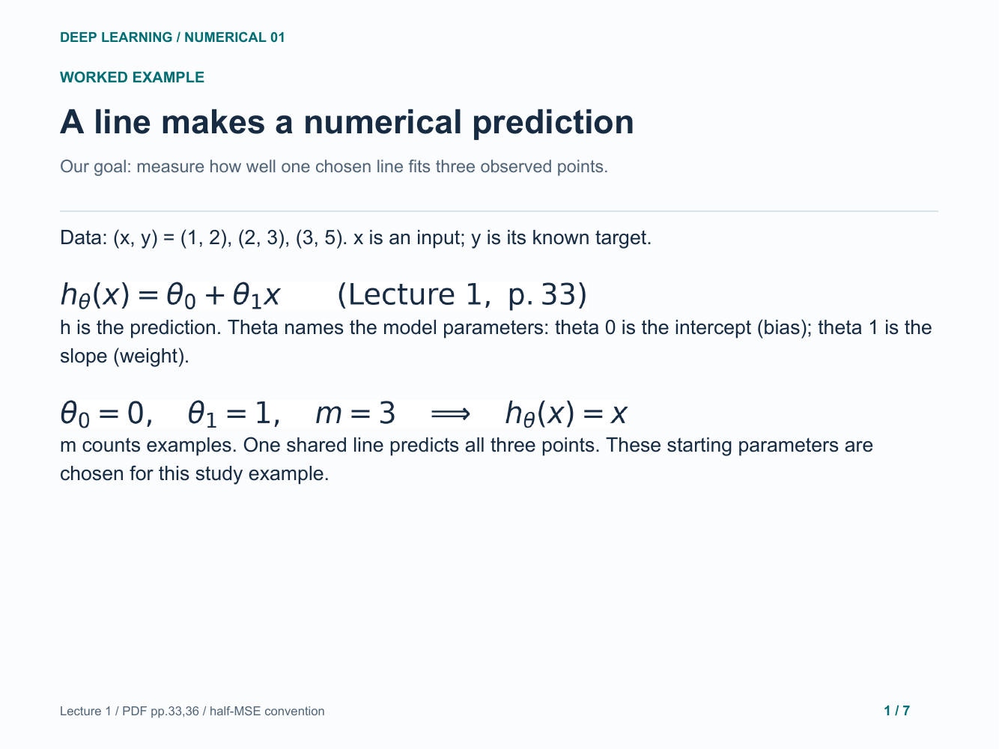
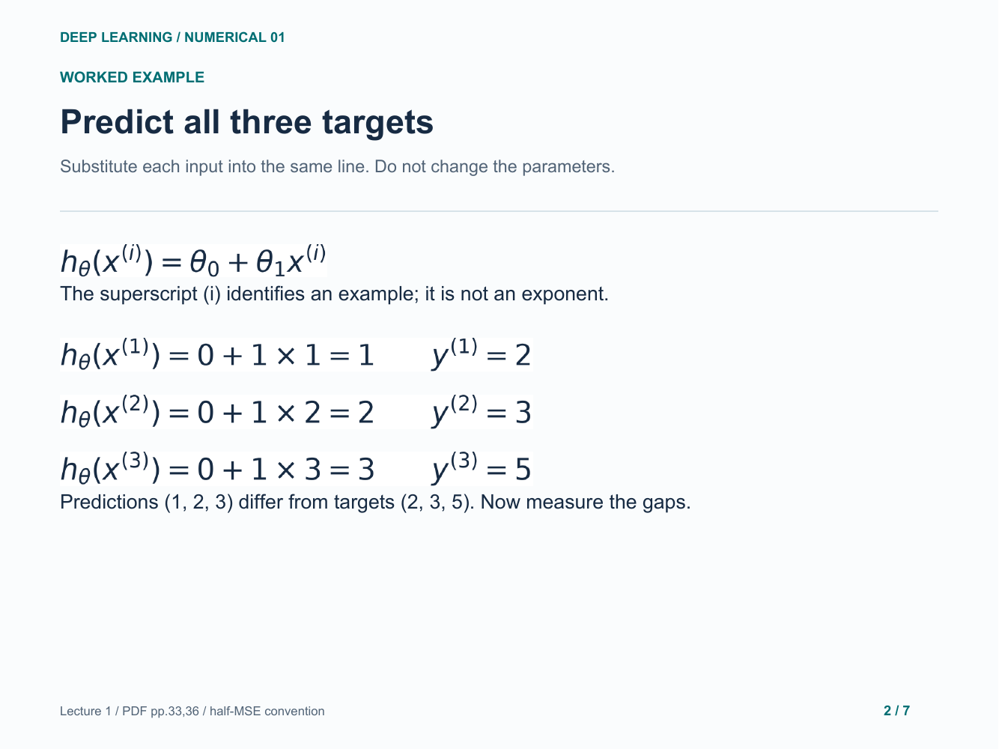
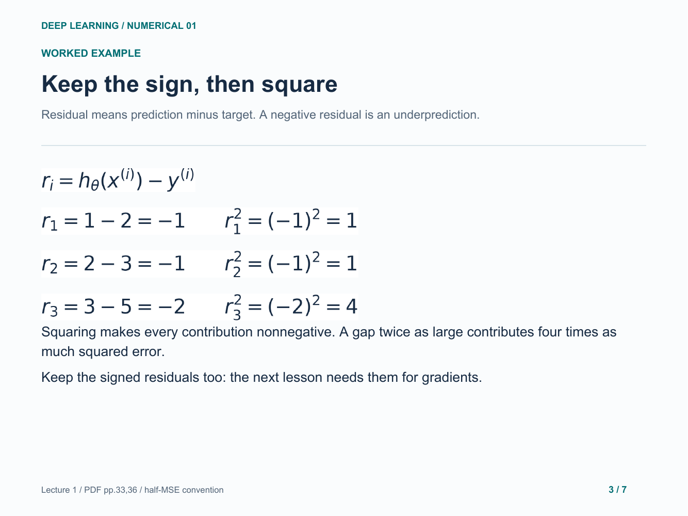
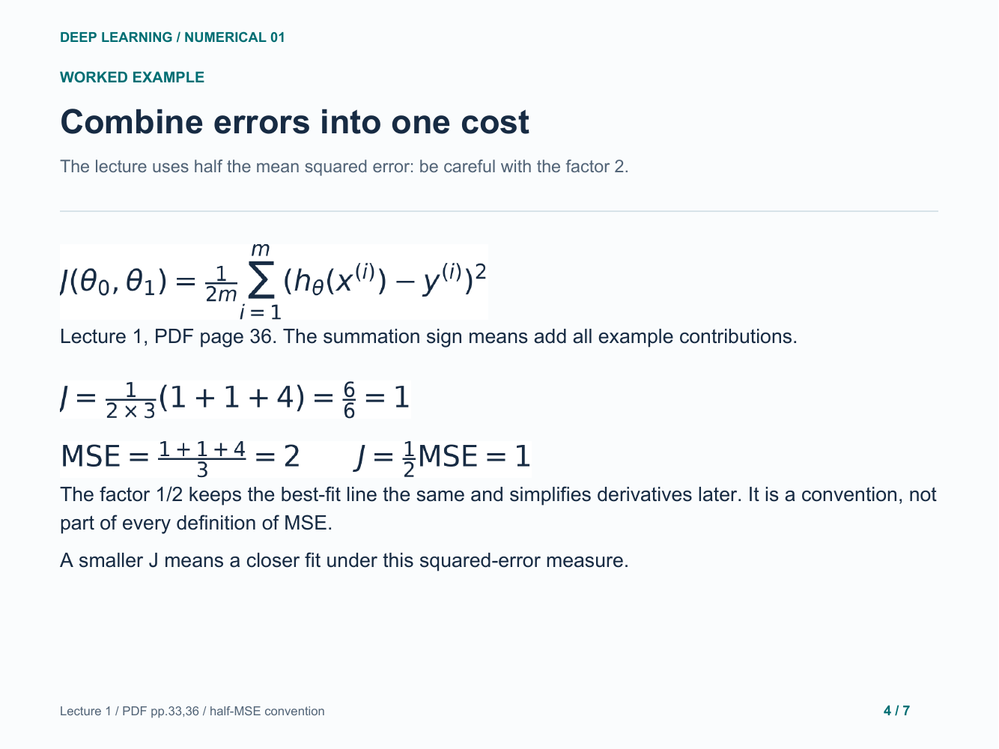
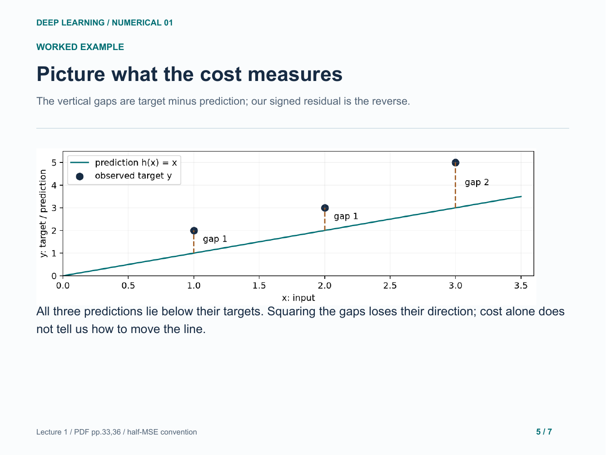
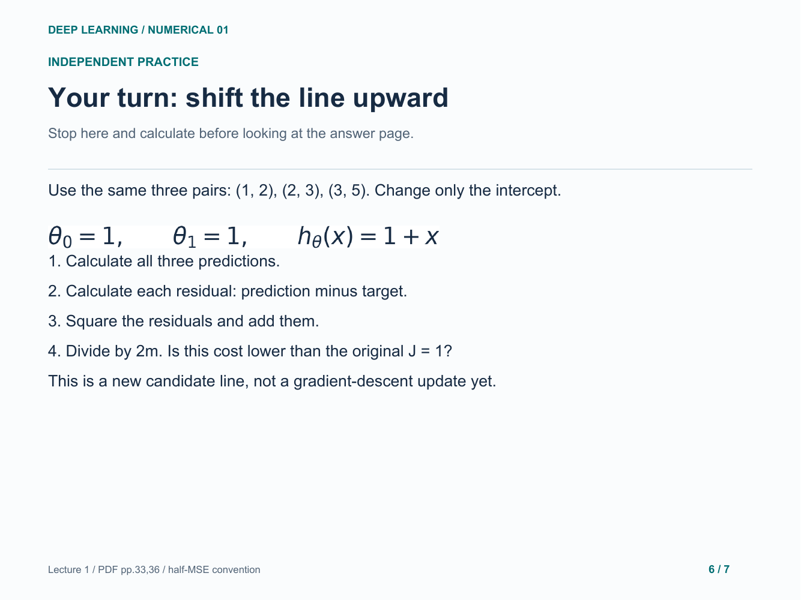
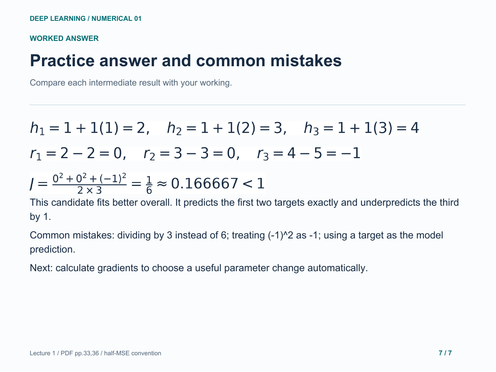

# 01. Single-feature linear regression

Three points, signed residuals and the lecture's half-MSE cost.

[Open the PDF](lesson.pdf)

Lecture reference: Lecture 1 - Introduction.pdf, pages 33 and 36 (PDF page numbers).

## Illustrated walkthrough

### 1. A line makes a numerical prediction

### 2. Predict all three targets

### 3. Keep the sign, then square

### 4. Combine errors into one cost

### 5. Picture what the cost measures

### 6. Your turn: shift the line upward

### 7. Practice answer and common mistakes

Original study example. Read the practice question before revealing the following answer pages.

[Back to numerical index](../README.md)
