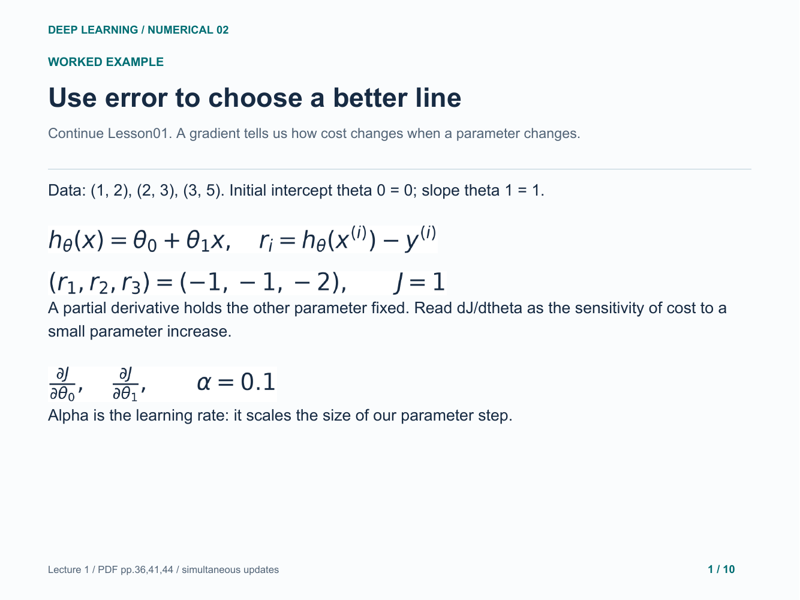
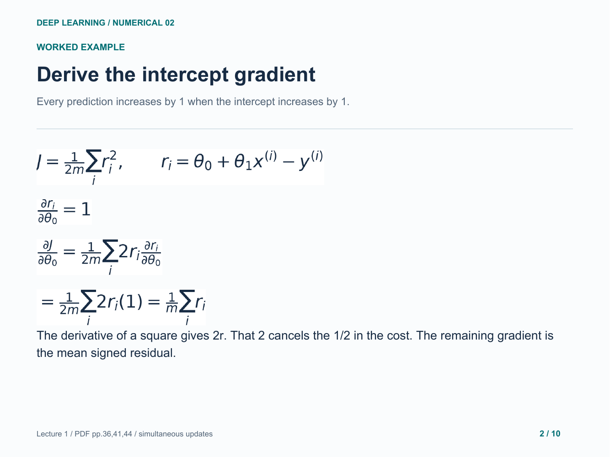
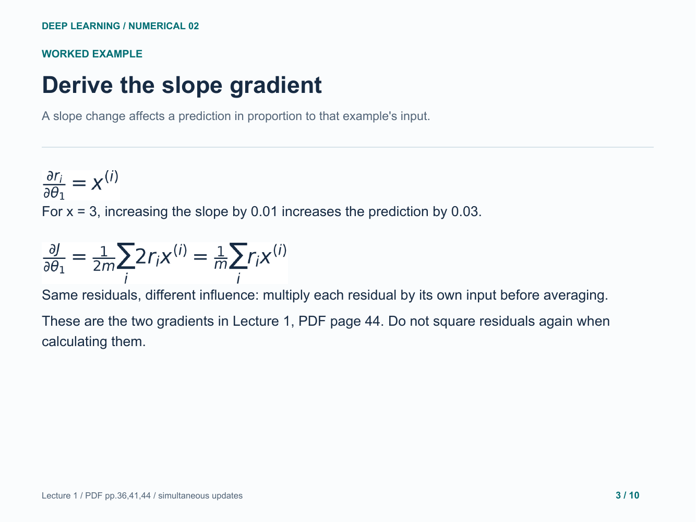
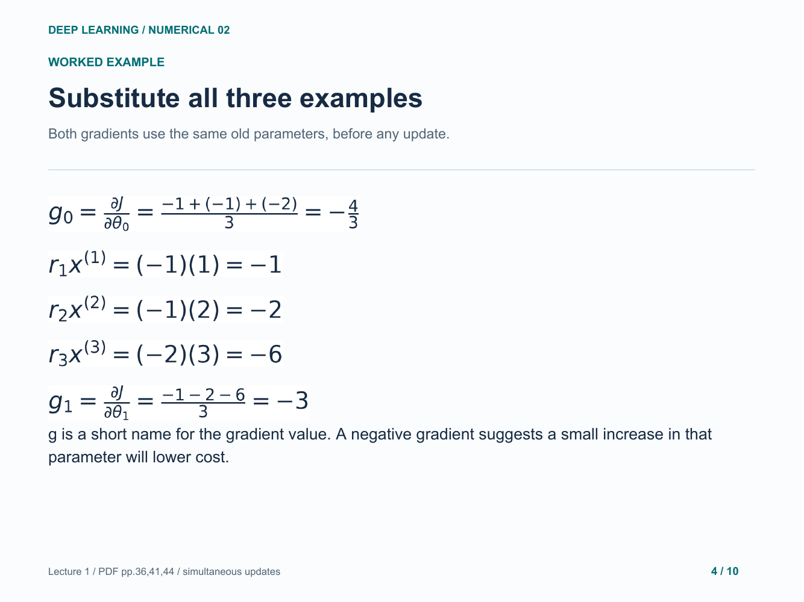
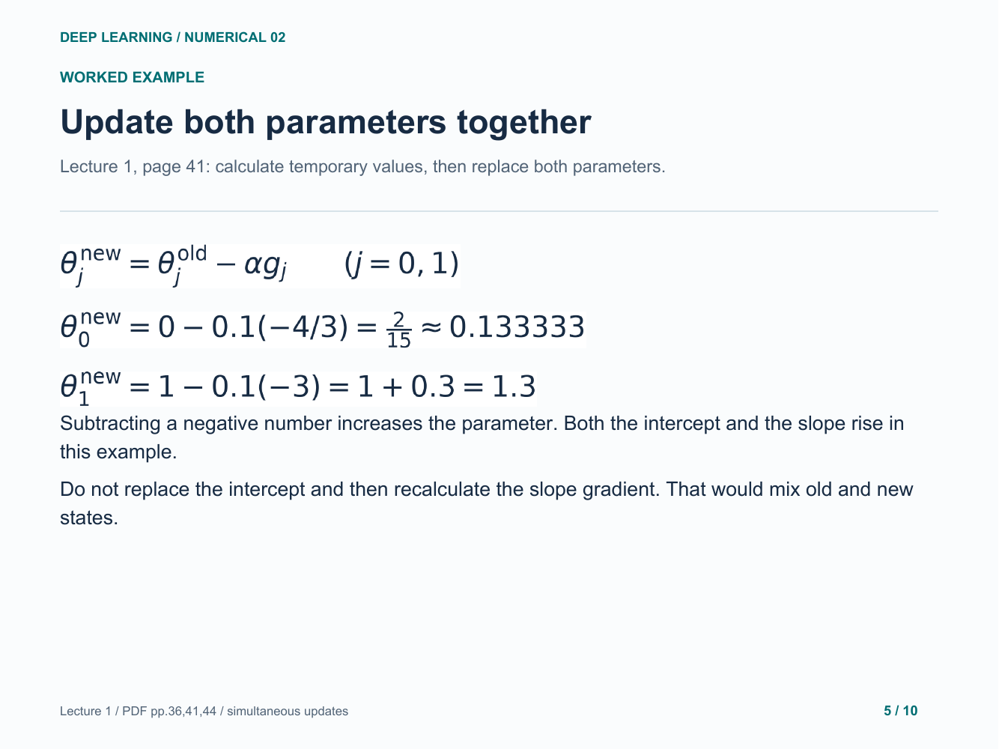
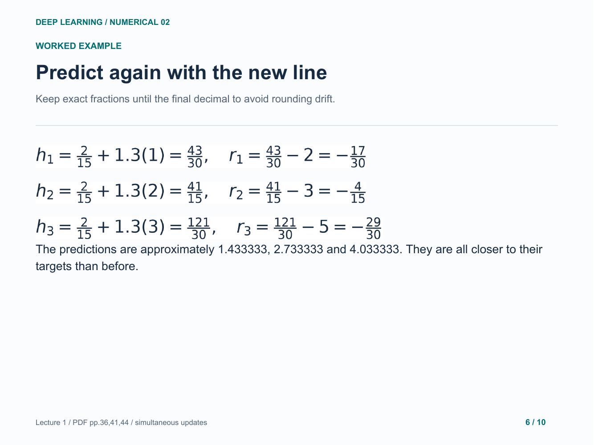
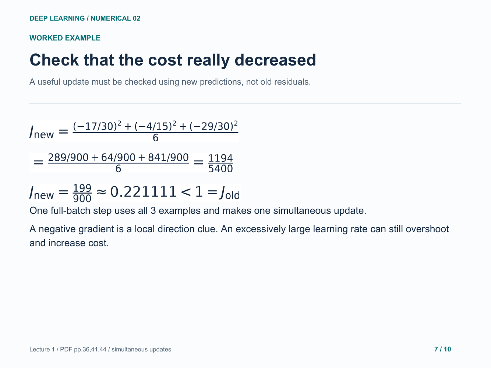
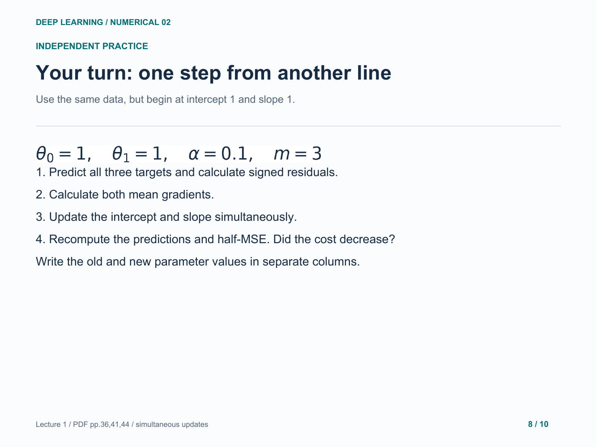
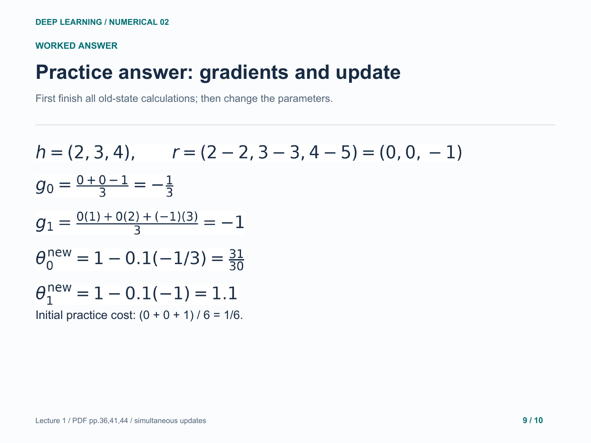
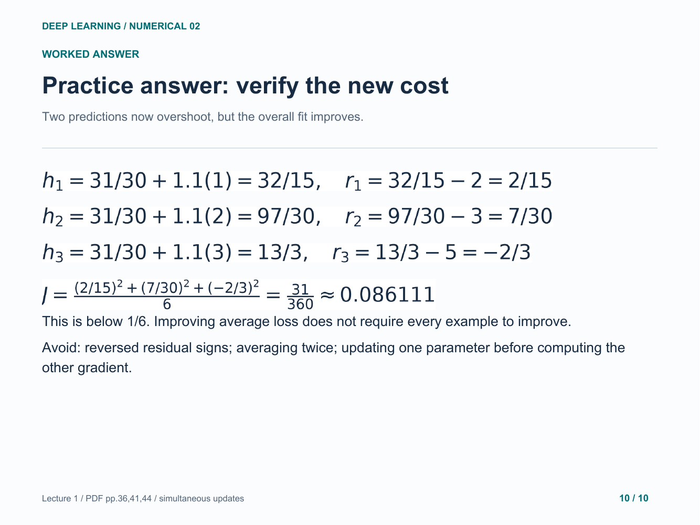

# 02. Linear-regression gradient descent

Derive, calculate and verify one simultaneous training step.

[Open the PDF](lesson.pdf)

Lecture reference: Lecture 1 - Introduction.pdf, pages 36, 41 and 44.

## Illustrated walkthrough

### 1. Use error to choose a better line

### 2. Derive the intercept gradient

### 3. Derive the slope gradient

### 4. Substitute all three examples

### 5. Update both parameters together

### 6. Predict again with the new line

### 7. Check that the cost really decreased

### 8. Your turn: one step from another line

### 9. Practice answer: gradients and update

### 10. Practice answer: verify the new cost

Original study example. Read the practice question before revealing the following answer pages.

[Back to numerical index](../README.md)
