# 03. Multiple-feature linear regression

Two input features, three parameters and two complete batch updates.

[Open the PDF](lesson.pdf)

Lecture reference: Lecture 1 - Introduction.pdf, pages 43-44; Home work 1 on Linear Regression.docx.

## Illustrated walkthrough

### 1. Two inputs, one prediction

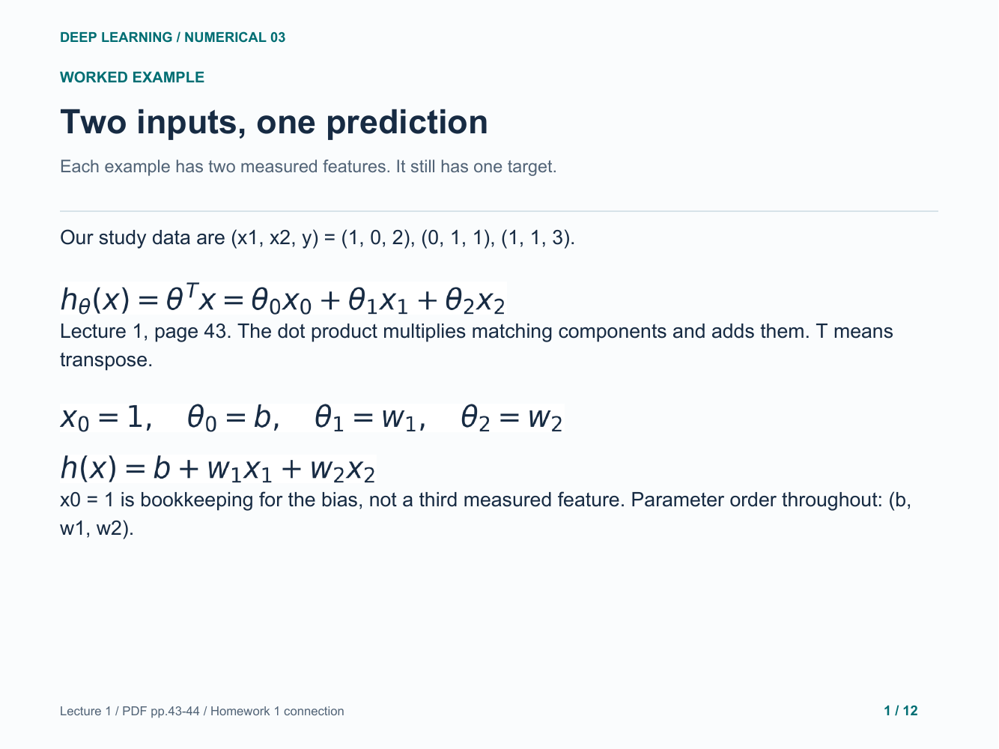

### 2. Start with three zero parameters

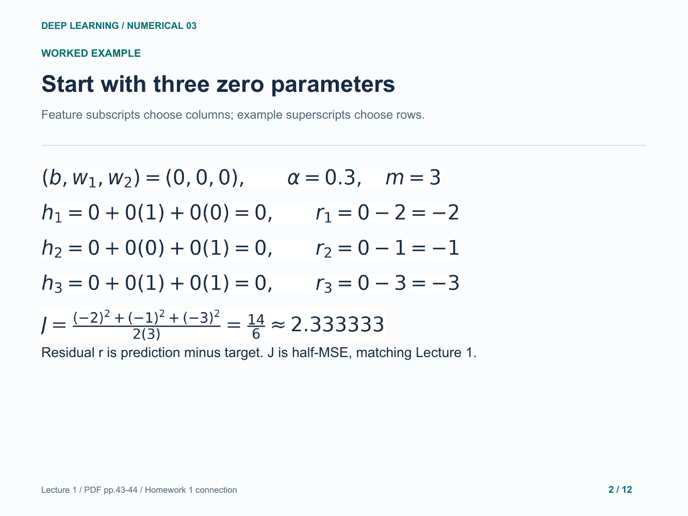

### 3. One gradient for every parameter

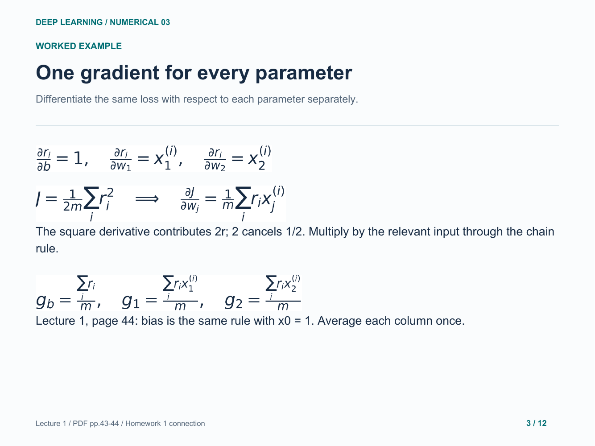

### 4. First step: calculate all contributions

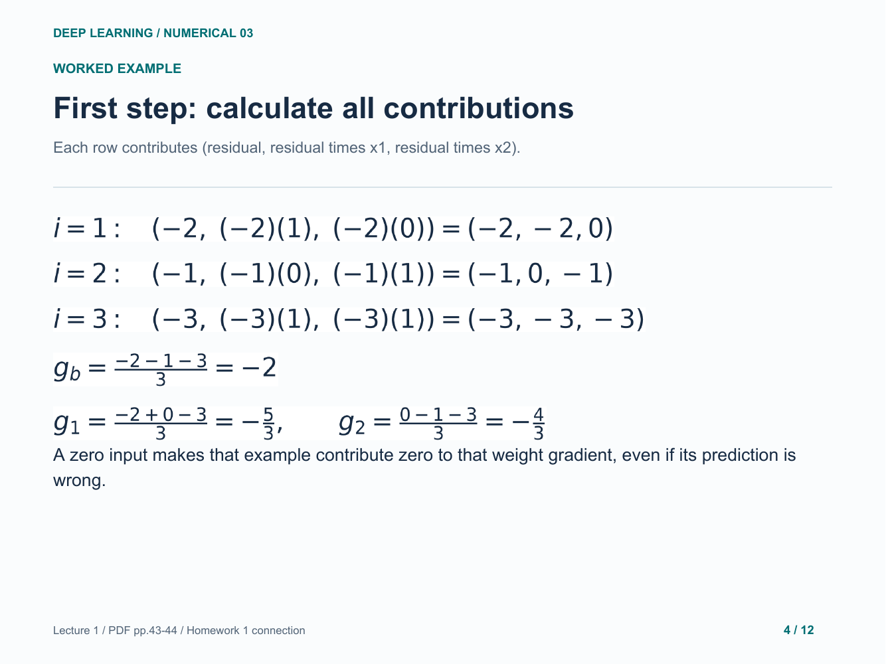

### 5. First simultaneous update

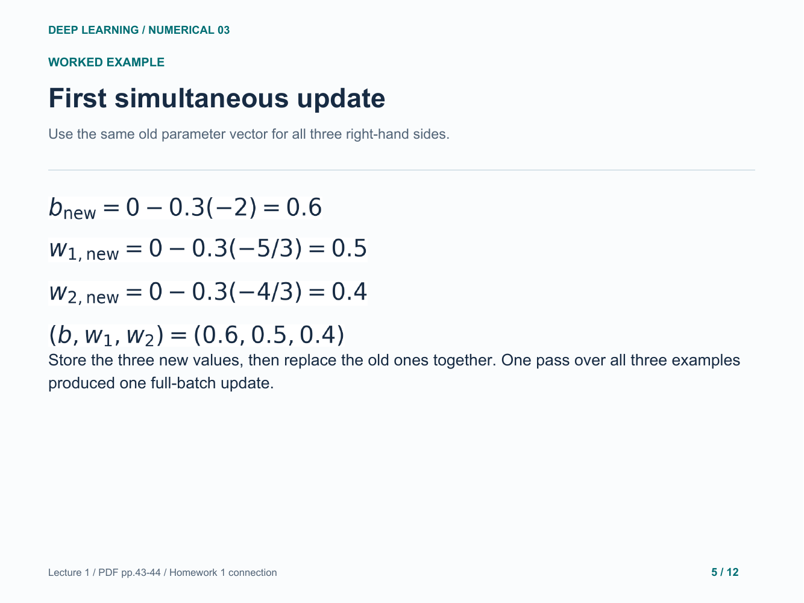

### 6. Recompute after the first update

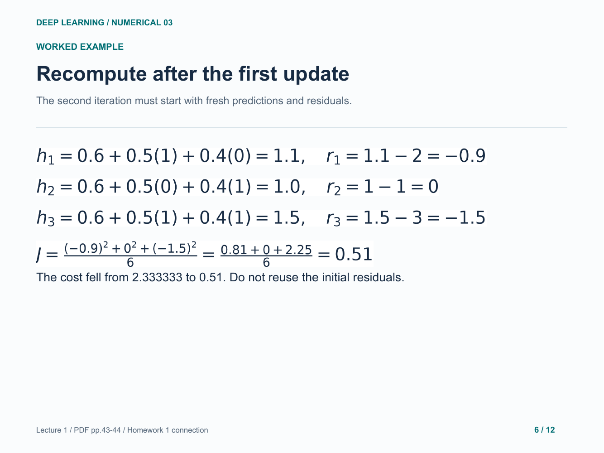

### 7. Second step: contributions and means

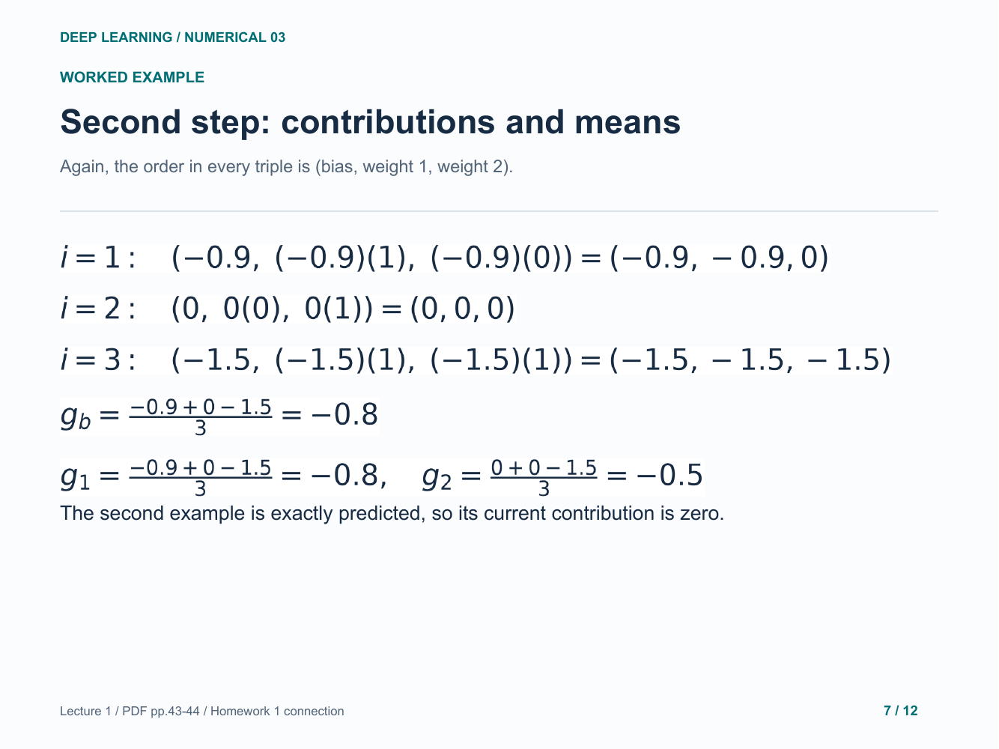

### 8. Second update and new predictions

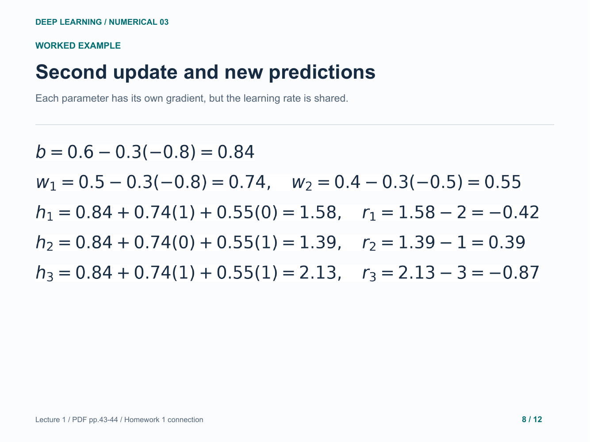

### 9. Verify the second cost

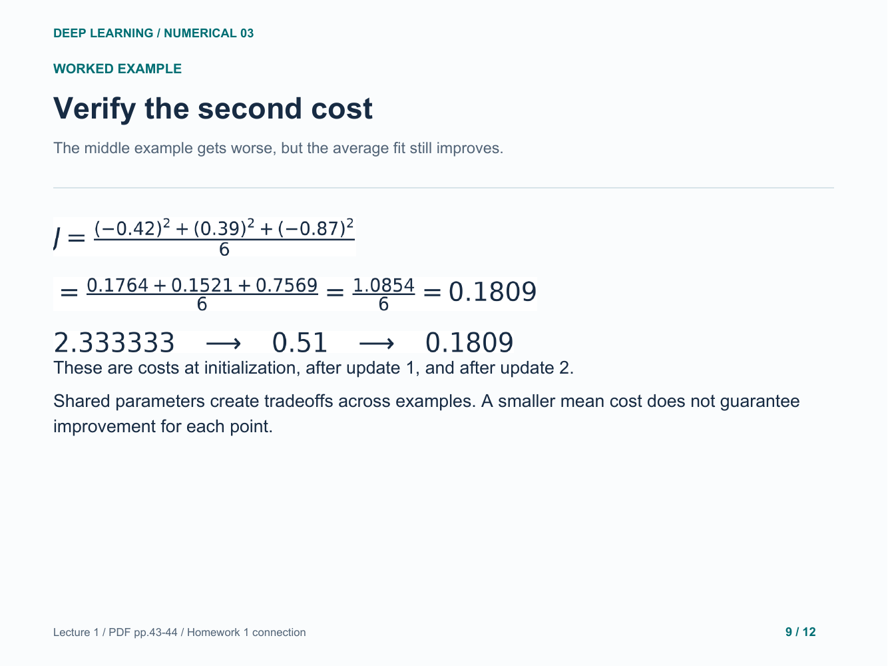

### 10. Connect this to Homework 1

### 11. Your turn: a negative feature value

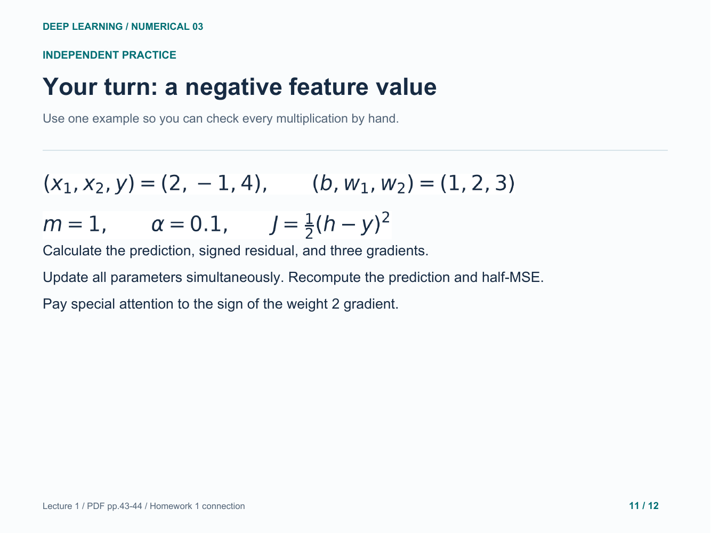

### 12. Practice answer: one full update

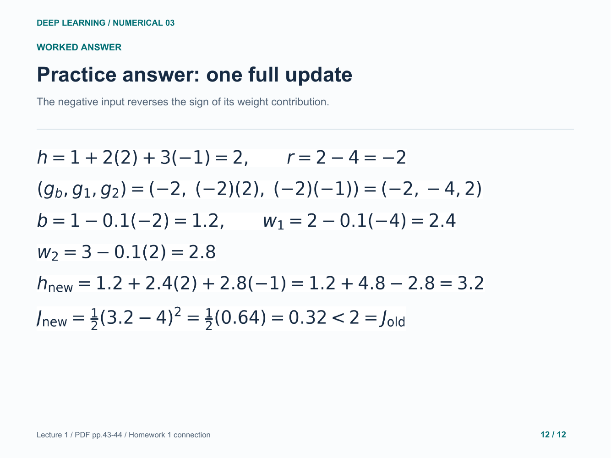

Original study example. Read the practice question before revealing the following answer pages.

[Back to numerical index](../README.md)
