# Logistic regression: three points, step by step

[Open the PDF](lesson.pdf) | [All numerical lessons](../README.md)

Source: Lecture 2, PDF pages 9 and 22–25. The examples are original practice problems. Read the illustrated pages in order.

## 1. Lecture notation mapping

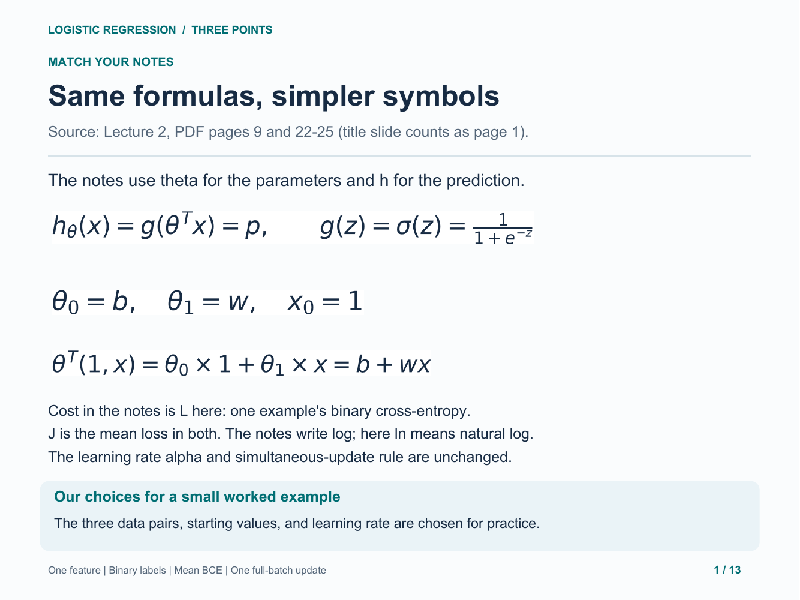

## 2. Data and symbols

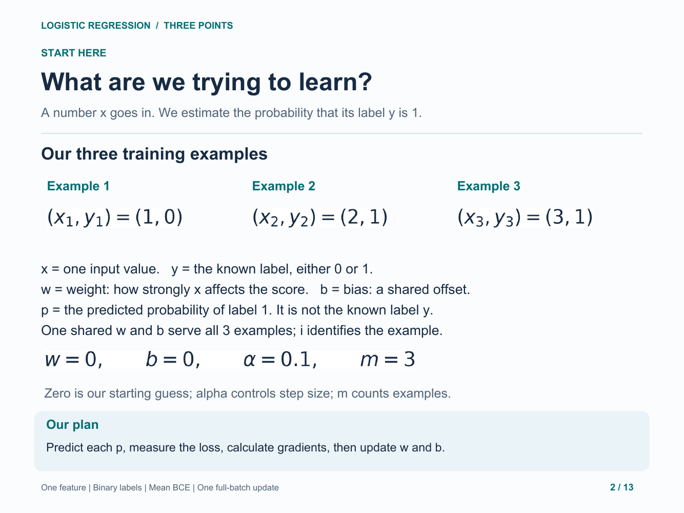

## 3. Predictions

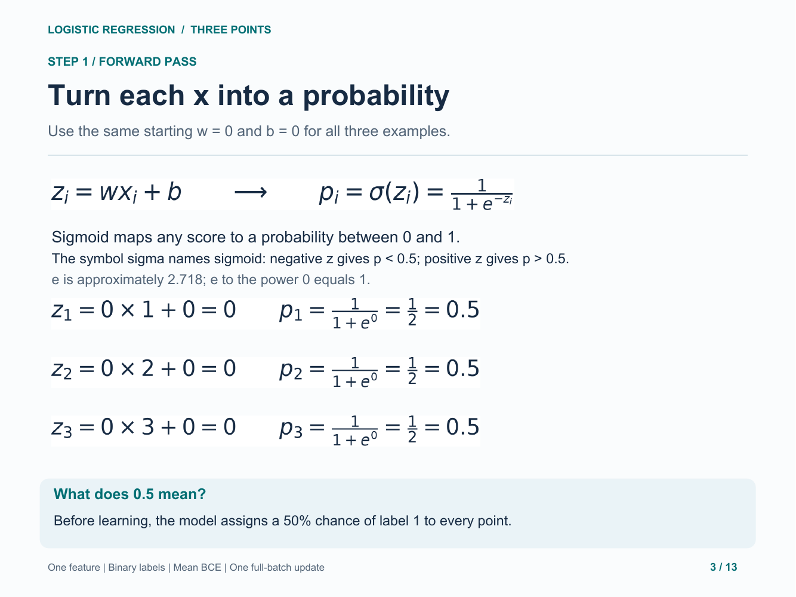

## 4. Losses and their mean

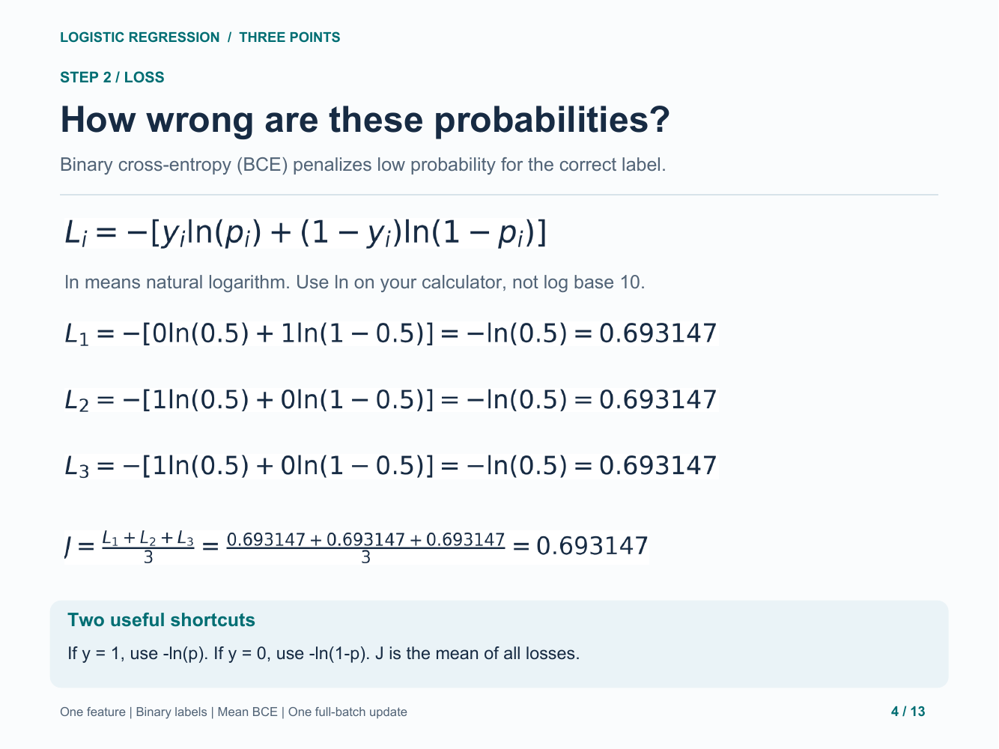

## 5. Derivative intuition

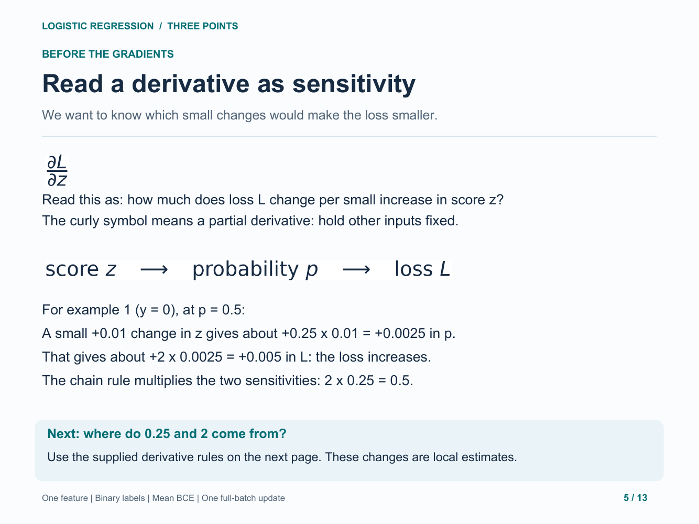

## 6. Chain rule and sigmoid/BCE gradient

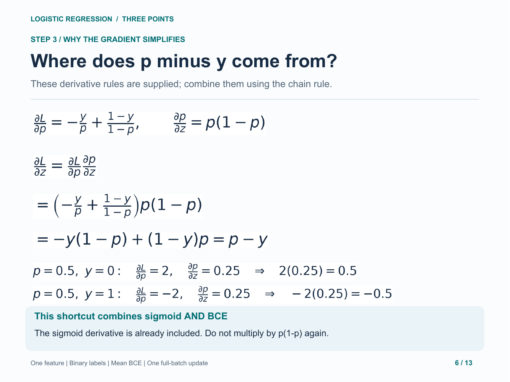

## 7. Weight and bias gradients

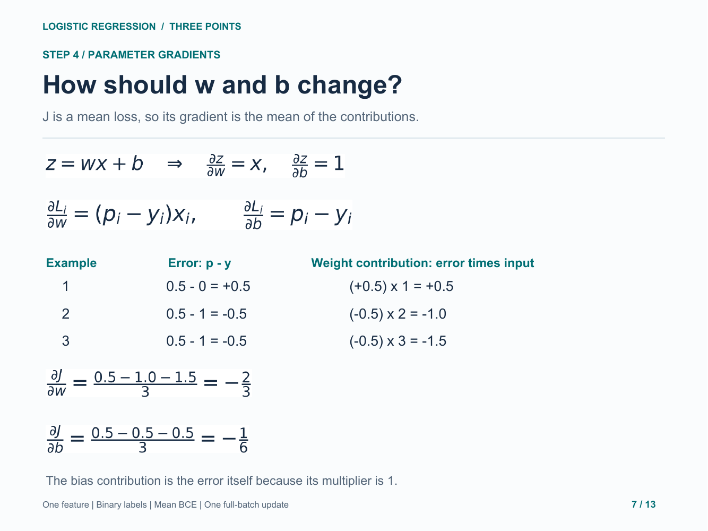

## 8. Simultaneous parameter update

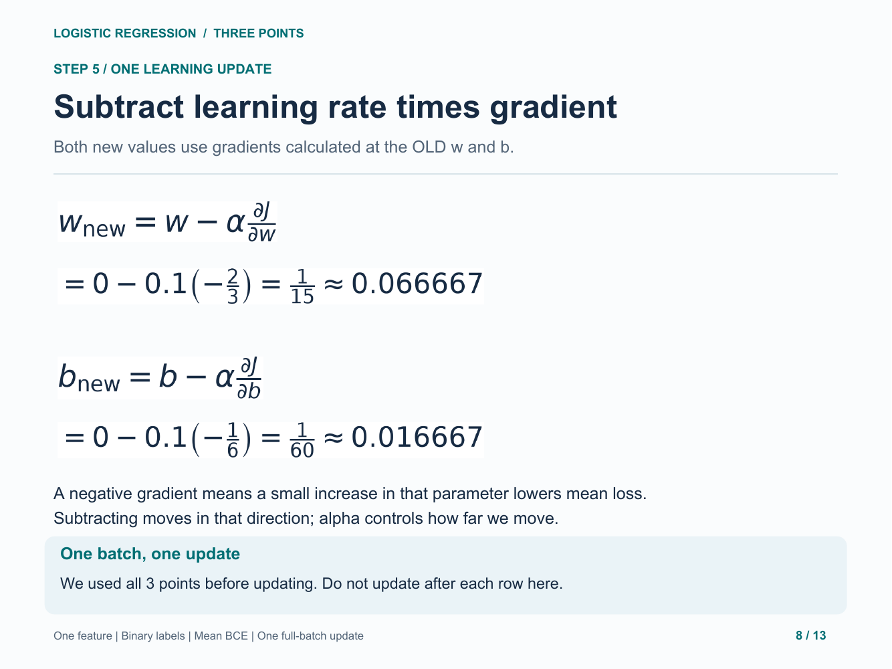

## 9. New predictions and loss

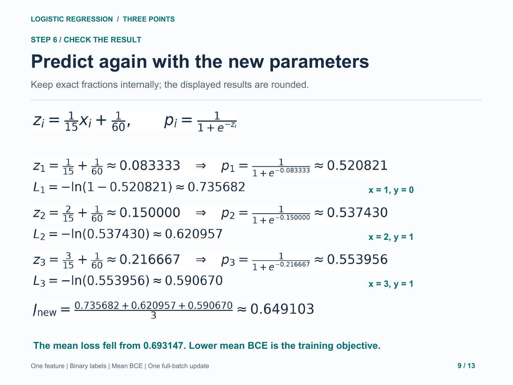

## 10. Recap

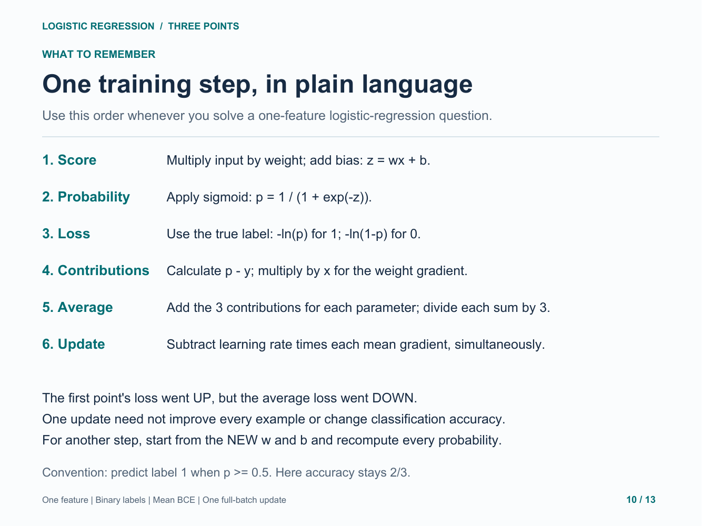

## 11. Independent practice

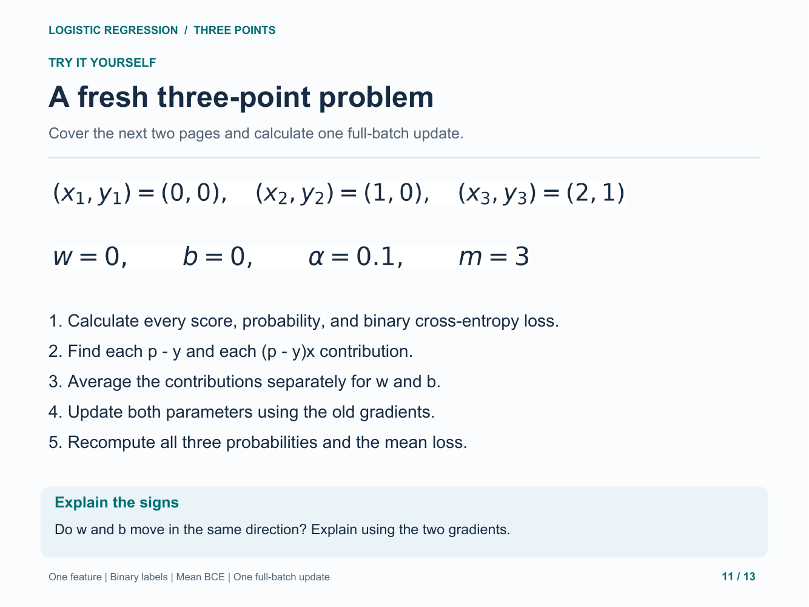

## 12. Practice solution: gradients and update

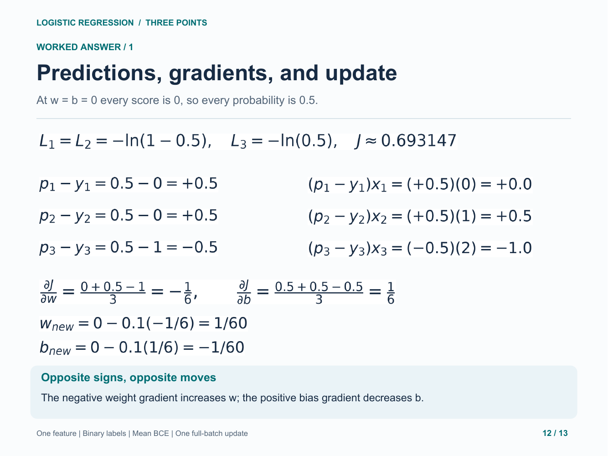

## 13. Practice solution: recomputed loss

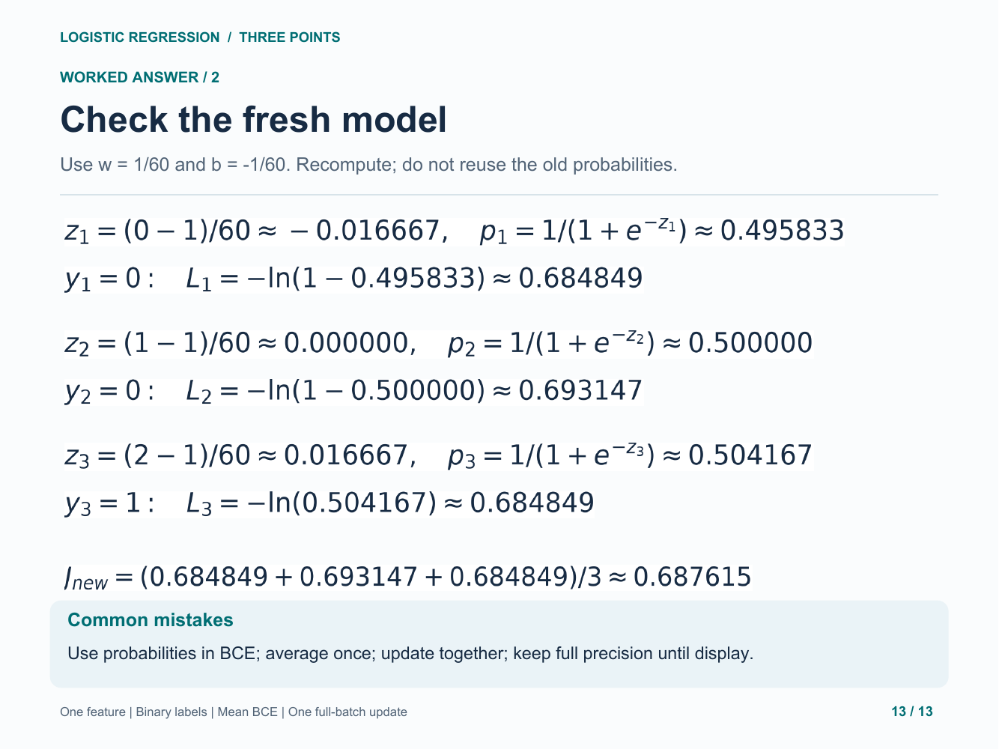
