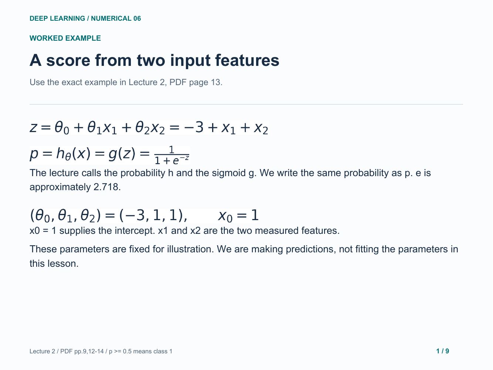
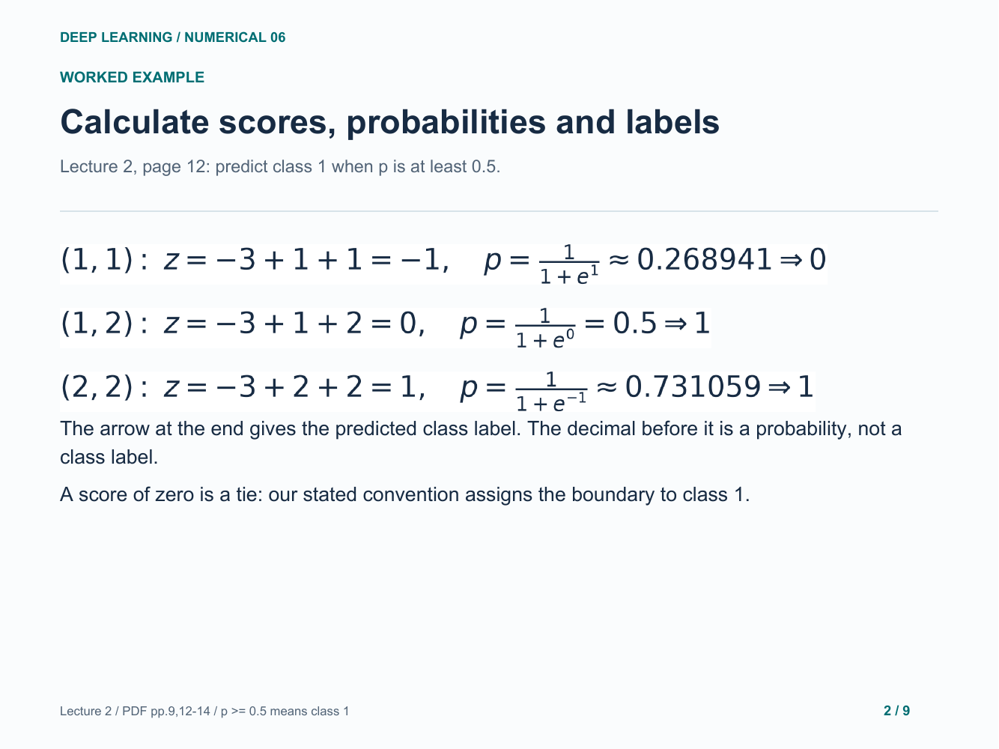
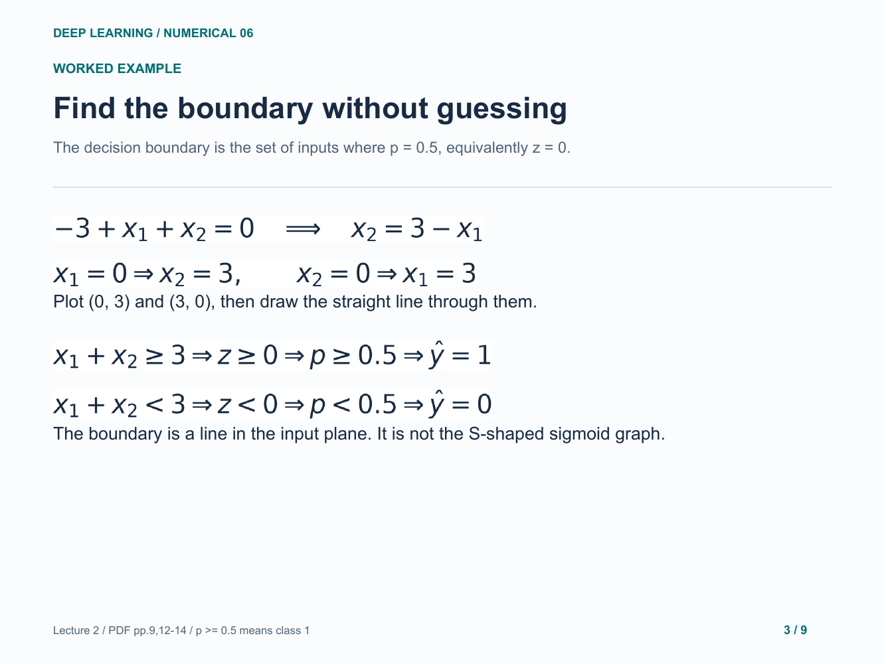
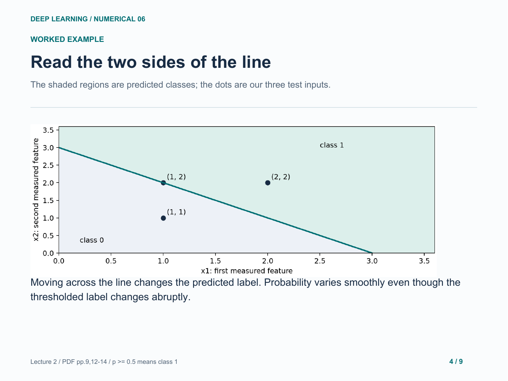
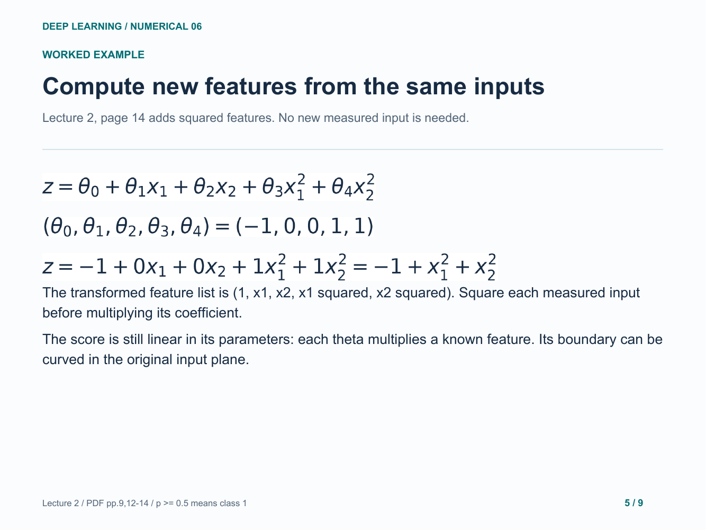
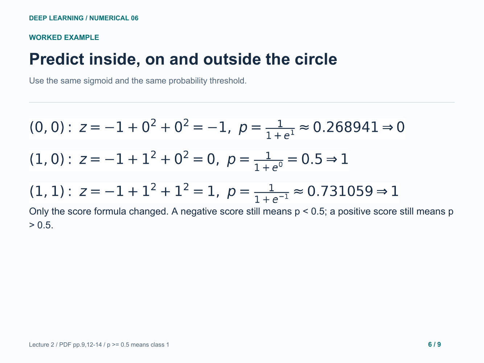
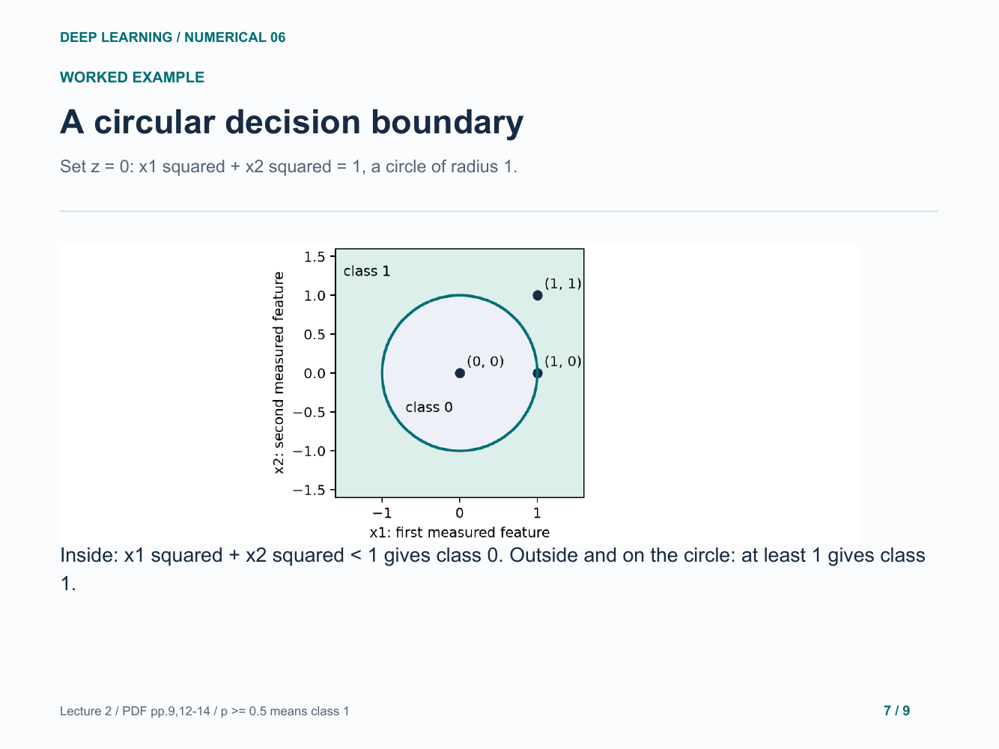
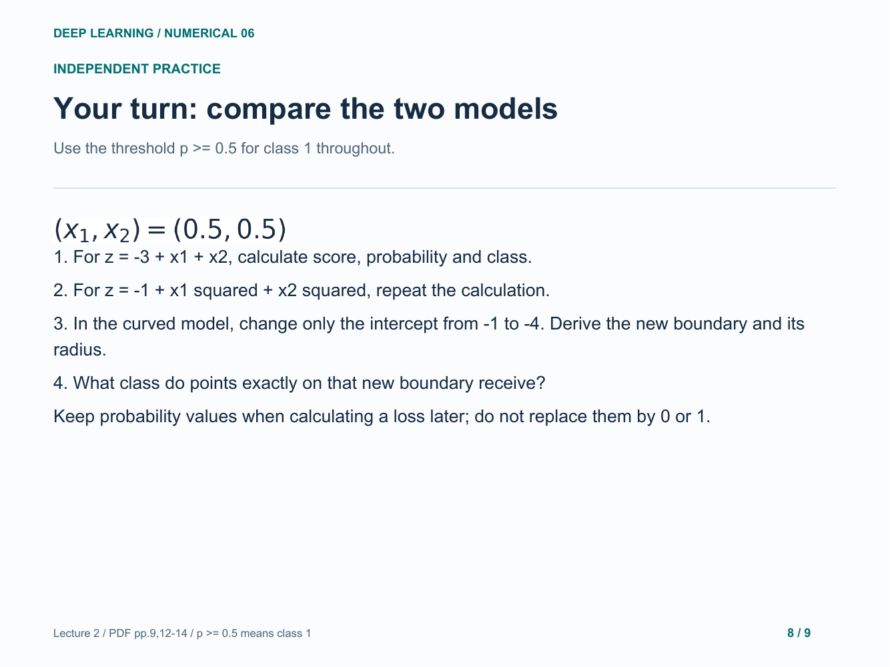
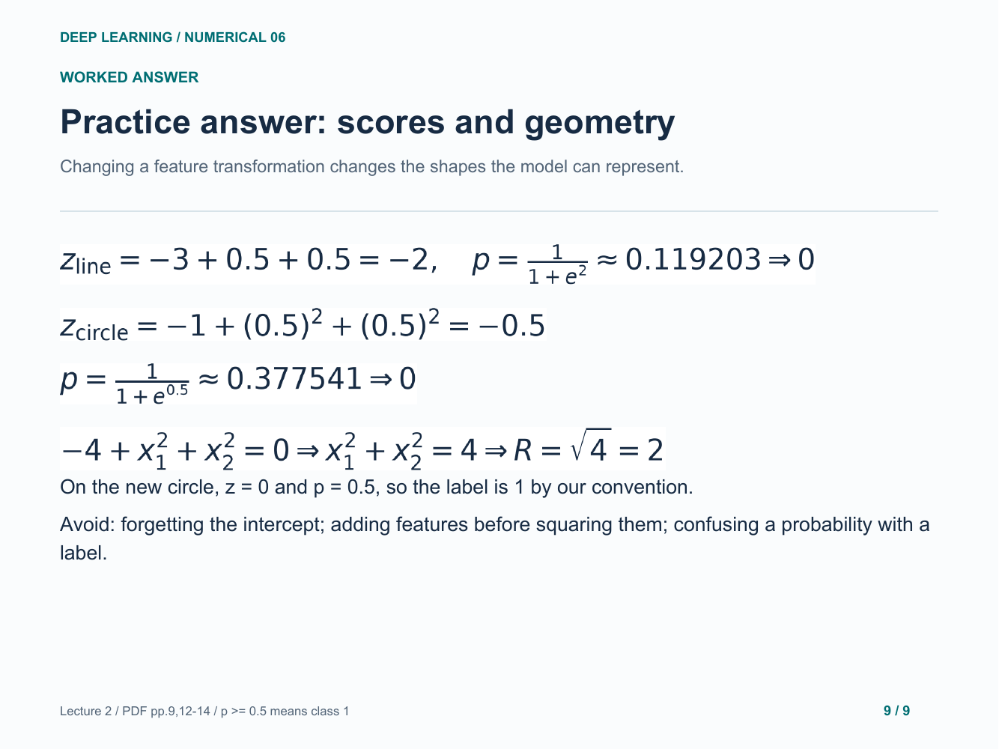

# 06. Logistic regression and decision boundaries

Two-feature probabilities, a straight boundary and a transformed circular boundary.

[Open the PDF](lesson.pdf)

Lecture reference: Lecture 2 - Logistic Regression + Neural Network.pdf, pages 9 and 12-14.

## Illustrated walkthrough

### 1. A score from two input features

### 2. Calculate scores, probabilities and labels

### 3. Find the boundary without guessing

### 4. Read the two sides of the line

### 5. Compute new features from the same inputs

### 6. Predict inside, on and outside the circle

### 7. A circular decision boundary

### 8. Your turn: compare the two models

### 9. Practice answer: scores and geometry

Original study example. Read the practice question before revealing the following answer pages.

[Back to numerical index](../README.md)
