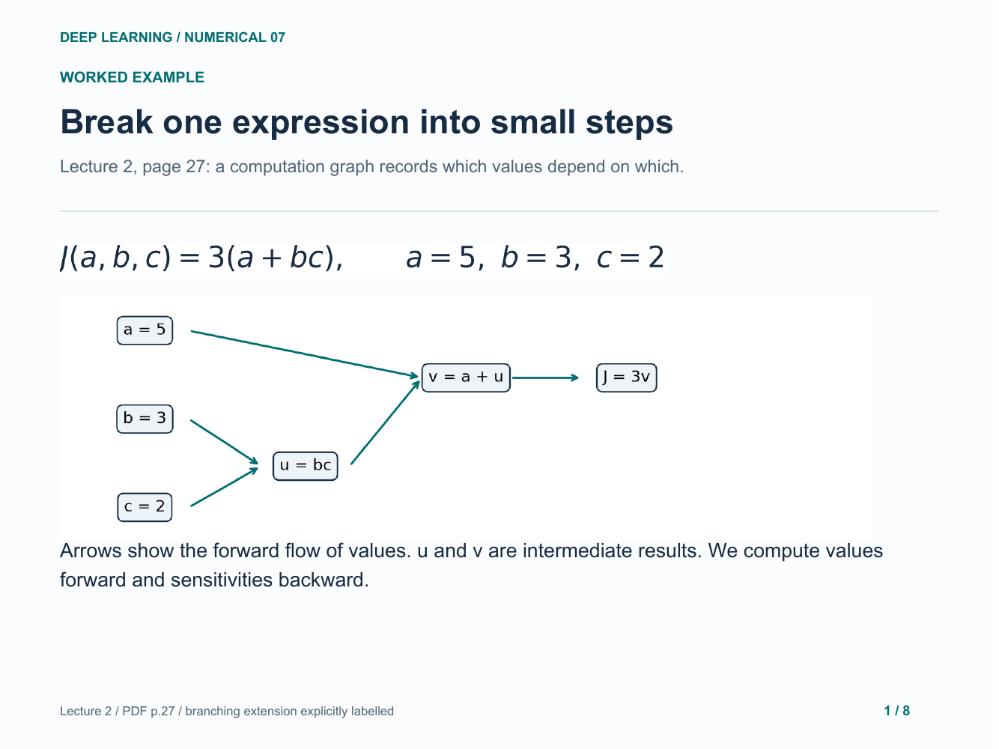
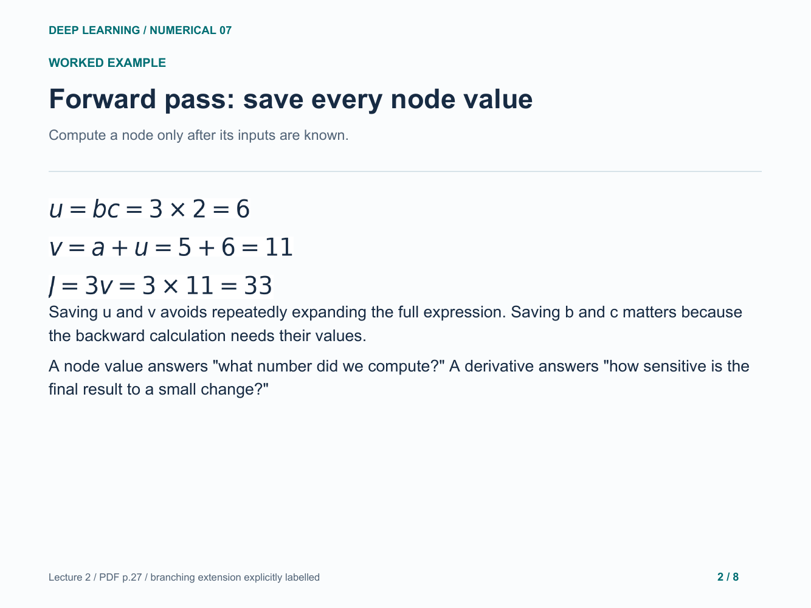
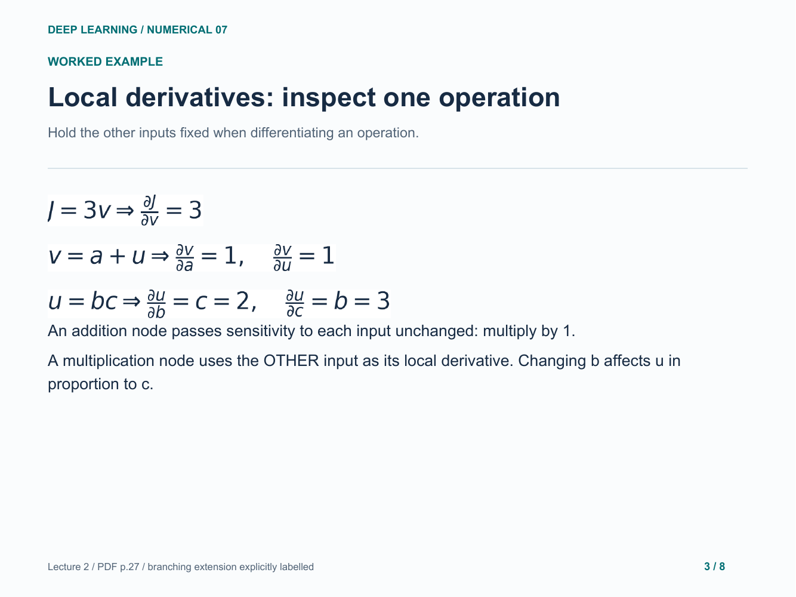
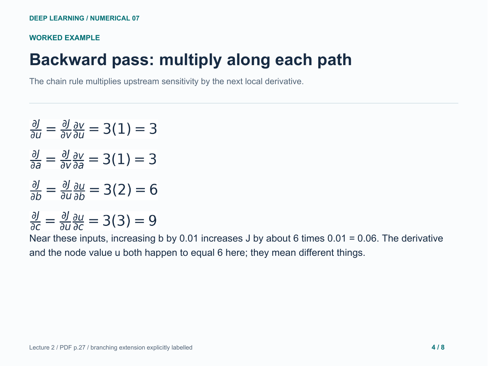
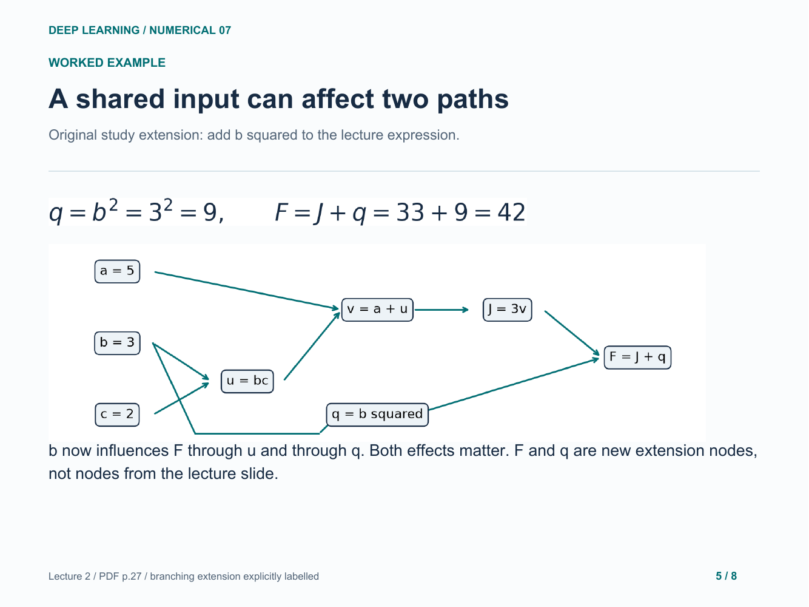
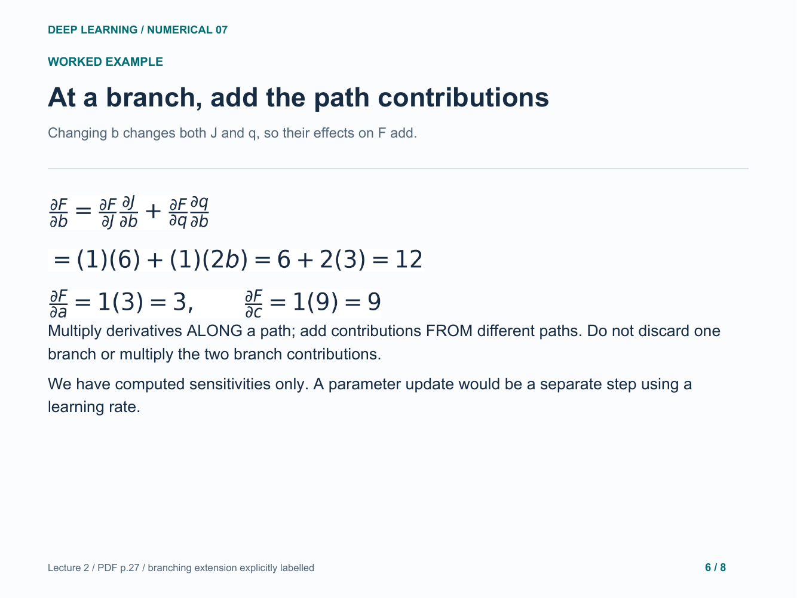
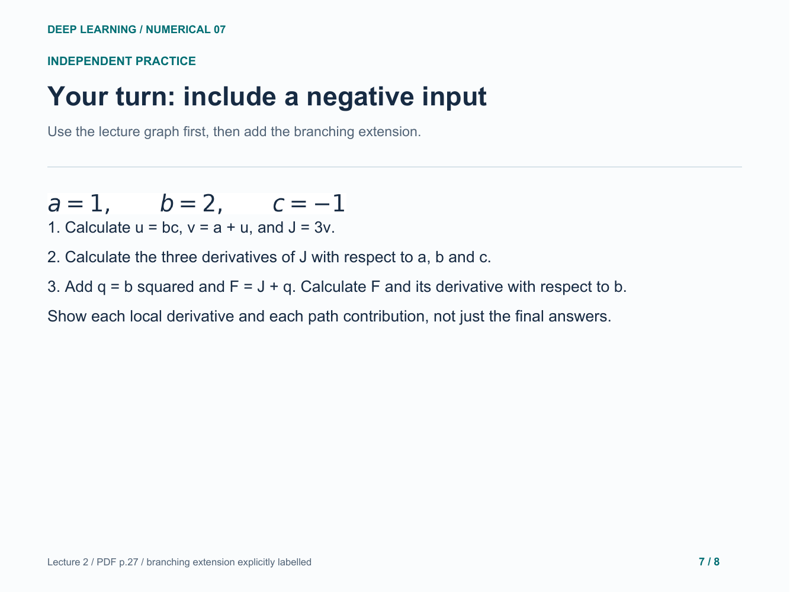
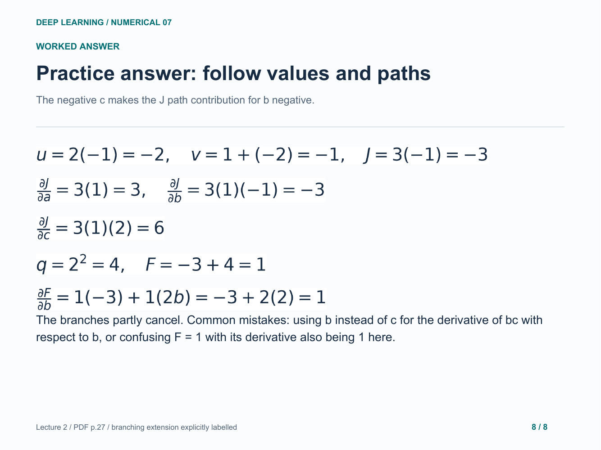

# 07. Computation graphs and the chain rule

Lecture graph forward and backward, then a branching-path extension.

[Open the PDF](lesson.pdf)

Lecture reference: Lecture 2 - Logistic Regression + Neural Network.pdf, page 27; branching example is an original extension.

## Illustrated walkthrough

### 1. Break one expression into small steps

### 2. Forward pass: save every node value

### 3. Local derivatives: inspect one operation

### 4. Backward pass: multiply along each path

### 5. A shared input can affect two paths

### 6. At a branch, add the path contributions

### 7. Your turn: include a negative input

### 8. Practice answer: follow values and paths

Original study example. Read the practice question before revealing the following answer pages.

[Back to numerical index](../README.md)
