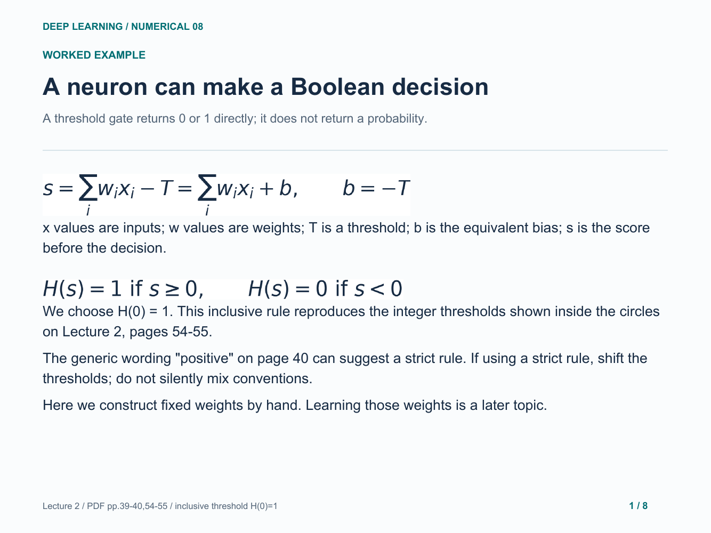
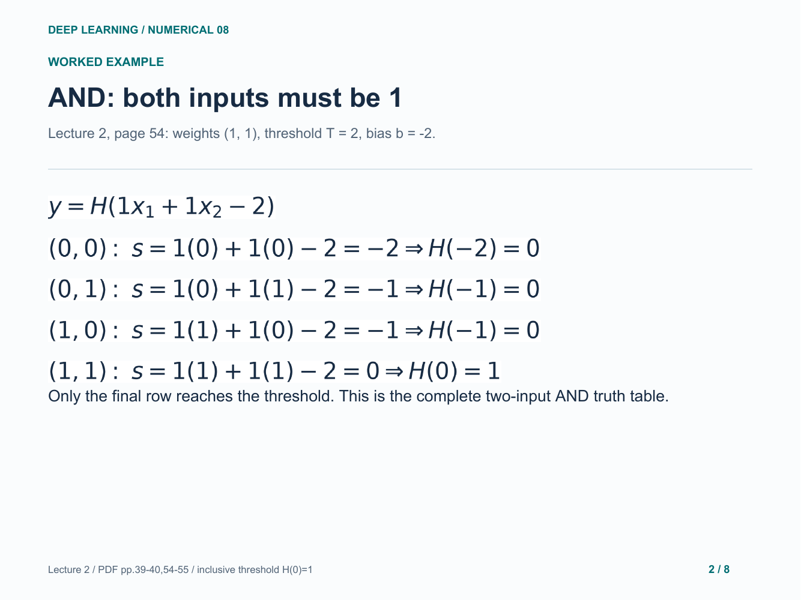
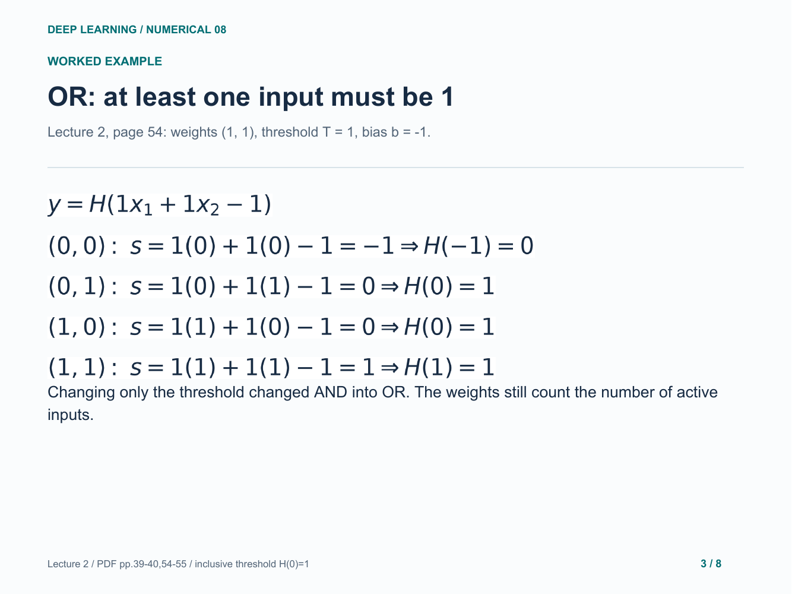
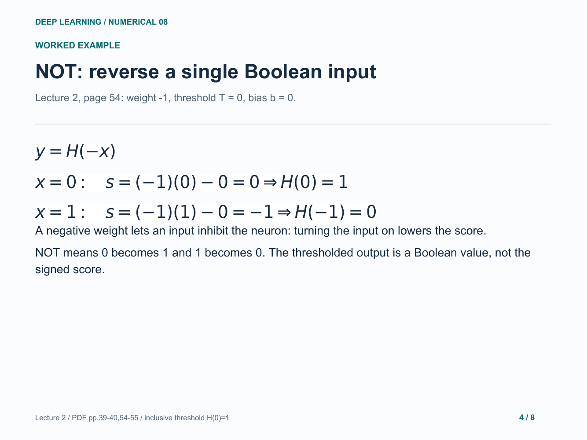
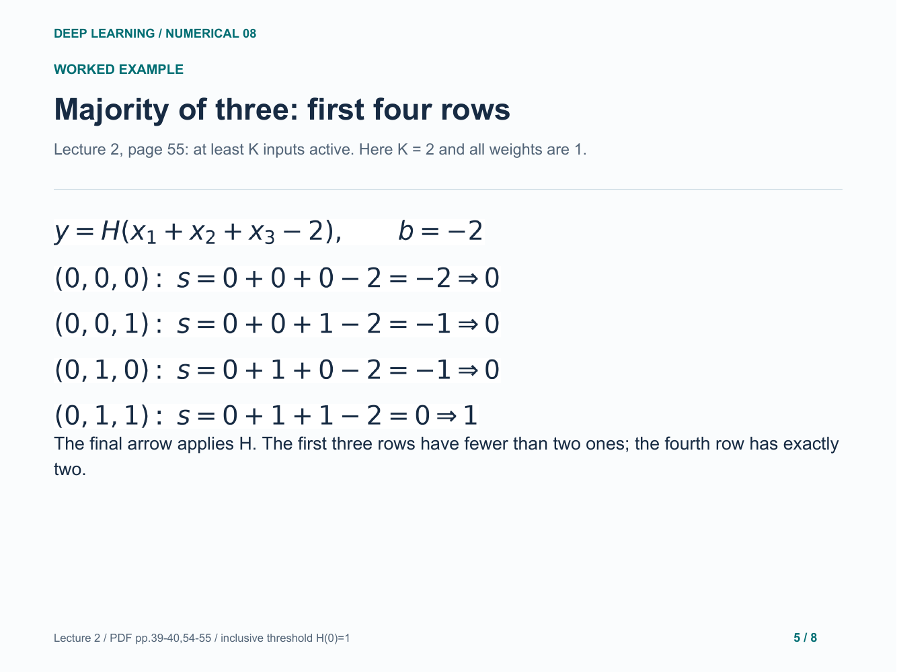
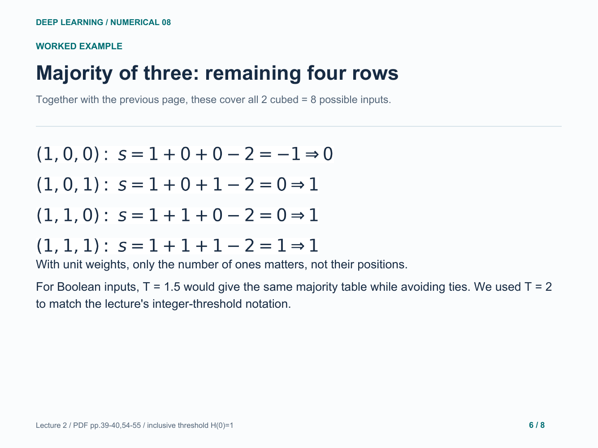
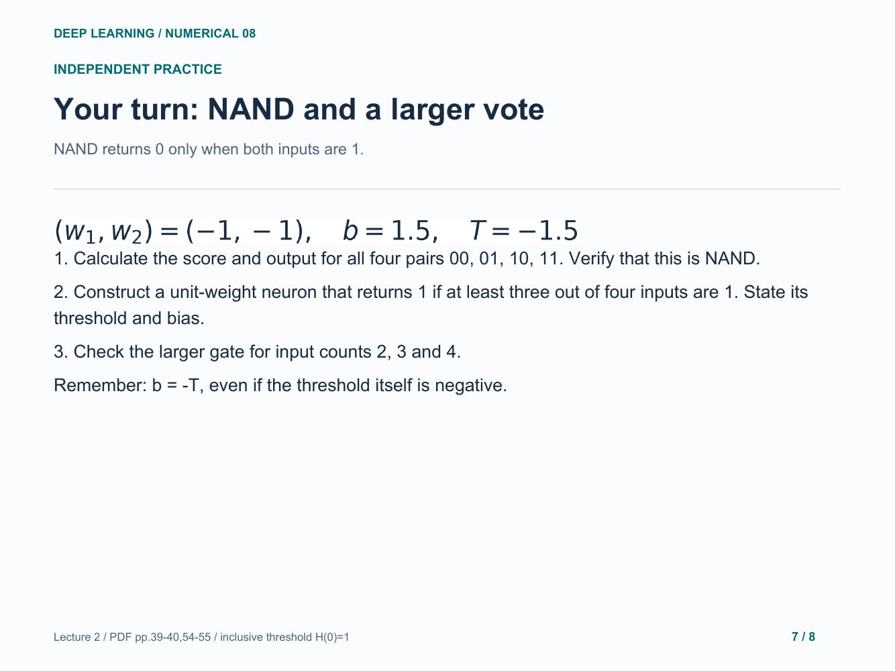
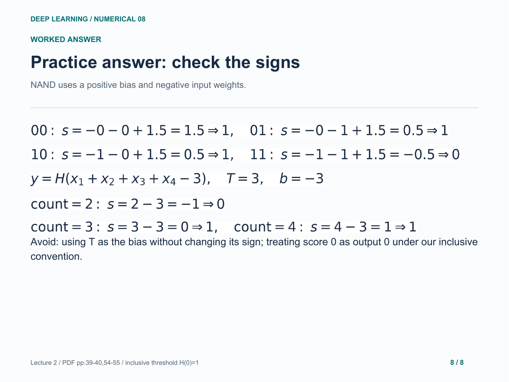

# 08. A neuron and logic gates

Score-by-score truth tables for AND, OR, NOT and majority; NAND practice.

[Open the PDF](lesson.pdf)

Lecture reference: Lecture 2 - Logistic Regression + Neural Network.pdf, pages 39-40 and 54-55.

## Illustrated walkthrough

### 1. A neuron can make a Boolean decision

### 2. AND: both inputs must be 1

### 3. OR: at least one input must be 1

### 4. NOT: reverse a single Boolean input

### 5. Majority of three: first four rows

### 6. Majority of three: remaining four rows

### 7. Your turn: NAND and a larger vote

### 8. Practice answer: check the signs

Original study example. Read the practice question before revealing the following answer pages.

[Back to numerical index](../README.md)
