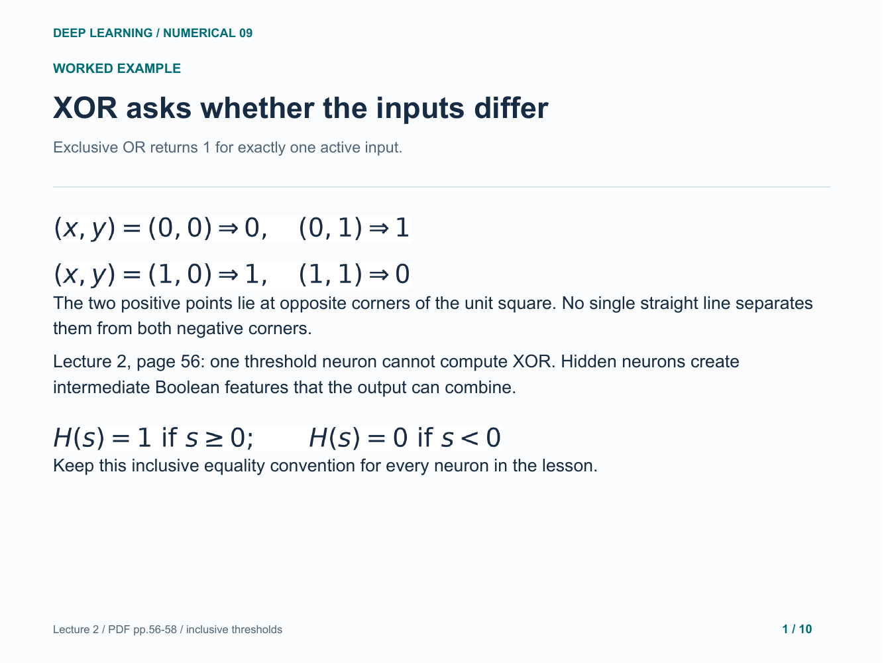
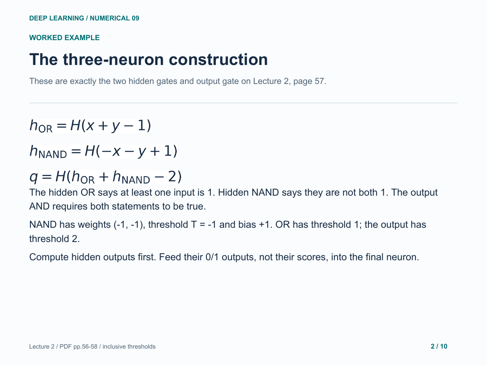
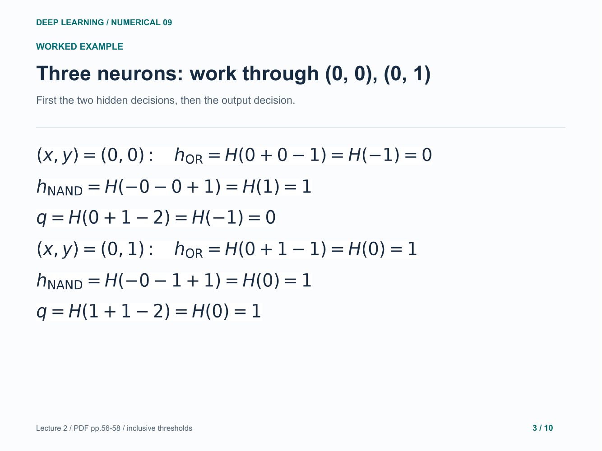
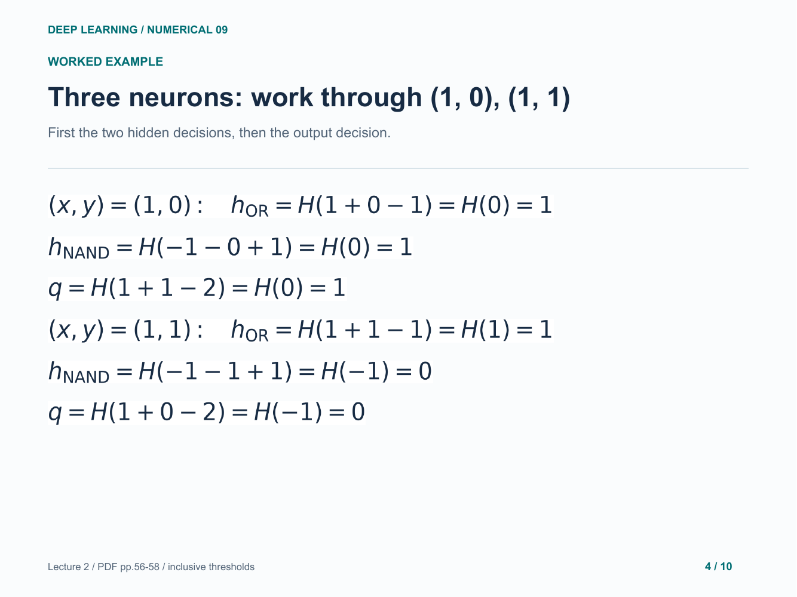
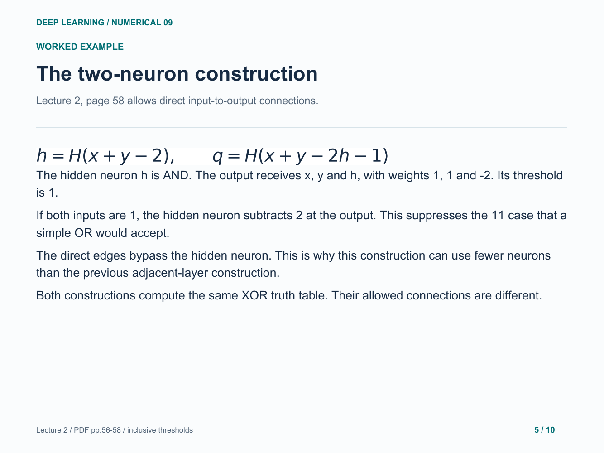
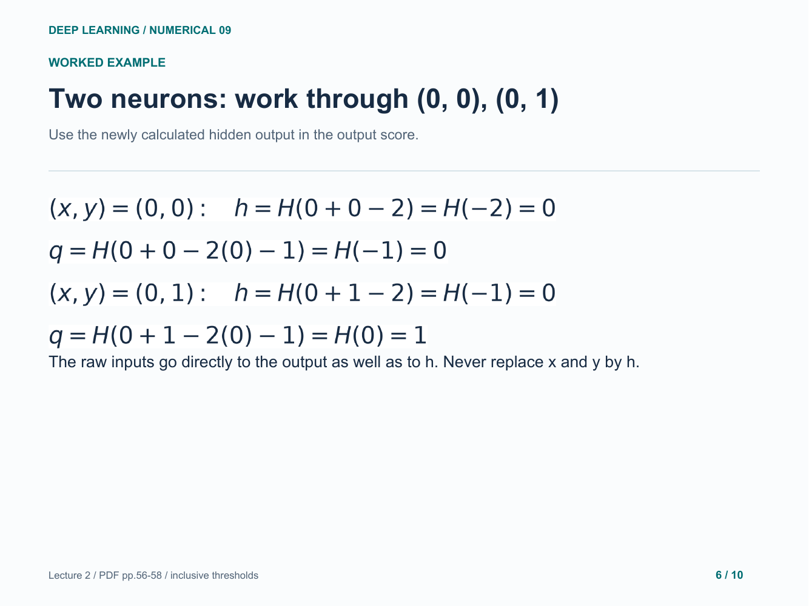
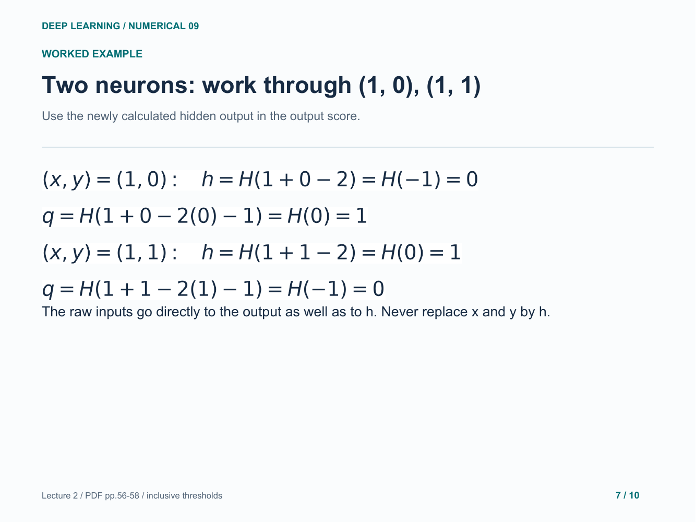
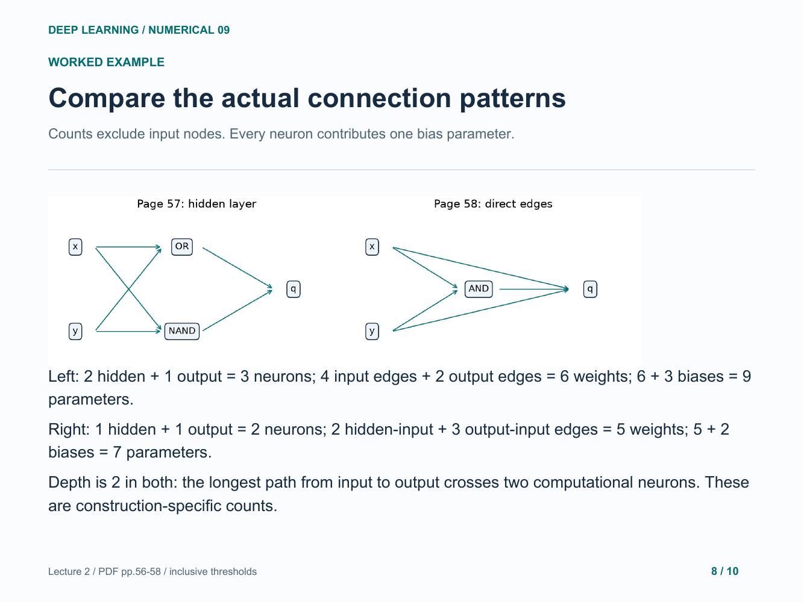
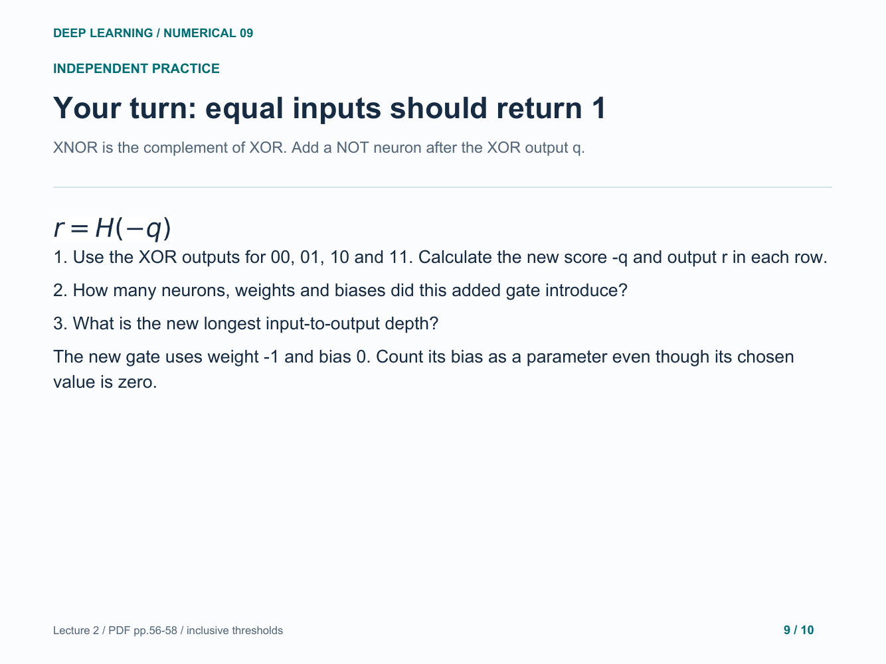
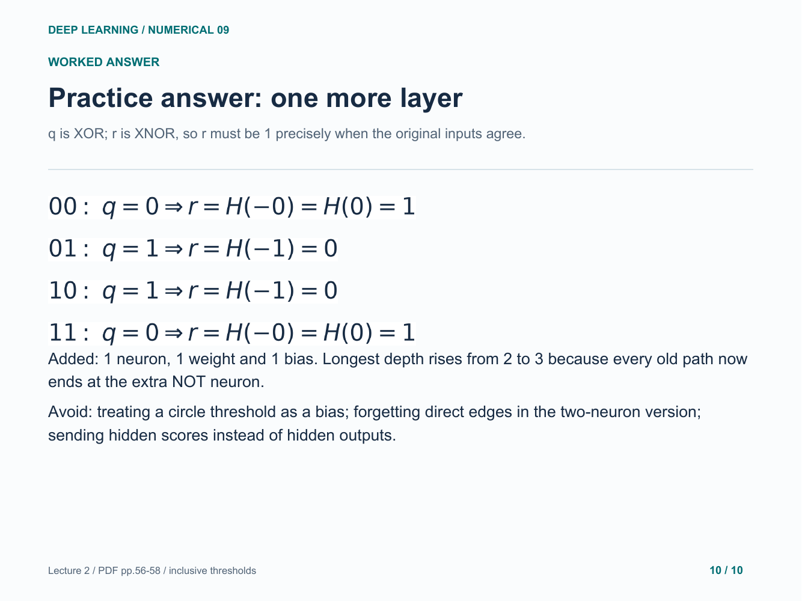

# 09. XOR with a hidden layer

Evaluate every input pair through both exact lecture architectures.

[Open the PDF](lesson.pdf)

Lecture reference: Lecture 2 - Logistic Regression + Neural Network.pdf, pages 56-58.

## Illustrated walkthrough

### 1. XOR asks whether the inputs differ

### 2. The three-neuron construction

### 3. Three neurons: work through (0, 0), (0, 1)

### 4. Three neurons: work through (1, 0), (1, 1)

### 5. The two-neuron construction

### 6. Two neurons: work through (0, 0), (0, 1)

### 7. Two neurons: work through (1, 0), (1, 1)

### 8. Compare the actual connection patterns

### 9. Your turn: equal inputs should return 1

### 10. Practice answer: one more layer

Original study example. Read the practice question before revealing the following answer pages.

[Back to numerical index](../README.md)
