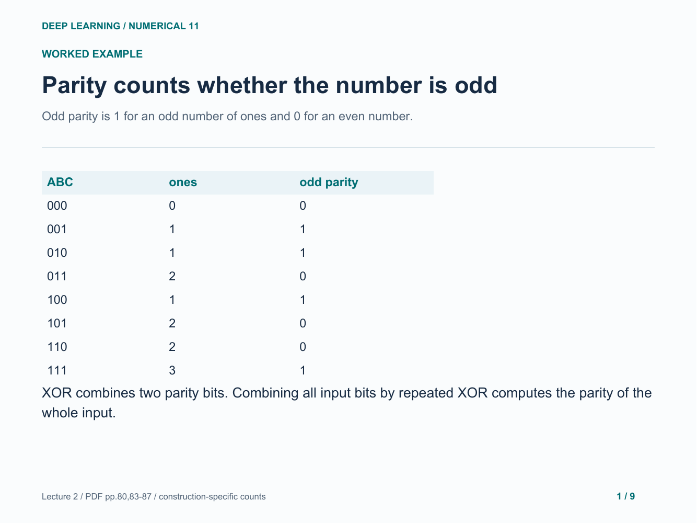
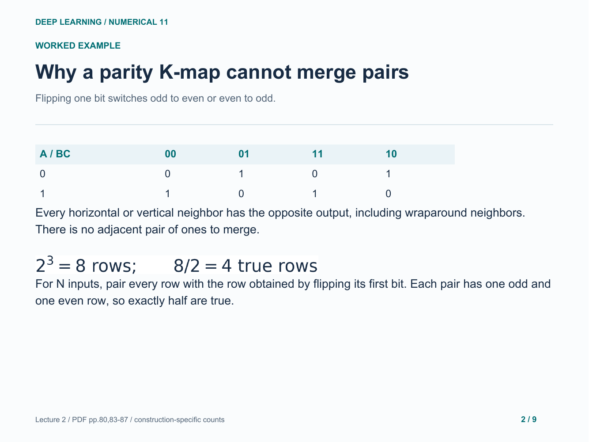
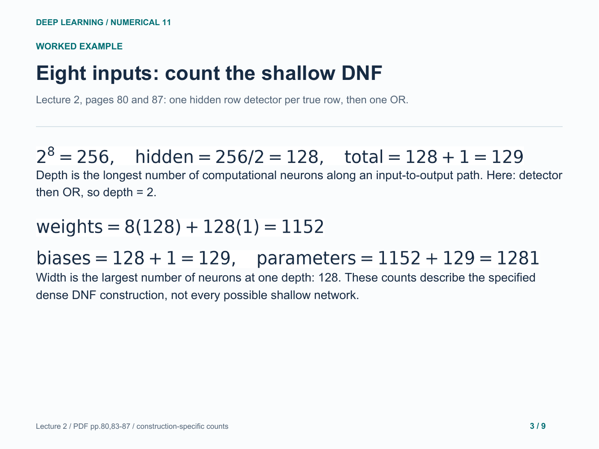
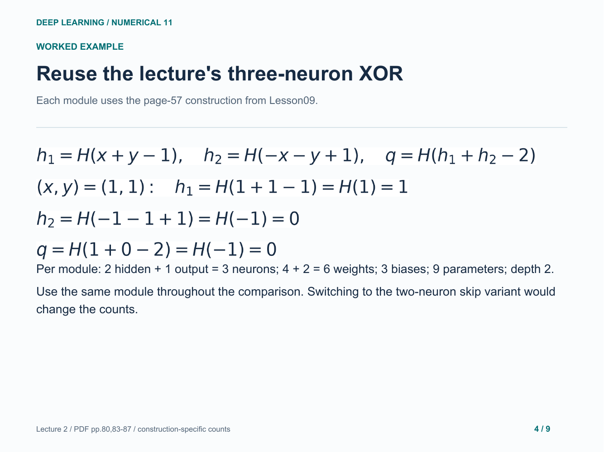
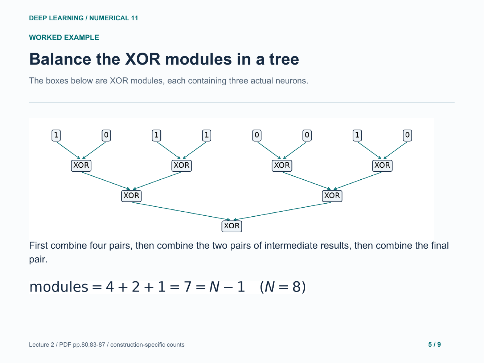
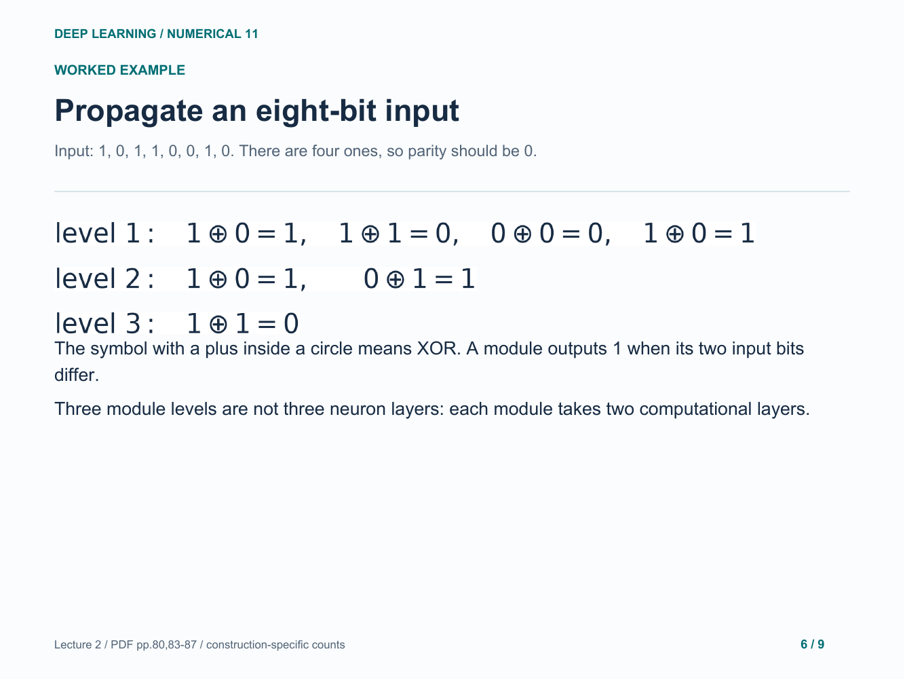
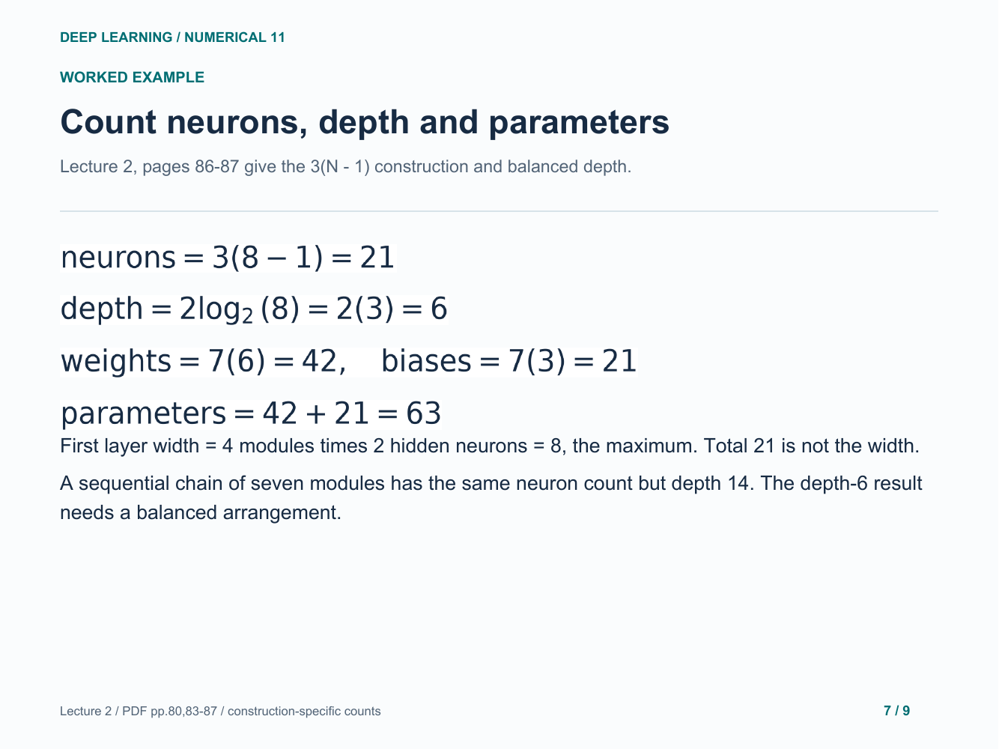
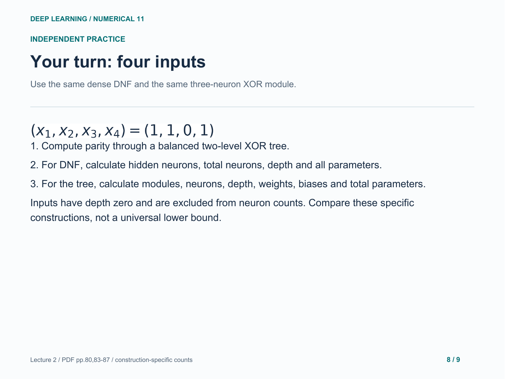
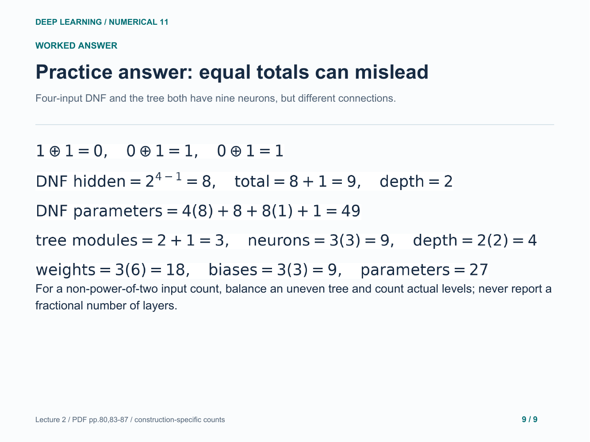

# 11. Parity and depth versus width

Propagate parity values and count two specified network constructions.

[Open the PDF](lesson.pdf)

Lecture reference: Lecture 2 - Logistic Regression + Neural Network.pdf, pages 80 and 83-87.

## Illustrated walkthrough

### 1. Parity counts whether the number is odd

### 2. Why a parity K-map cannot merge pairs

### 3. Eight inputs: count the shallow DNF

### 4. Reuse the lecture's three-neuron XOR

### 5. Balance the XOR modules in a tree

### 6. Propagate an eight-bit input

### 7. Count neurons, depth and parameters

### 8. Your turn: four inputs

### 9. Practice answer: equal totals can mislead

Original study example. Read the practice question before revealing the following answer pages.

[Back to numerical index](../README.md)
