# 13. Perceptron learning

Every visit and mistake update across four epochs, with an independent practice problem.

[Open the PDF](lesson.pdf)

Lecture reference: Lecture 3 - Learning Neural Network.pdf, algorithm page 41 and nonseparable data pages 53-54. Original study dataset.

## Illustrated walkthrough

### 1. Learn a threshold neuron from mistakes

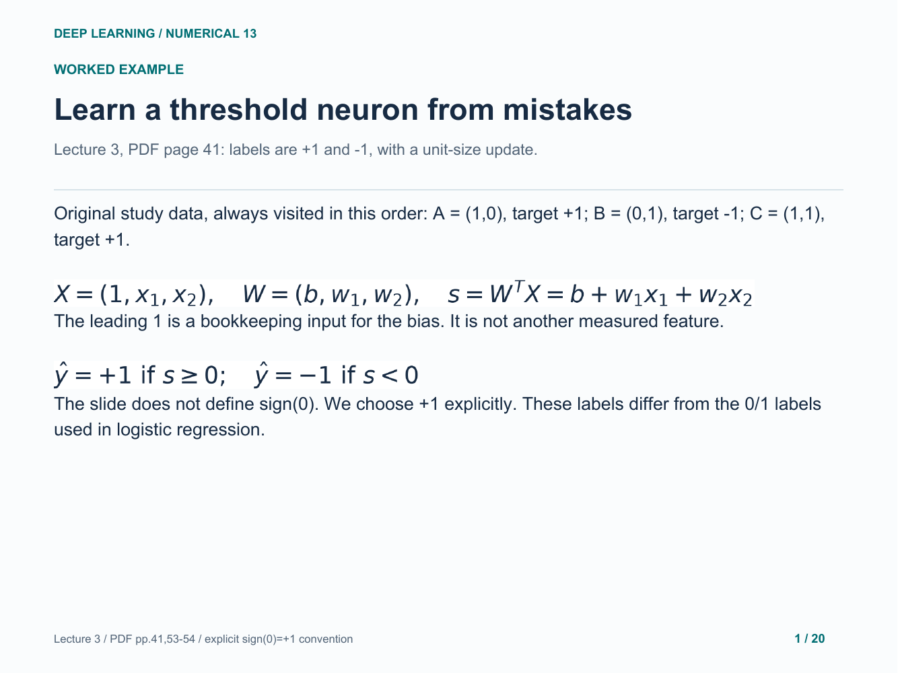

### 2. Update only after a mistaken prediction

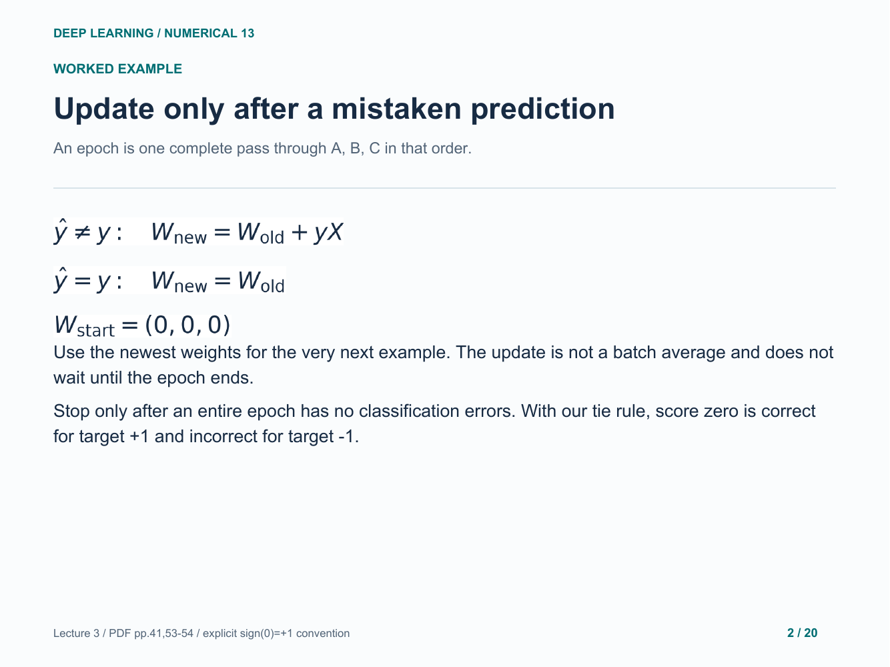

### 3. Epoch 1, point A: keep the weights

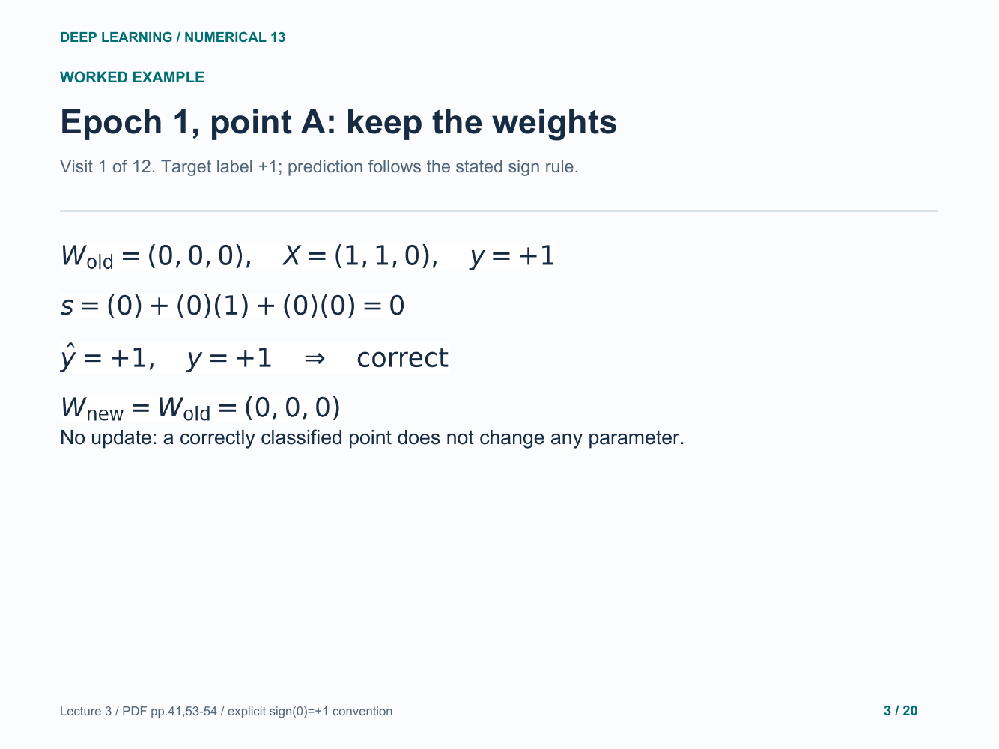

### 4. Epoch 1, point B: correct the mistake

### 5. Epoch 1, point C: correct the mistake

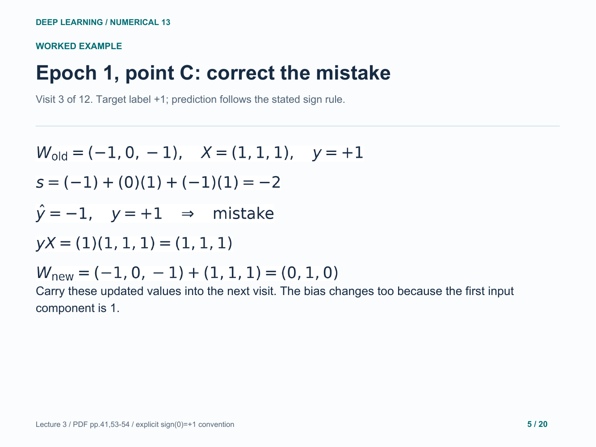

### 6. Epoch 2, point A: keep the weights

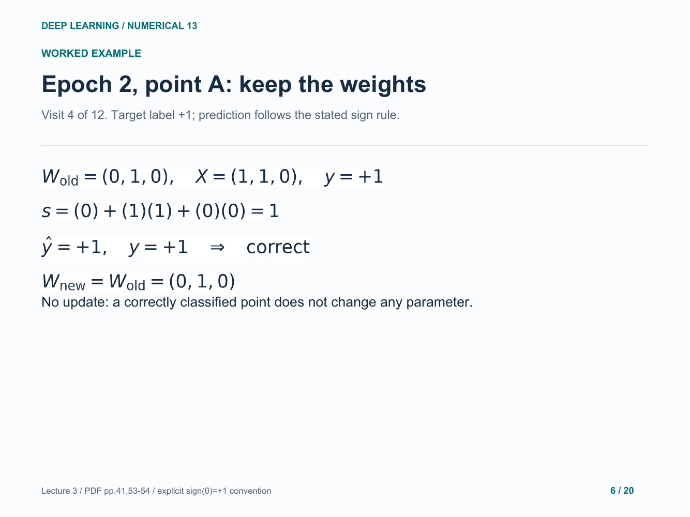

### 7. Epoch 2, point B: correct the mistake

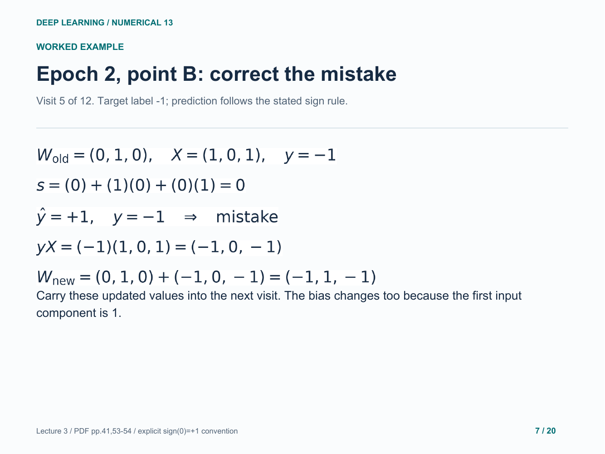

### 8. Epoch 2, point C: correct the mistake

### 9. Epoch 3, point A: keep the weights

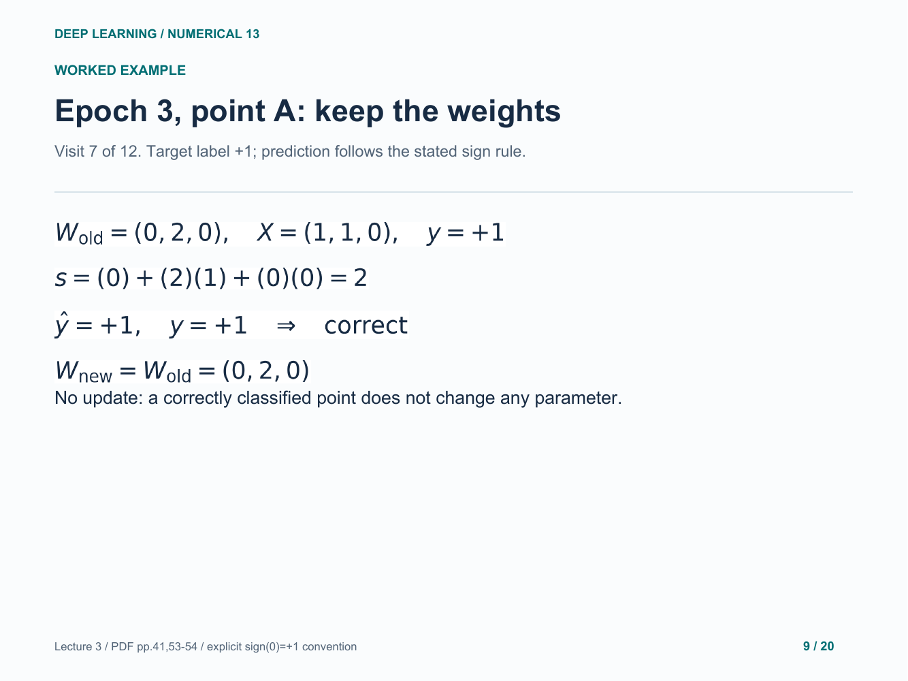

### 10. Epoch 3, point B: correct the mistake

### 11. Epoch 3, point C: keep the weights

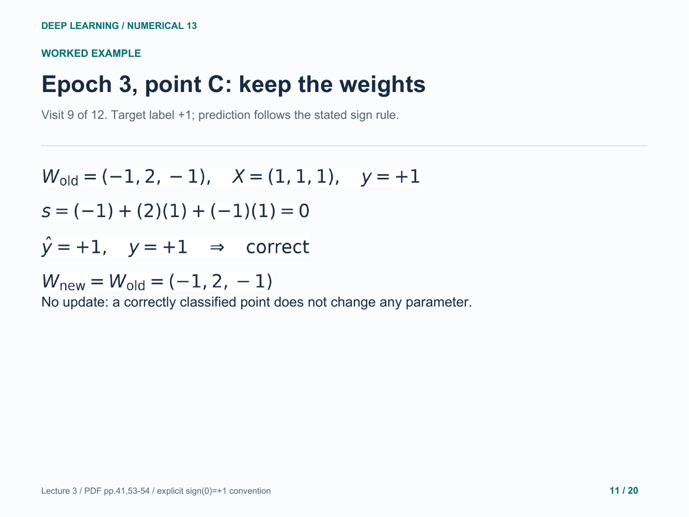

### 12. Epoch 4, point A: keep the weights

### 13. Epoch 4, point B: keep the weights

### 14. Epoch 4, point C: keep the weights

### 15. Why the mistake update helps this point

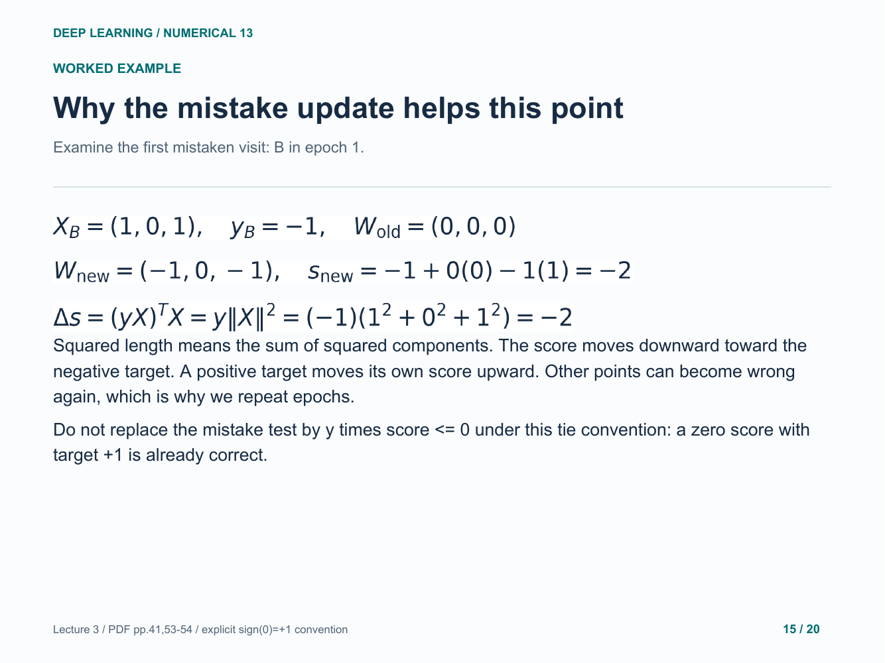

### 16. Verify the final neuron and stop

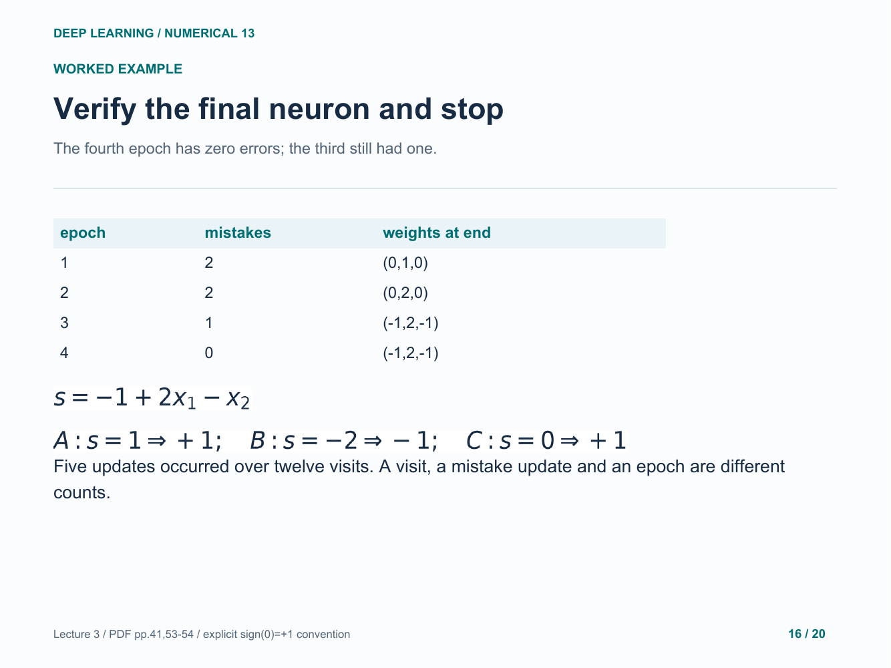

### 17. Picture the final separating boundary

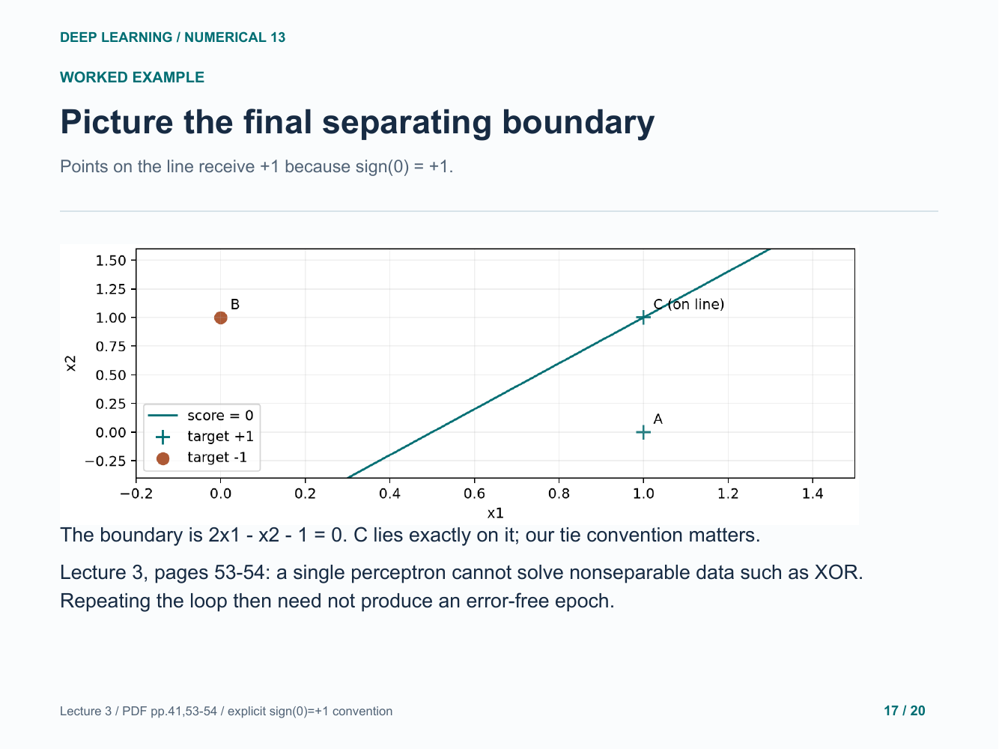

### 18. Your turn: two points, one measured feature

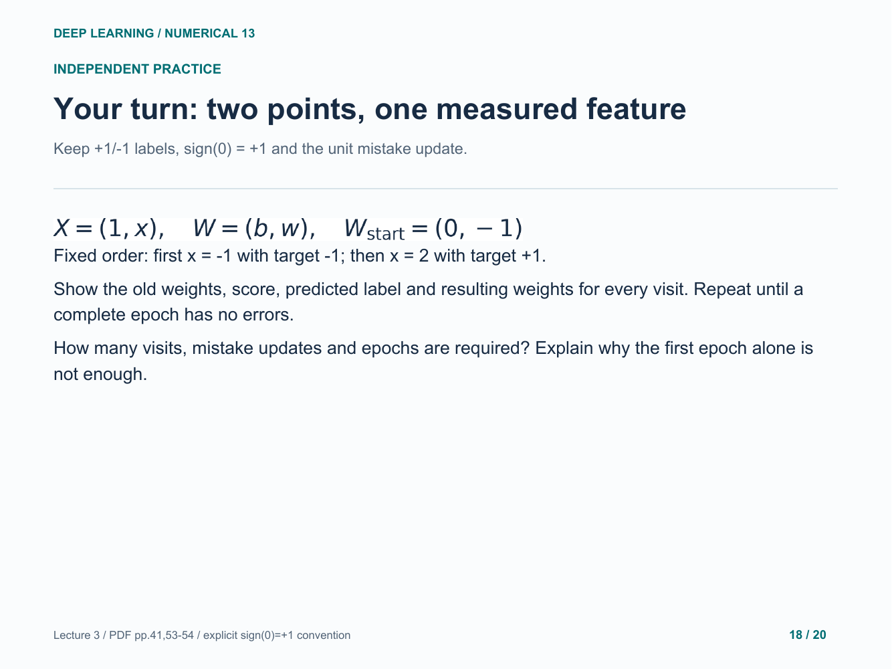

### 19. Practice answer: correct both first-epoch errors

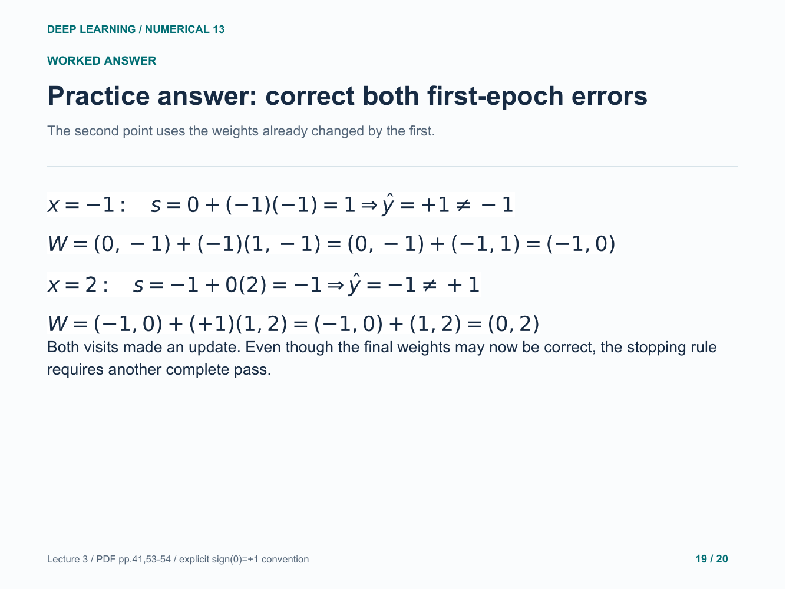

### 20. Practice answer: check the whole second epoch

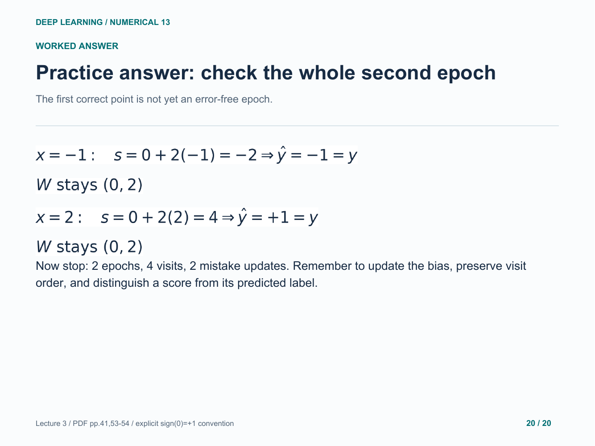

Original study example. Read the practice question before revealing the following answer pages.

[Back to numerical index](../README.md)
