# 15. Loss, empirical risk and expected risk

Compute individual losses, compare two kinds of average, and interpret empirical risk minimization.

[Open the PDF](lesson.pdf)

Lecture reference: Lecture 3 - Learning Neural Network.pdf, pages 101-107; binary cross-entropy connection to earlier logistic lesson.

## Illustrated walkthrough

### 1. Start with one prediction and one target

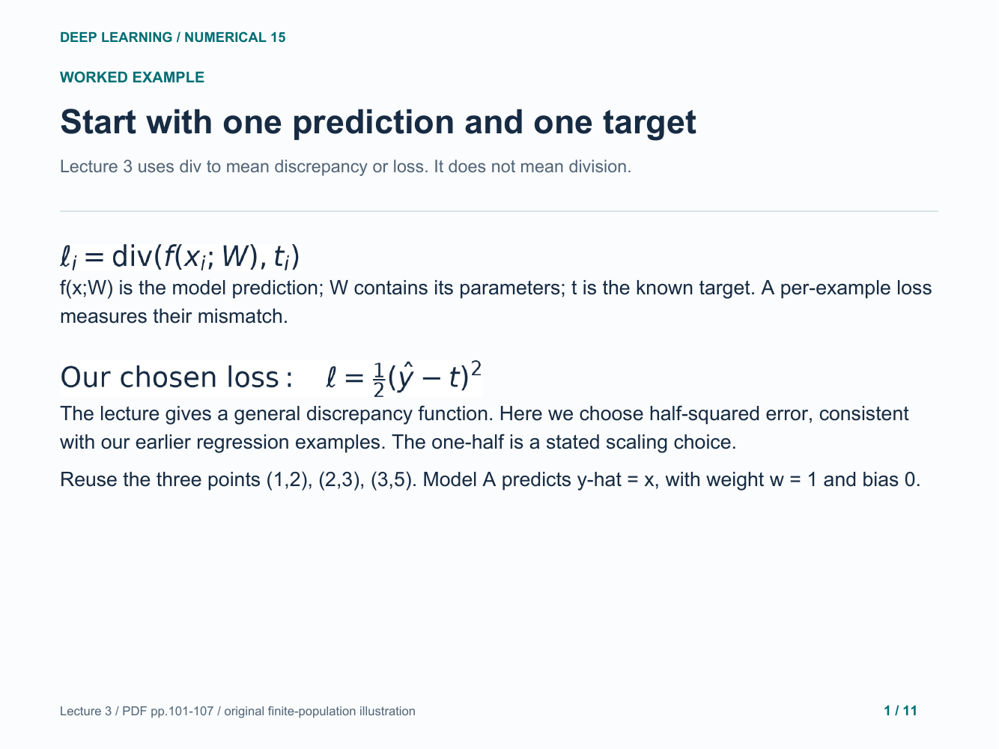

### 2. Compute all three losses before averaging

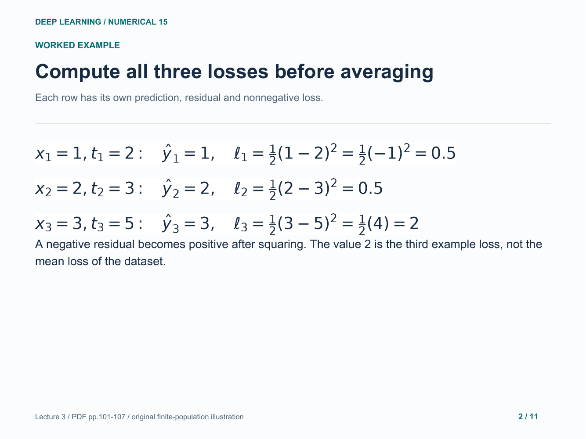

### 3. Empirical risk: average the observed sample

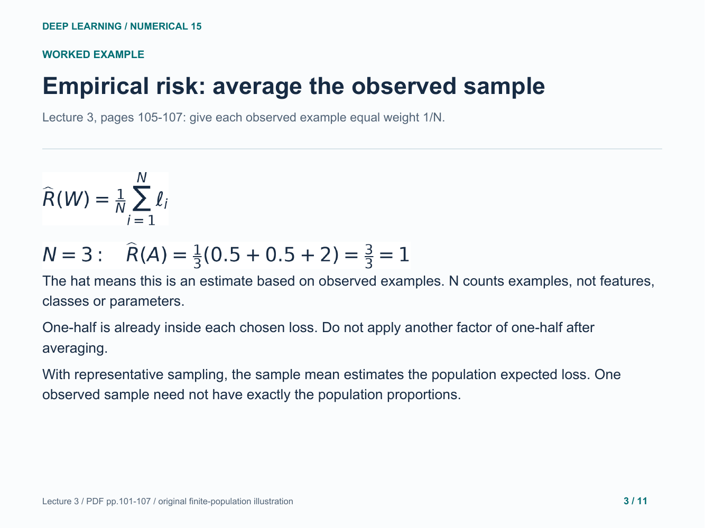

### 4. Expected risk: specify a tiny population

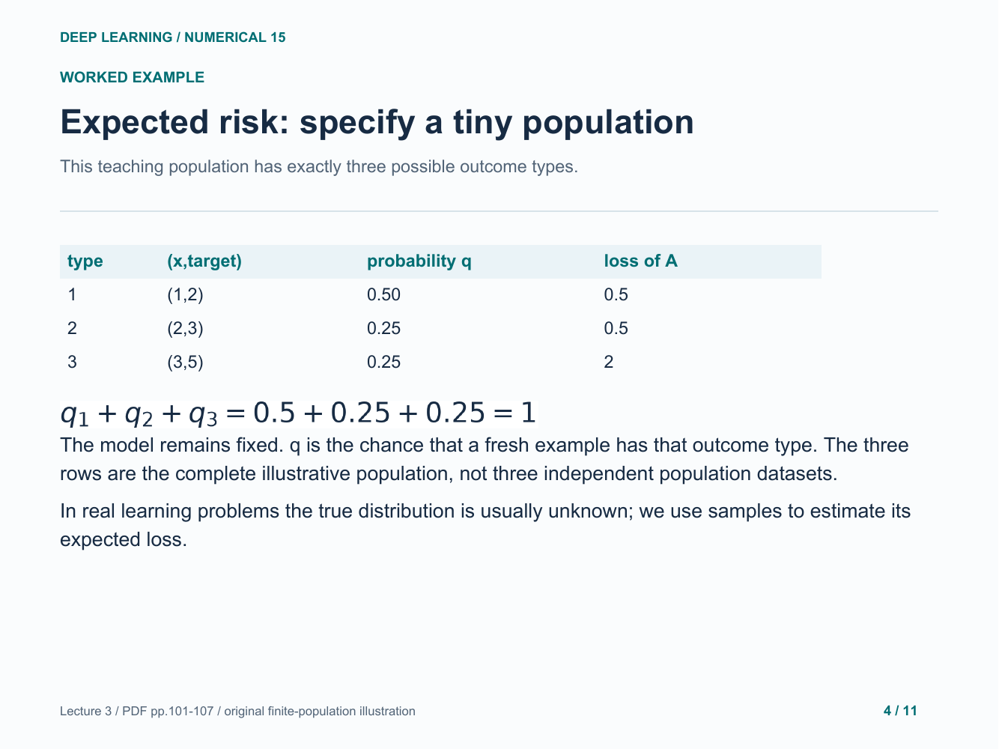

### 5. Weight each population loss by its probability

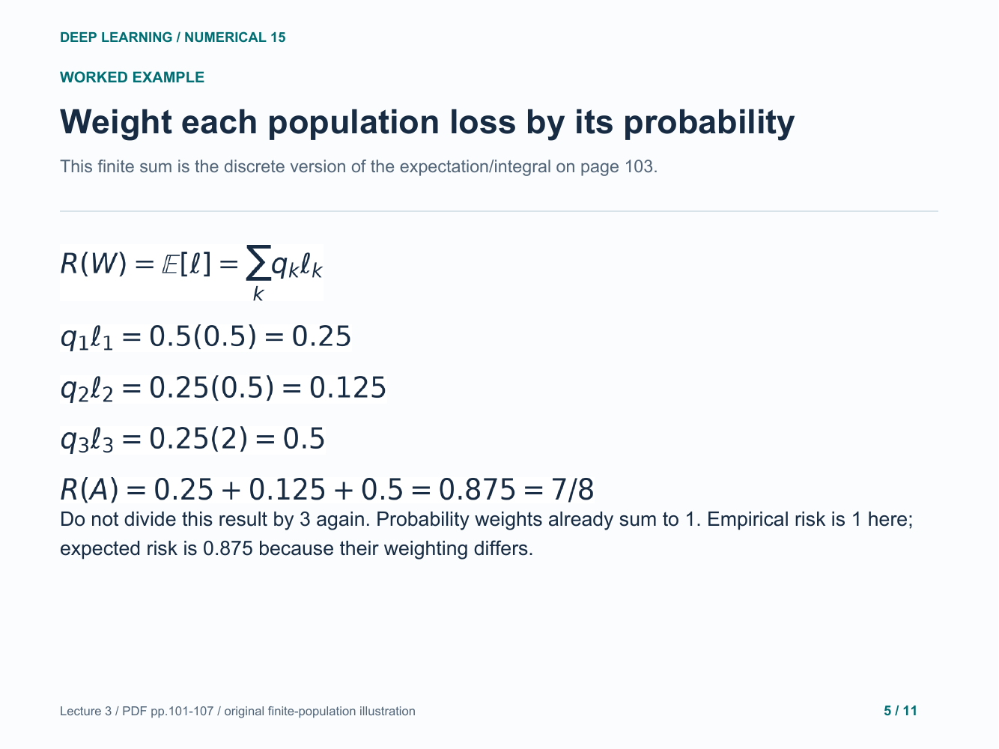

### 6. Compare a second fixed model

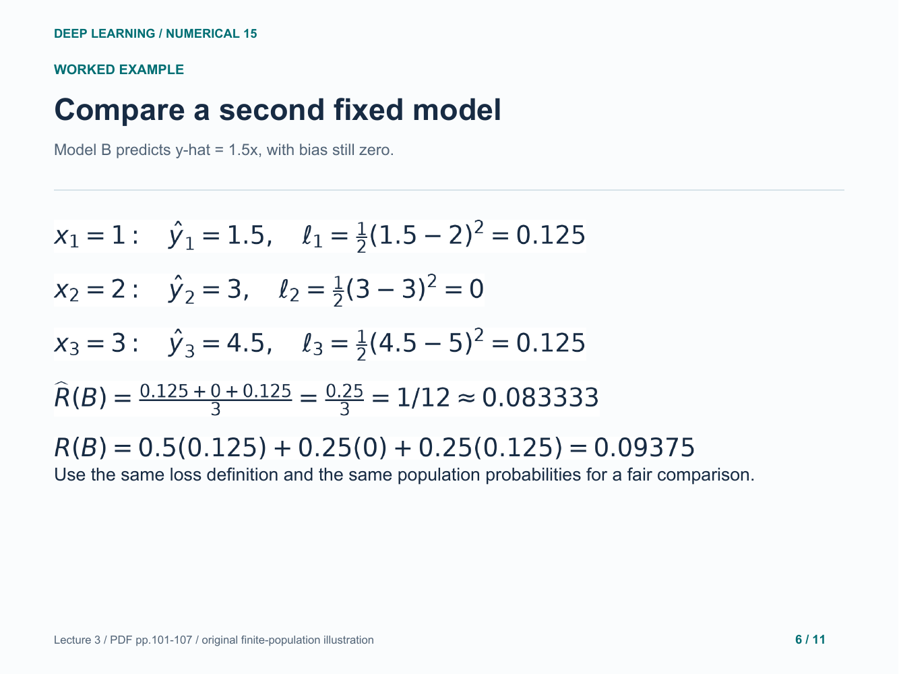

### 7. What does argmin return?

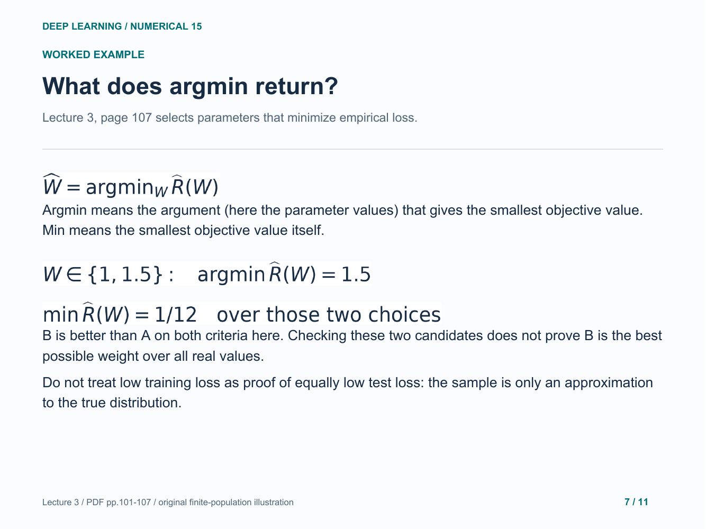

### 8. A loss can distinguish two correct predictions

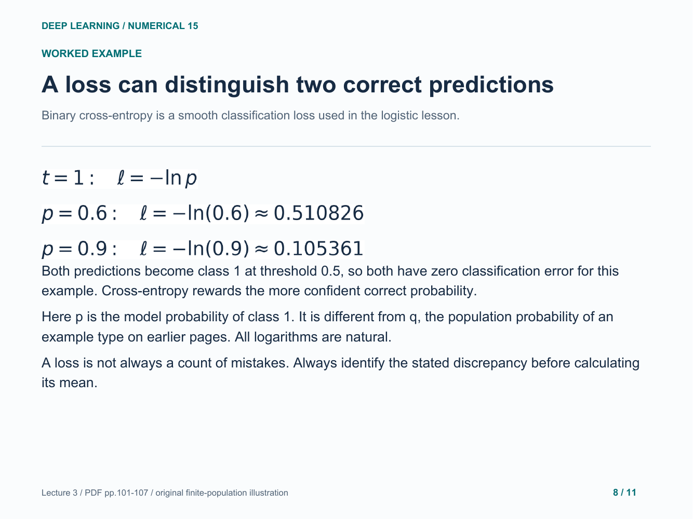

### 9. Your turn: sample mean versus population mean

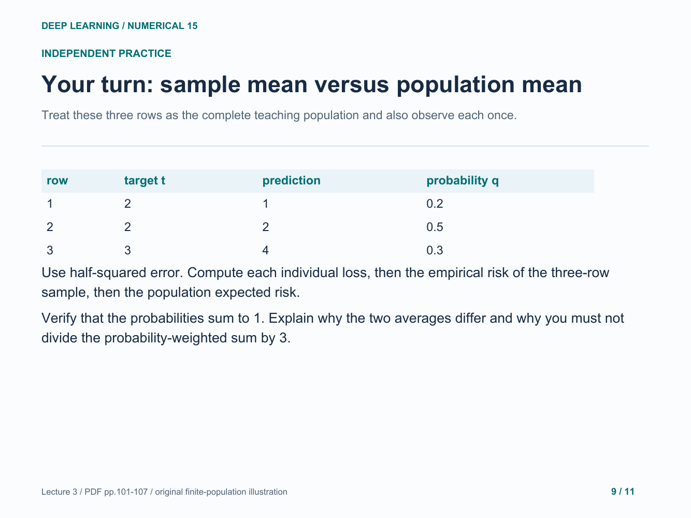

### 10. Practice answer: losses and the sample mean

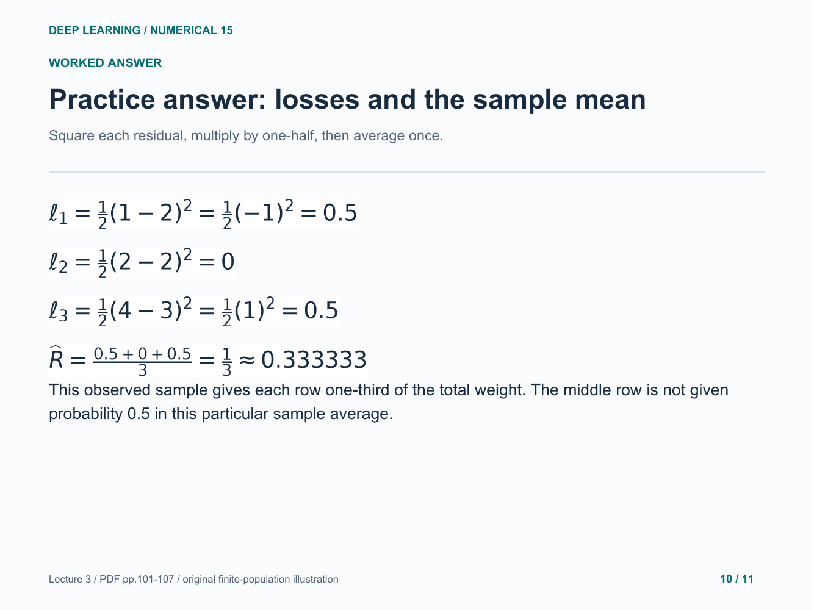

### 11. Practice answer: the population expectation

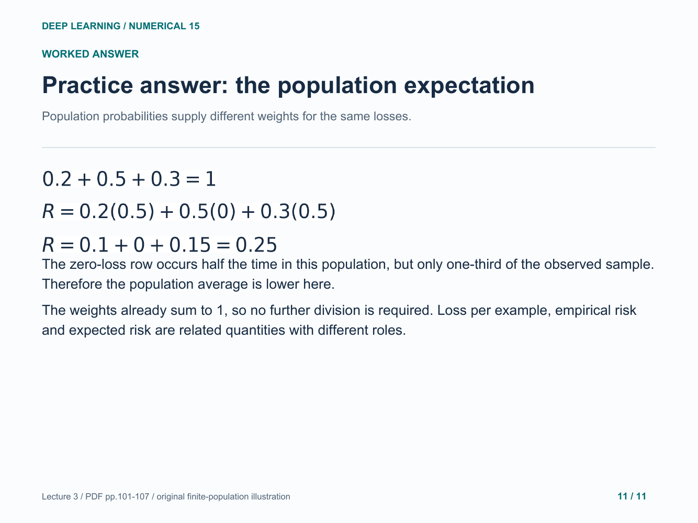

Original study example. Read the practice question before revealing the following answer pages.

[Back to numerical index](../README.md)
