# 16. Network shapes and parameter counts

Map scalar connections to matrices using the shared network for Lessons16-20.

[Open the PDF](lesson.pdf)

Lecture reference: Backpropagation_Derivation.pdf page 1; Assignment 1.pdf pages 1-3; numerical-practice.md N3.4 chosen parameters.

## Illustrated walkthrough

### 1. One network for the next five lessons

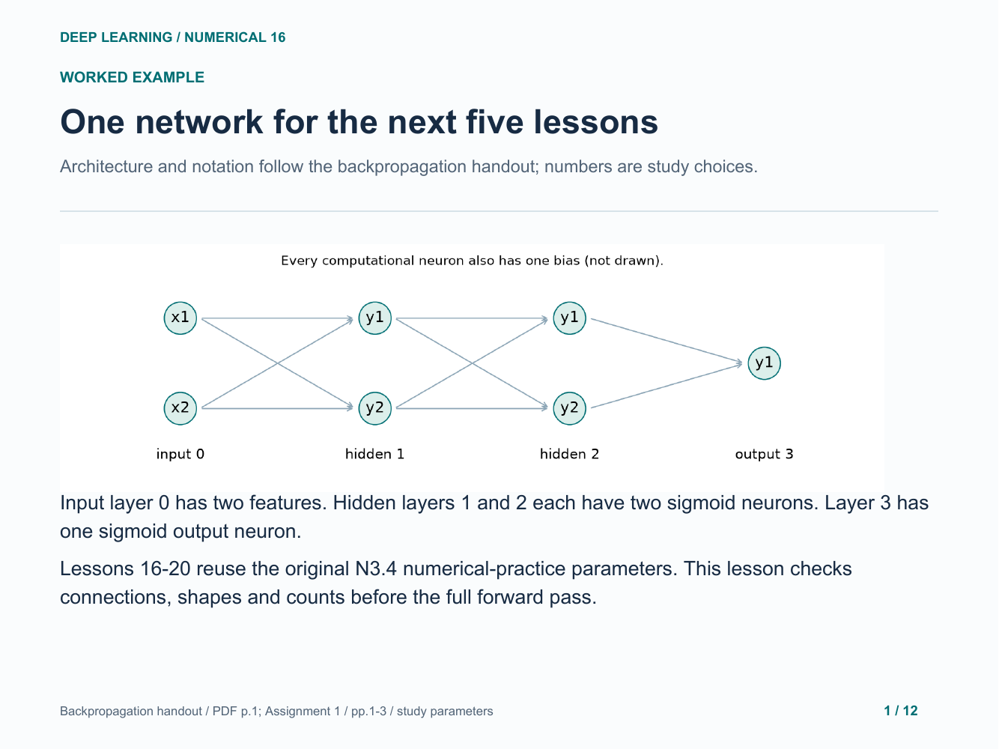

### 2. Read the weight indices as an arrow

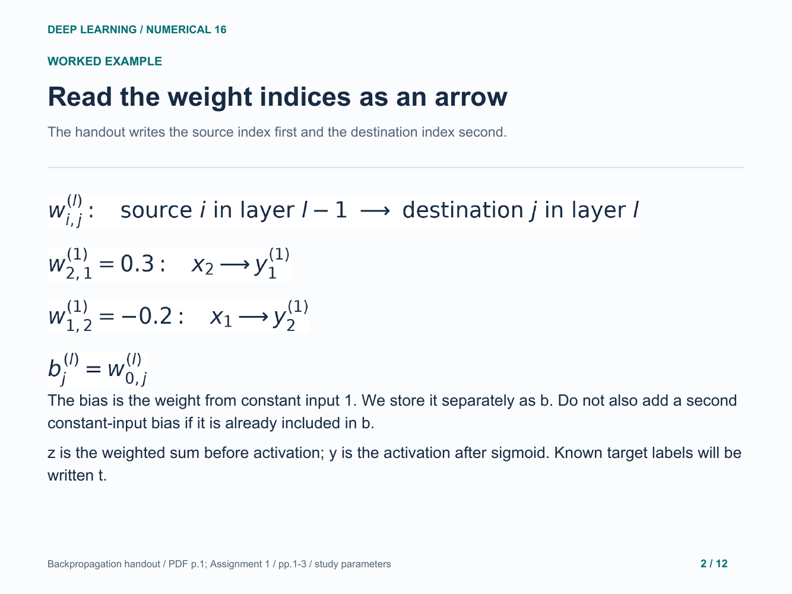

### 3. Count every weight and every bias

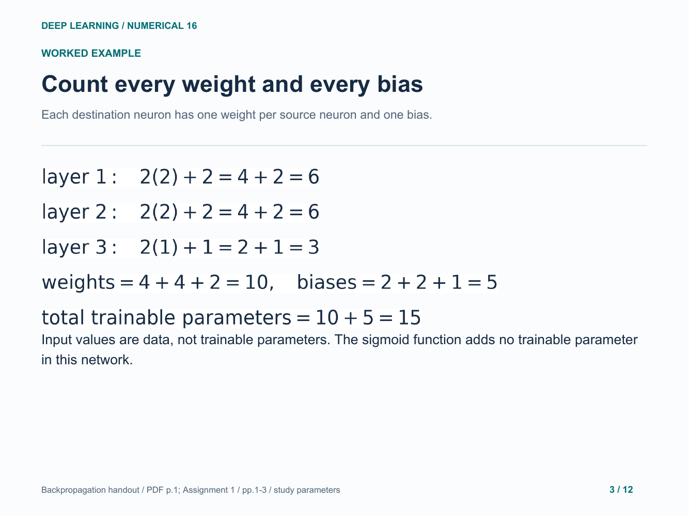

### 4. Record all original parameter values

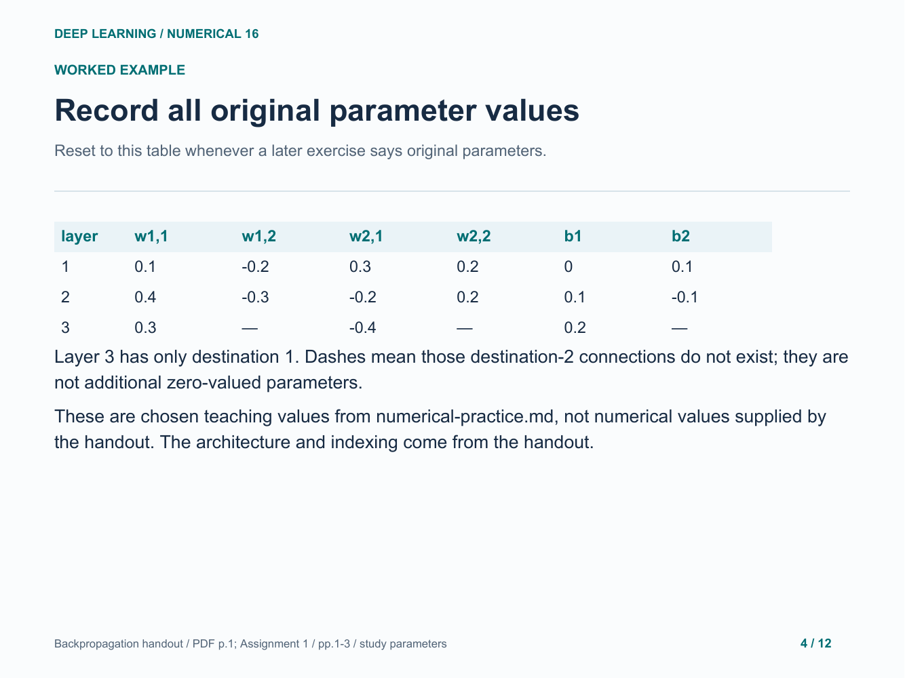

### 5. Arrange connection weights into a matrix

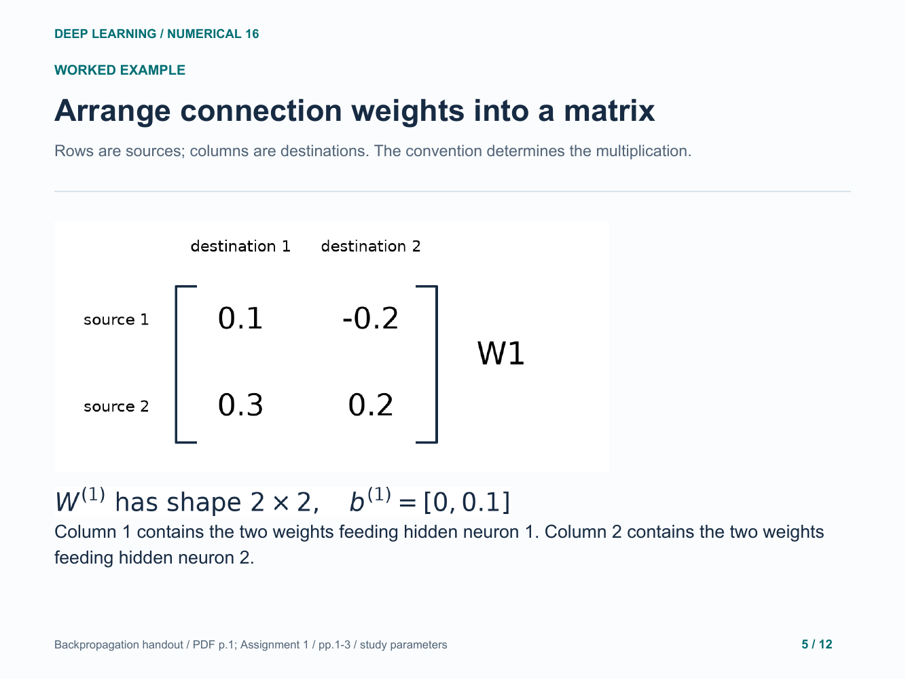

### 6. Matrix multiplication is a list of dot products

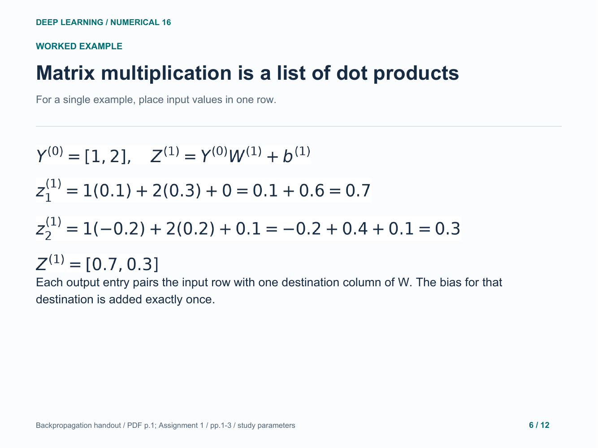

### 7. Apply sigmoid to each entry separately

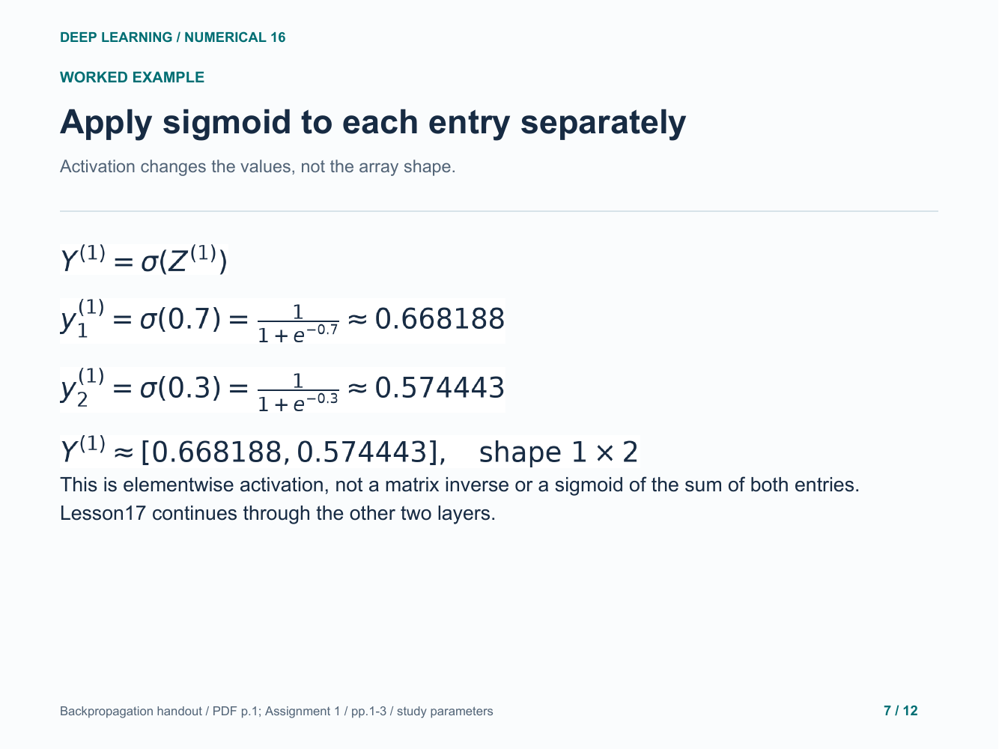

### 8. Add a second example as another row

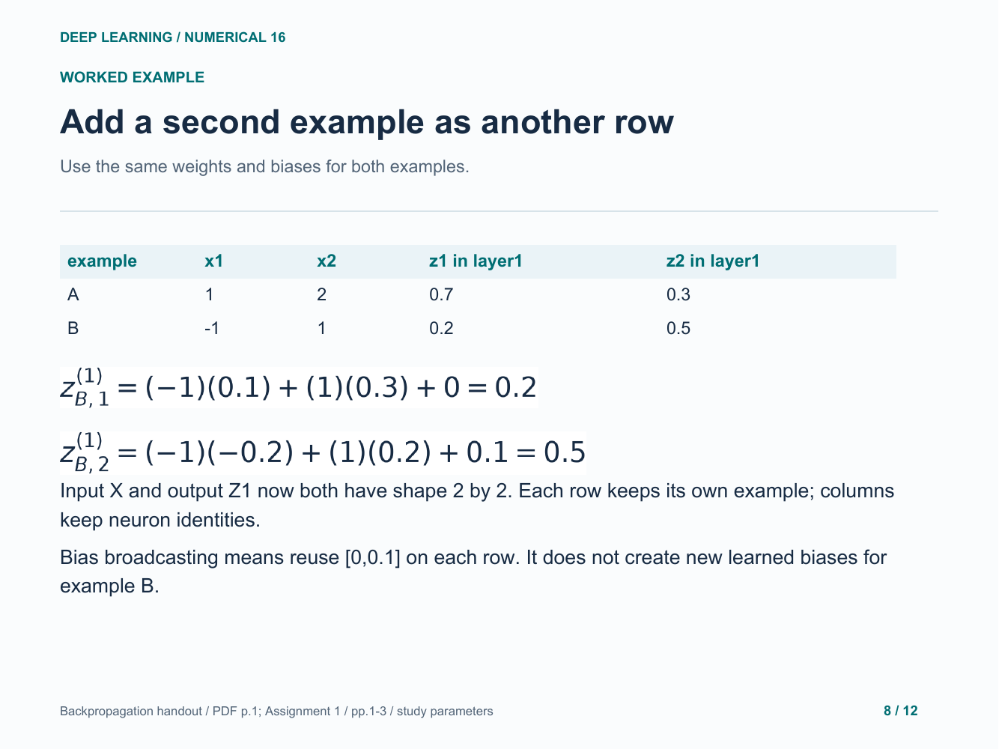

### 9. Check dimensions before multiplying

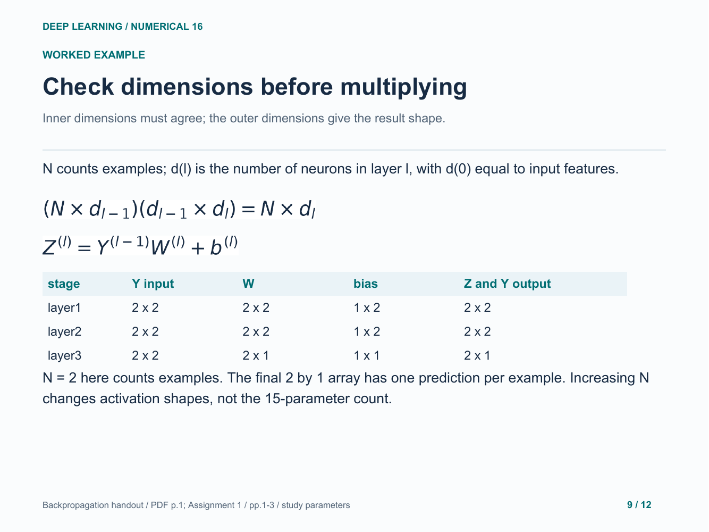

### 10. Your turn: a different small architecture

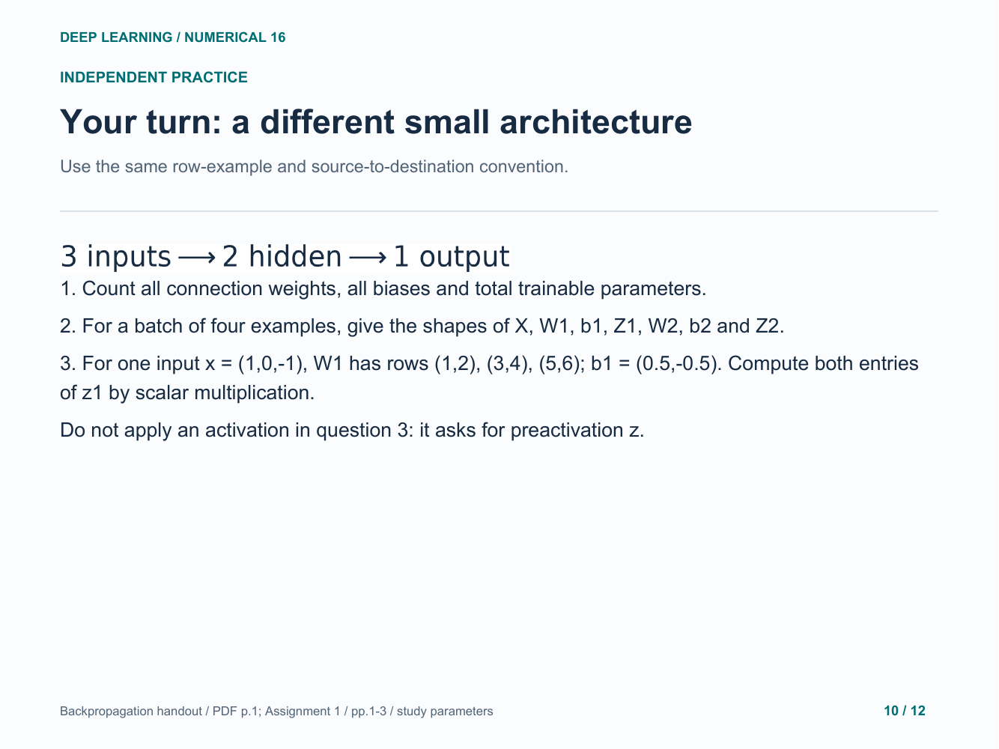

### 11. Practice answer: count and check shapes

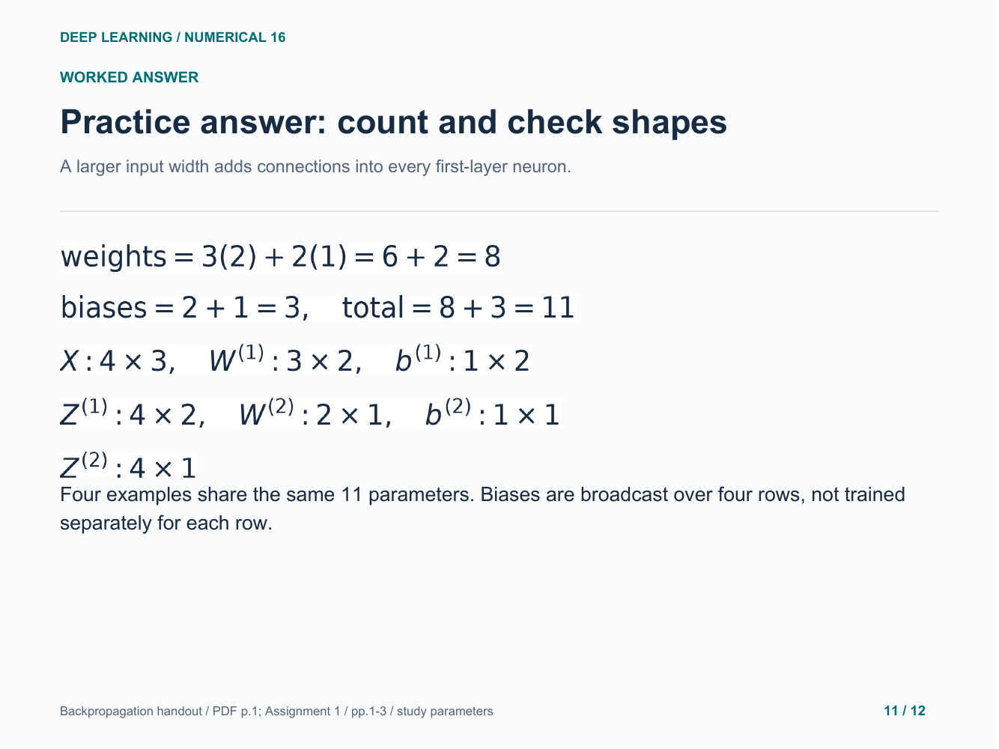

### 12. Practice answer: multiply one row by columns

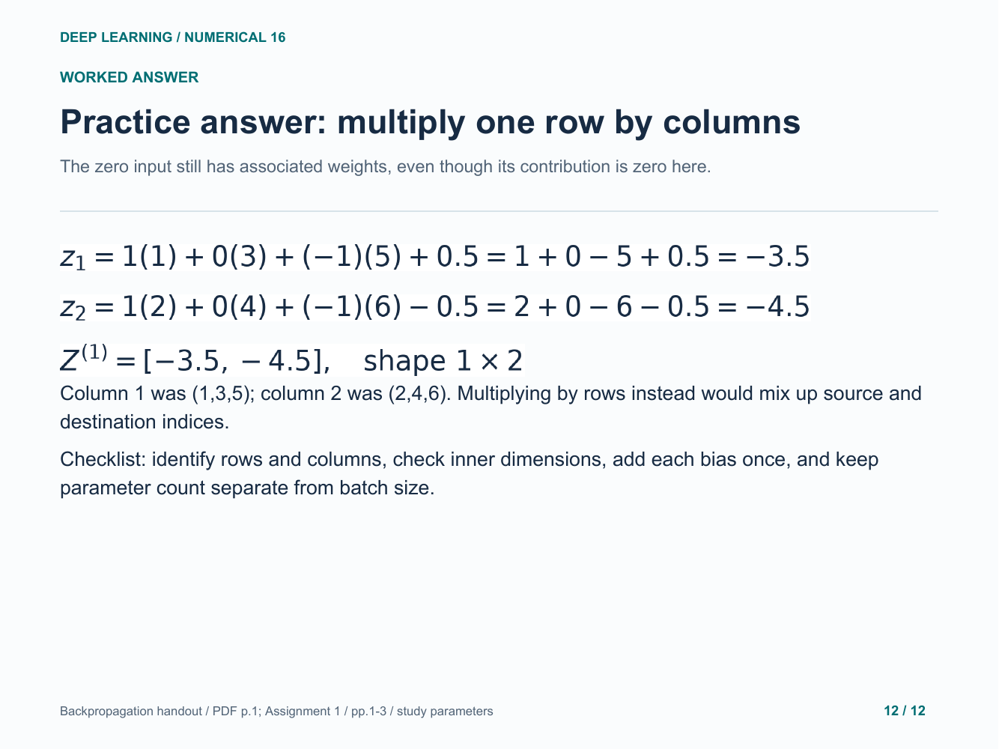

Original study example. Read the practice question before revealing the following answer pages.

[Back to numerical index](../README.md)
