# 18. Output-layer backpropagation

Derive sigmoid/BCE delta, calculate every output gradient, and verify sensitivity with a target-flip practice.

[Open the PDF](lesson.pdf)

Lecture reference: Backpropagation_Derivation.pdf pages 2-3, sections 4-5.2; numerical-practice.md N3.4 and N3.6.

## Illustrated walkthrough

### 1. Start from the saved forward pass

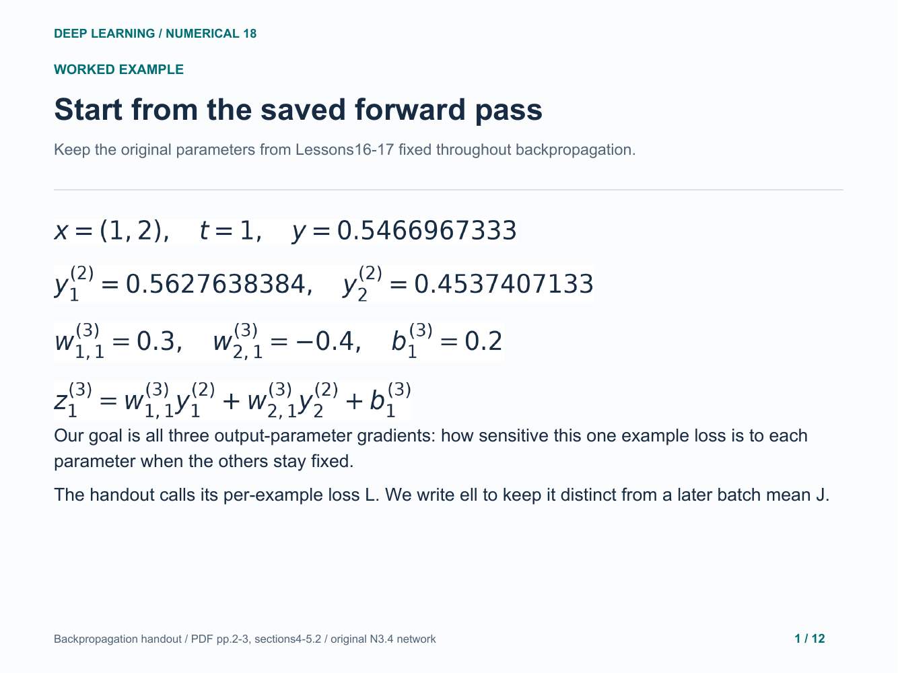

### 2. Delta measures sensitivity to preactivation

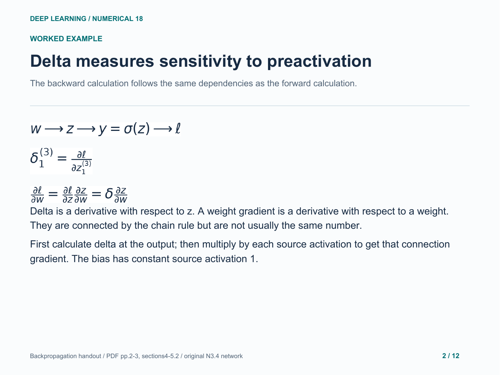

### 3. Differentiate binary cross-entropy

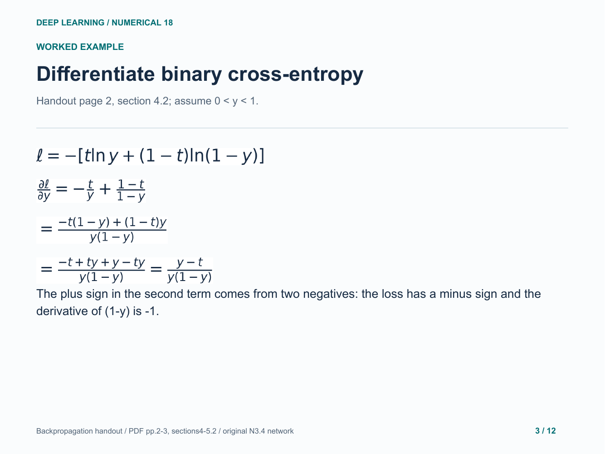

### 4. Cancel the sigmoid derivative once

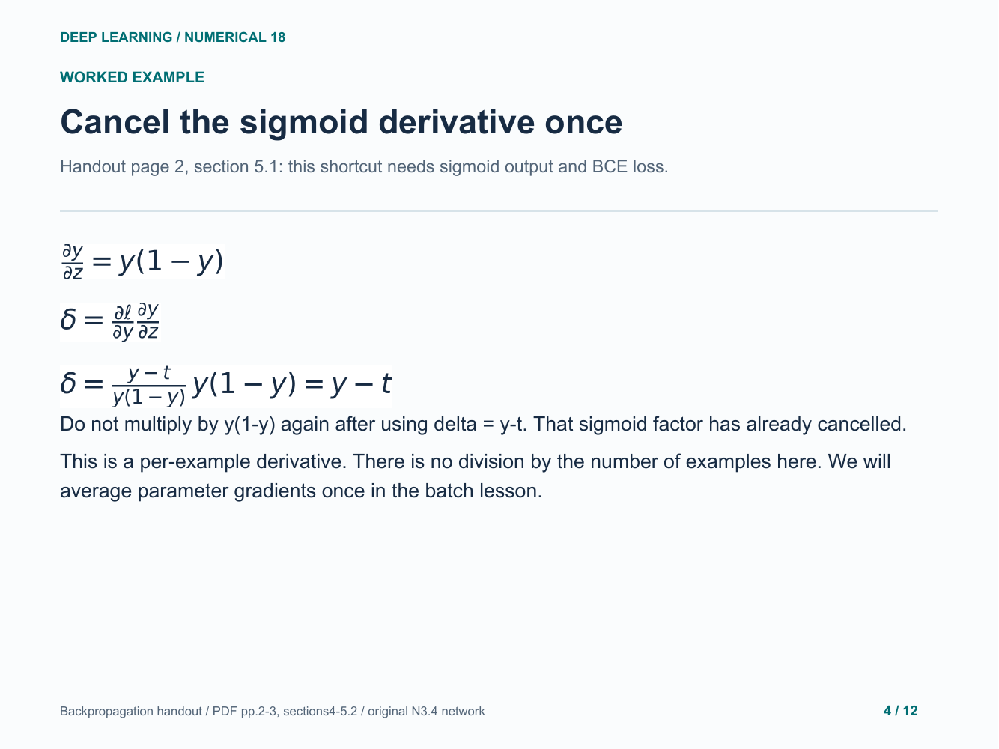

### 5. Check both factors numerically

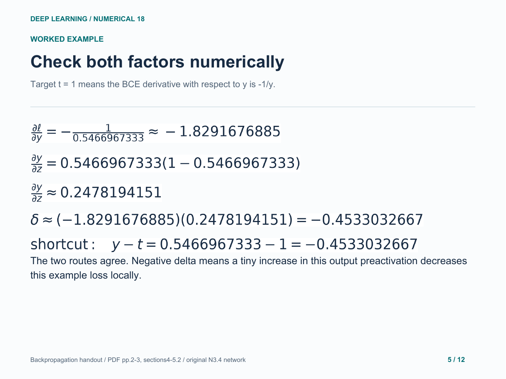

### 6. First output weight: use its source activation

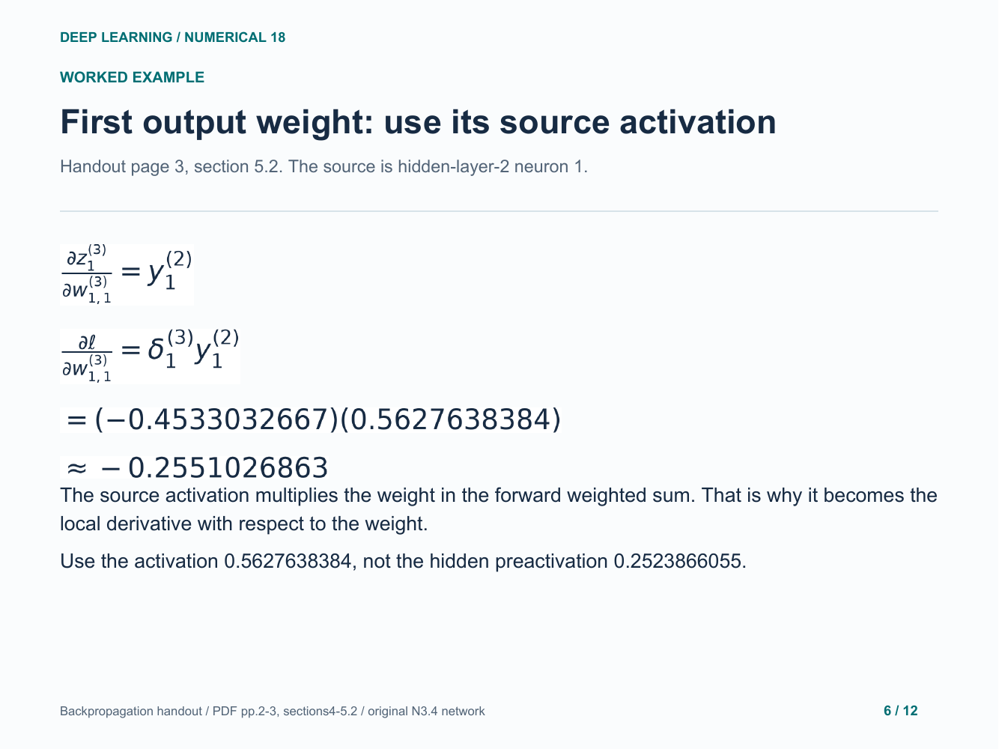

### 7. Second output weight: keep its own source

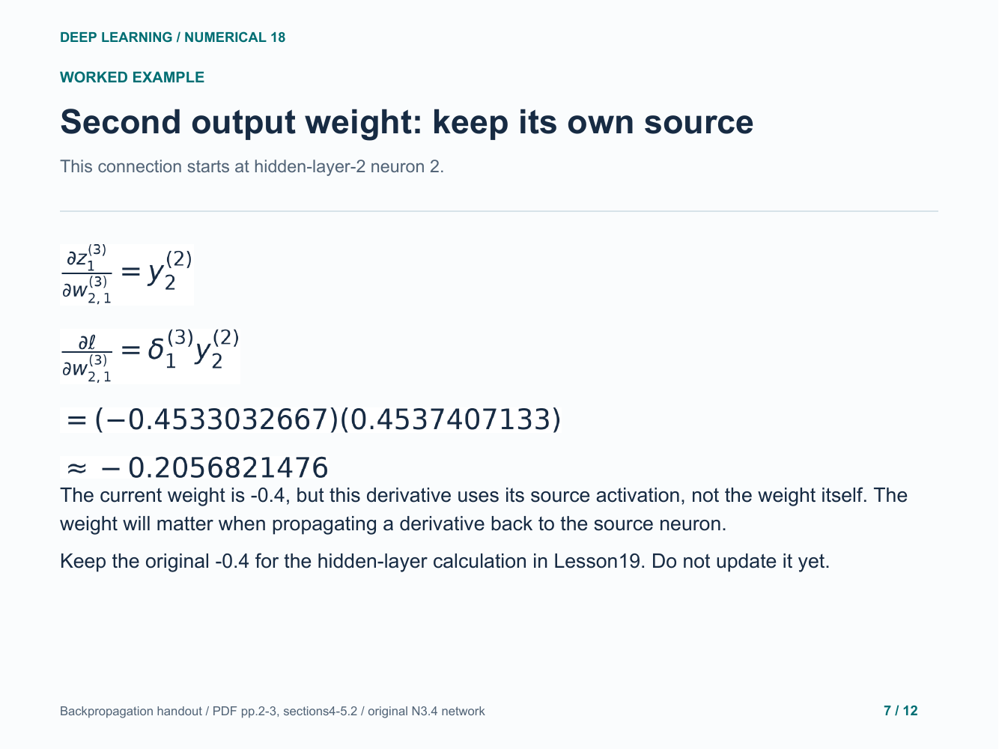

### 8. Output bias: the source is constant one

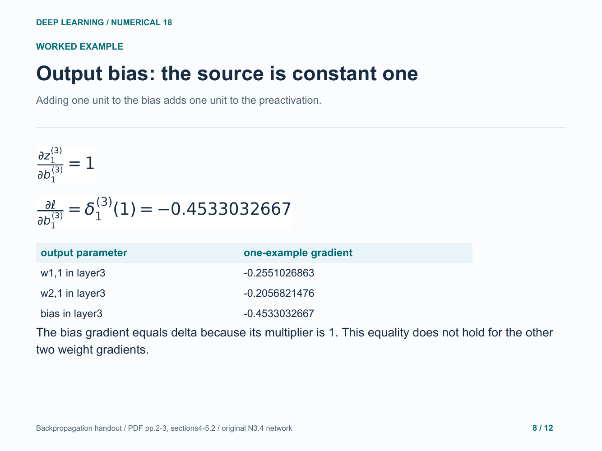

### 9. What does a negative gradient predict?

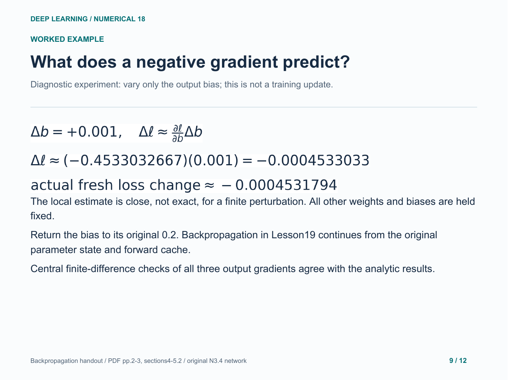

### 10. Your turn: flip only the known target

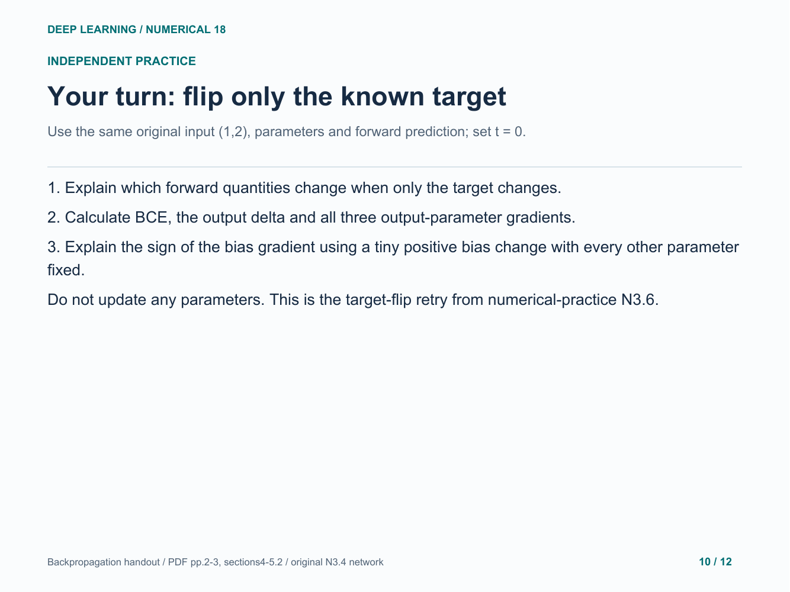

### 11. Practice answer: prediction stays the same

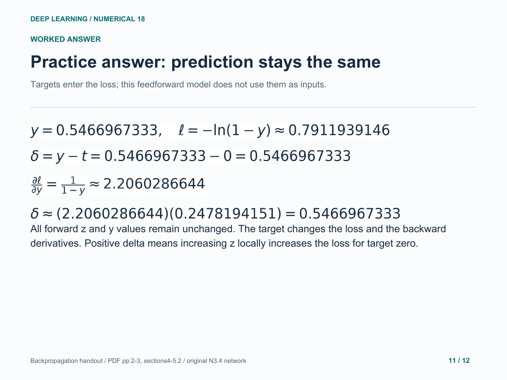

### 12. Practice answer: all three output gradients

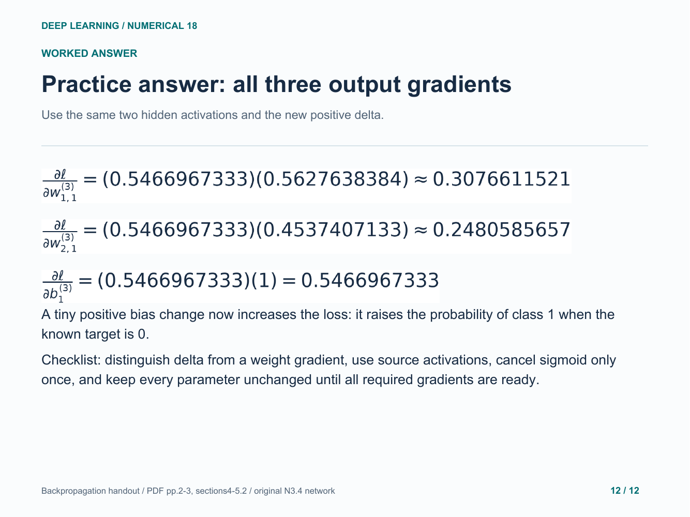

Original study example. Read the practice question before revealing the following answer pages.

[Back to numerical index](../README.md)
