# 23. Sigmoid saturation and loss choice

Compare half-squared error and BCE on the same wrong prediction, derive every gradient, and work both parameter updates with a fresh practice.

[Open the PDF](lesson.pdf)

Lecture reference: Lecture4 PDF pages8-26: saturation/squared divergence, unhalved formula page12; Backpropagation_Derivation.pdf page2: sigmoid+BCE; numerical-practice.md N4.1. Half-square study convention explicitly labeled.

## Illustrated walkthrough

### 1. The same wrong prediction, two loss functions

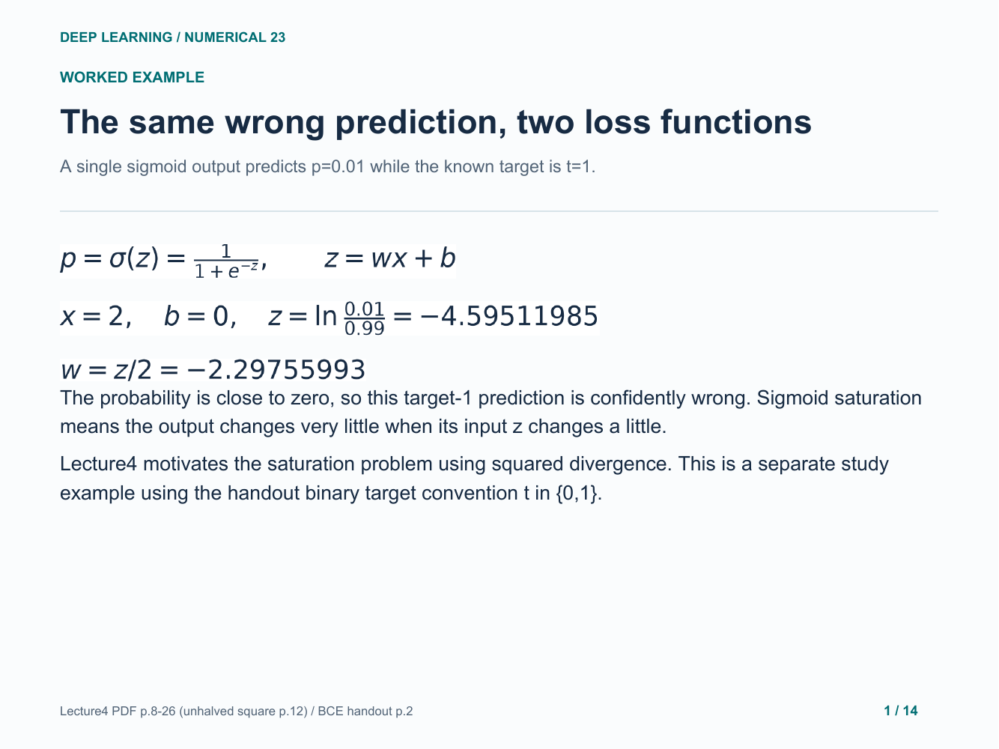

### 2. State the loss scaling before differentiating

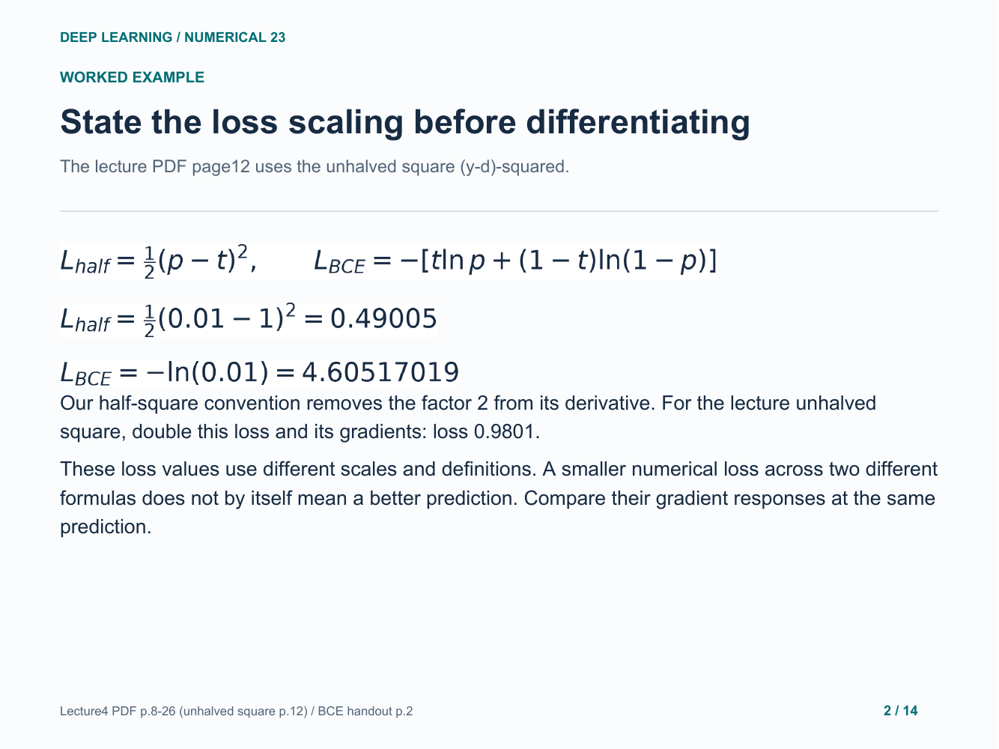

### 3. Half-squared error keeps the small sigmoid slope

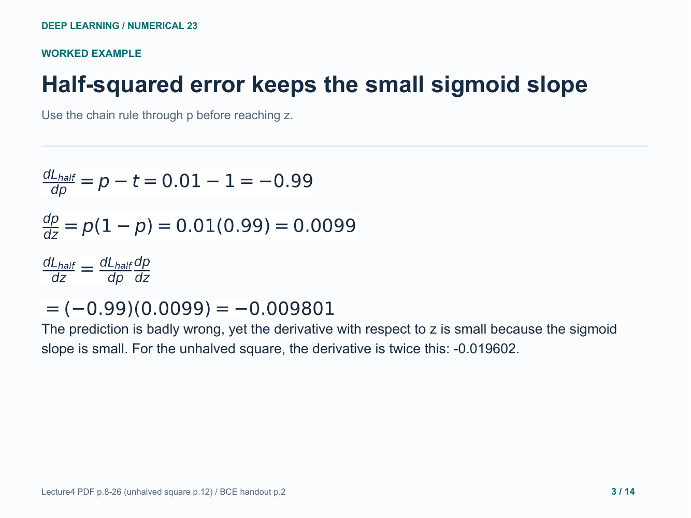

### 4. BCE cancels the sigmoid factor

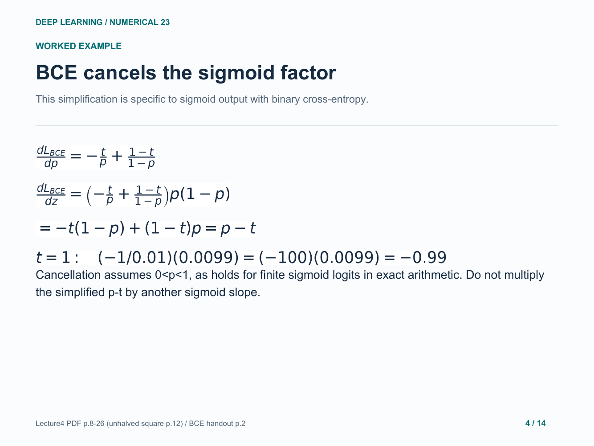

### 5. Translate each output derivative into parameters

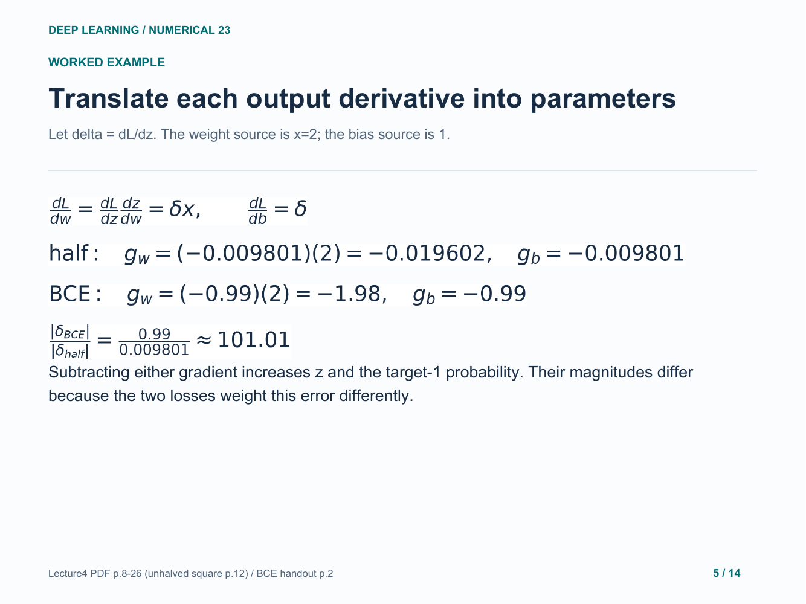

### 6. one step with half-squared error

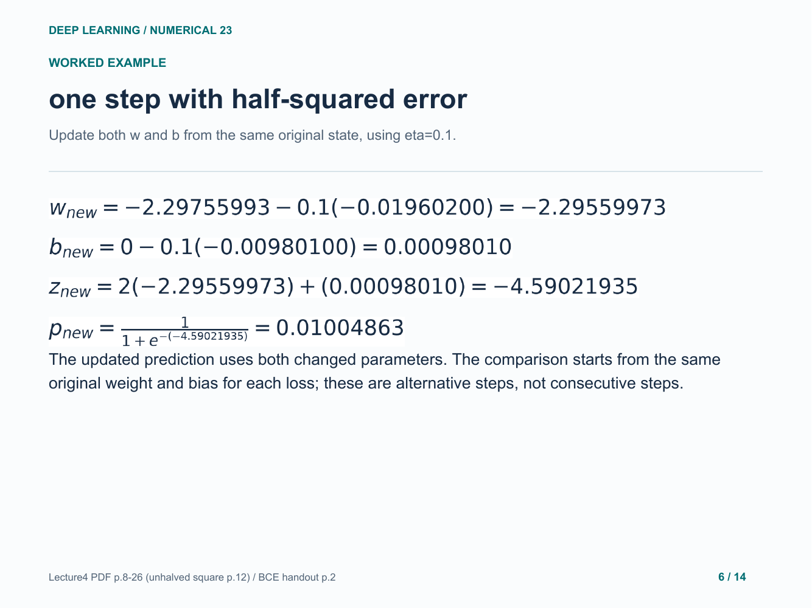

### 7. one step with BCE

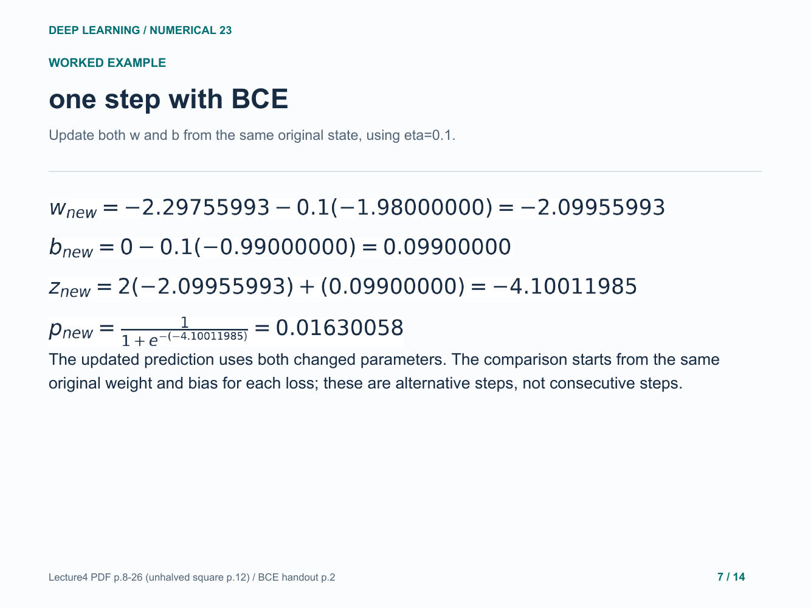

### 8. Why the logit change contains x-squared

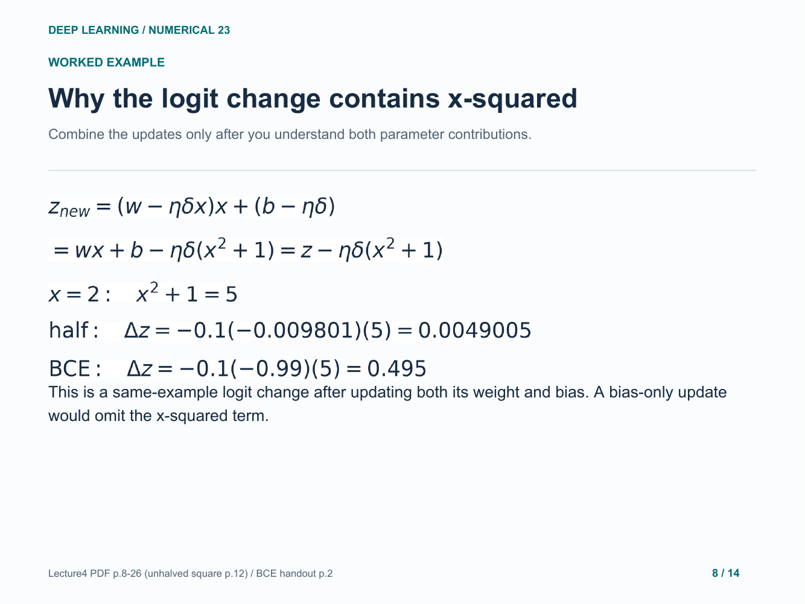

### 9. Where sigmoid becomes insensitive

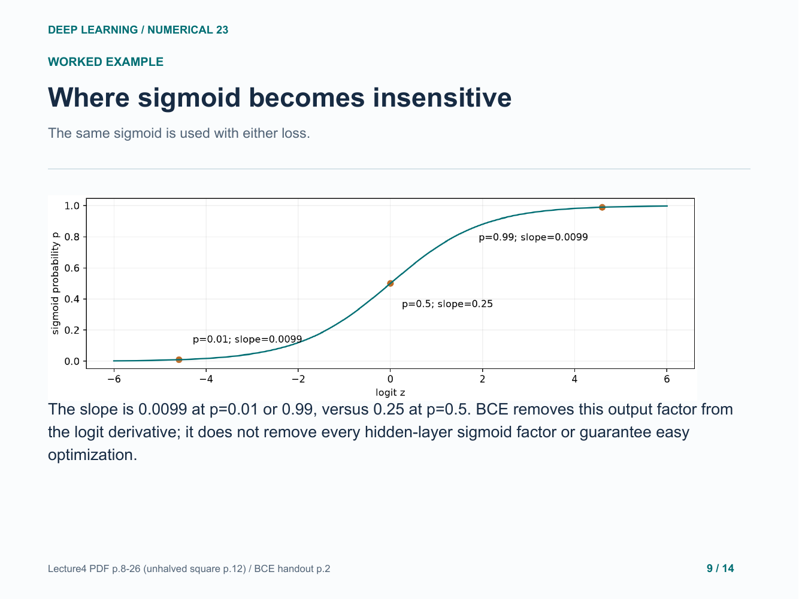

### 10. Your turn: a wrong target-zero prediction

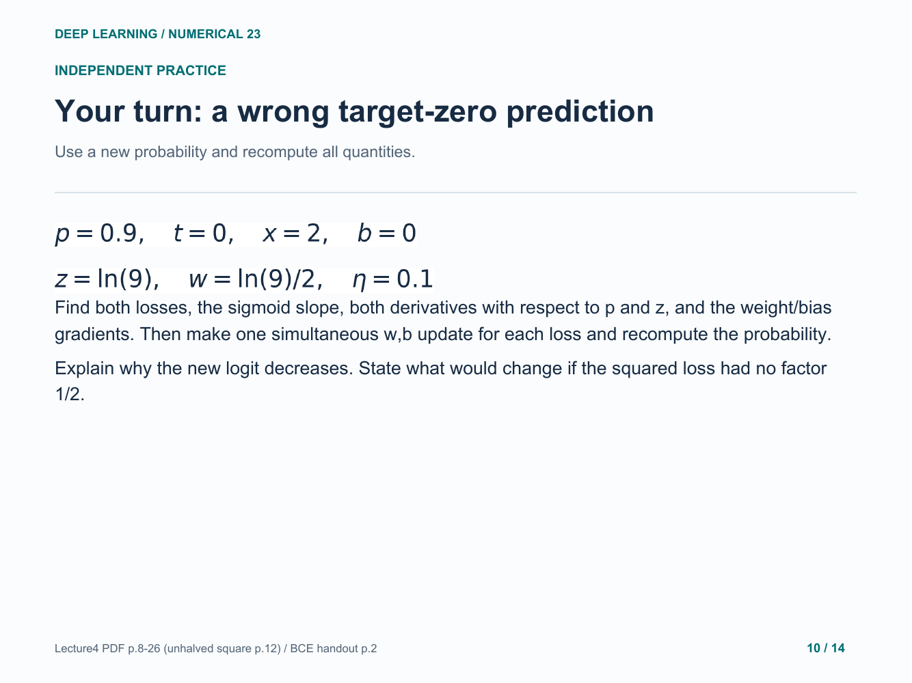

### 11. Practice: losses and full chain-rule arithmetic

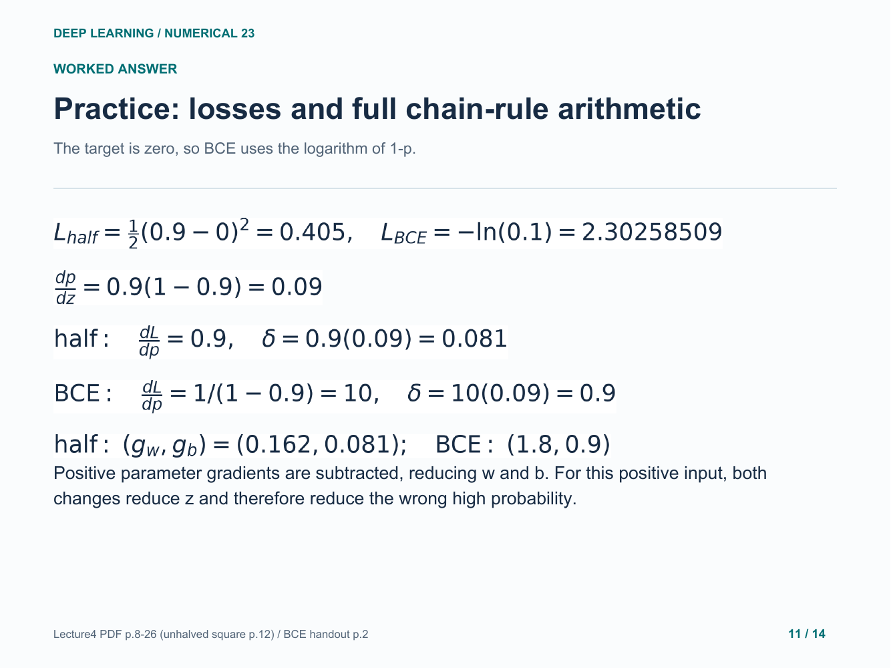

### 12. Practice: one step with half-squared error

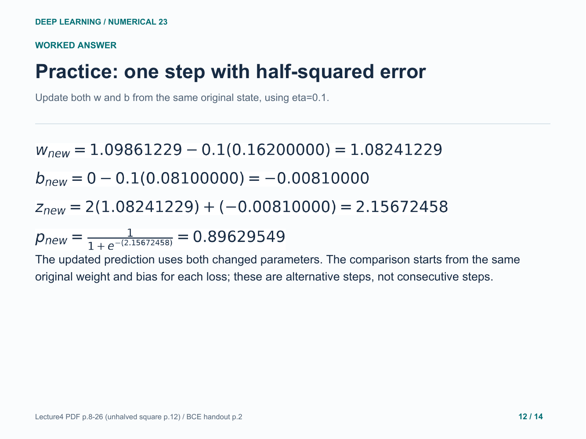

### 13. Practice: one step with BCE

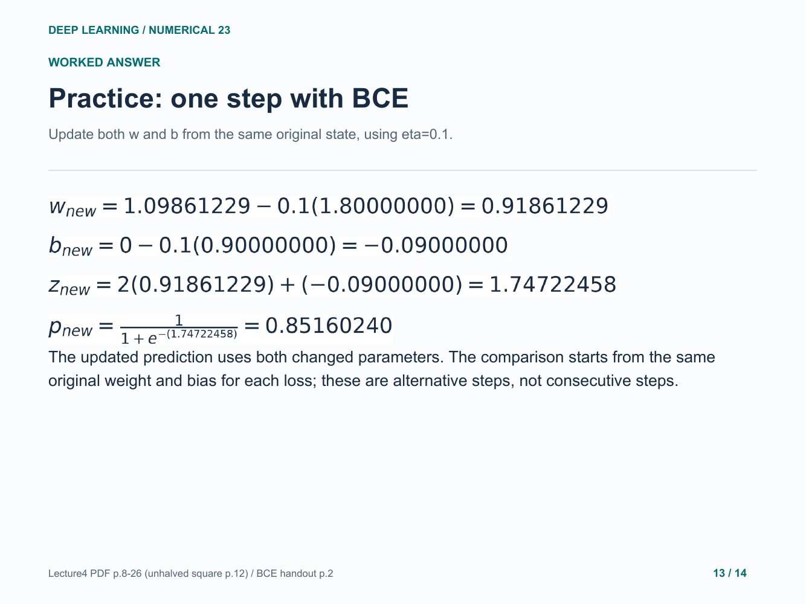

### 14. Practice checks and the scope of the conclusion

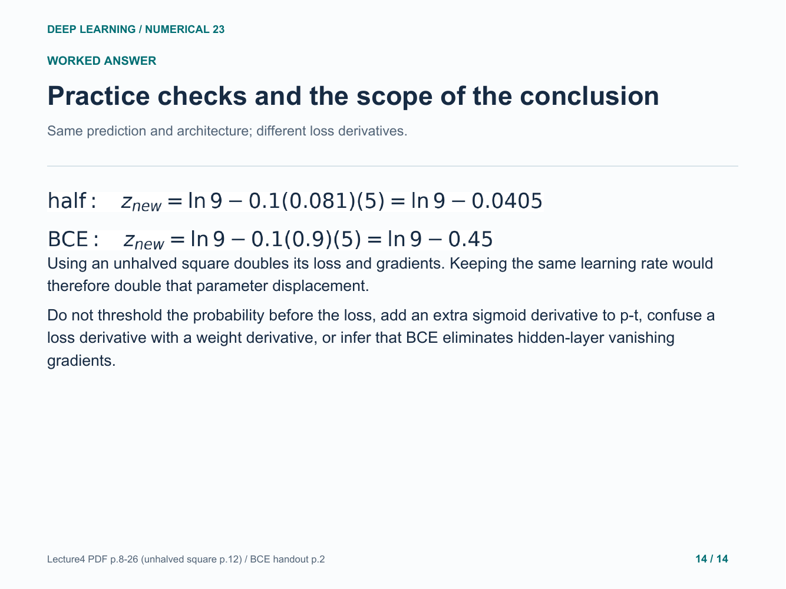

Original study example. Read the practice question before revealing the following answer pages.

[Back to numerical index](../README.md)
