# 24. Newton method and curvature correction

Solve a full Newton correction, compare gradient descent from the same point, and work a fresh practice with saddle/singular counterexamples.

[Open the PDF](lesson.pdf)

Lecture reference: Lecture4 PDF pages33-36: scalar curvature; pages47-52: normalized multivariate update and Hessian issues, eta included on page50. numerical-practice.md N4.3.

## Illustrated walkthrough

### 1. Newton uses slope and curvature together

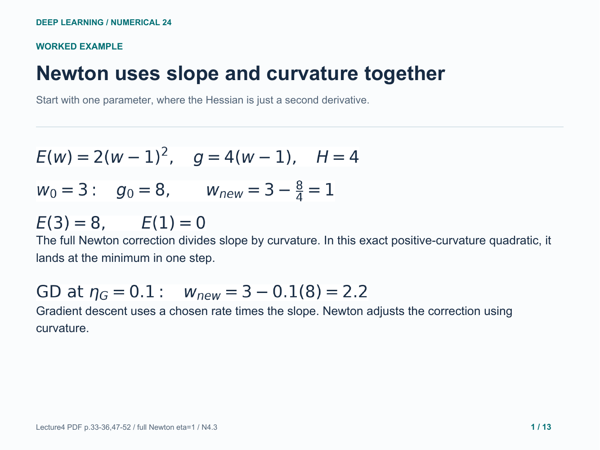

### 2. Map the lecture formula to a linear system

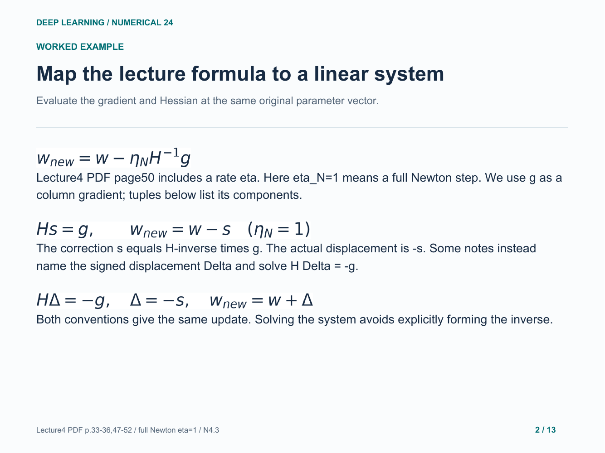

### 3. Compute the mixed-quadratic ingredients

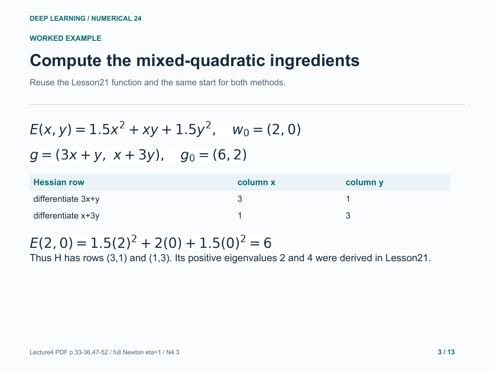

### 4. Solve for the Newton correction by elimination

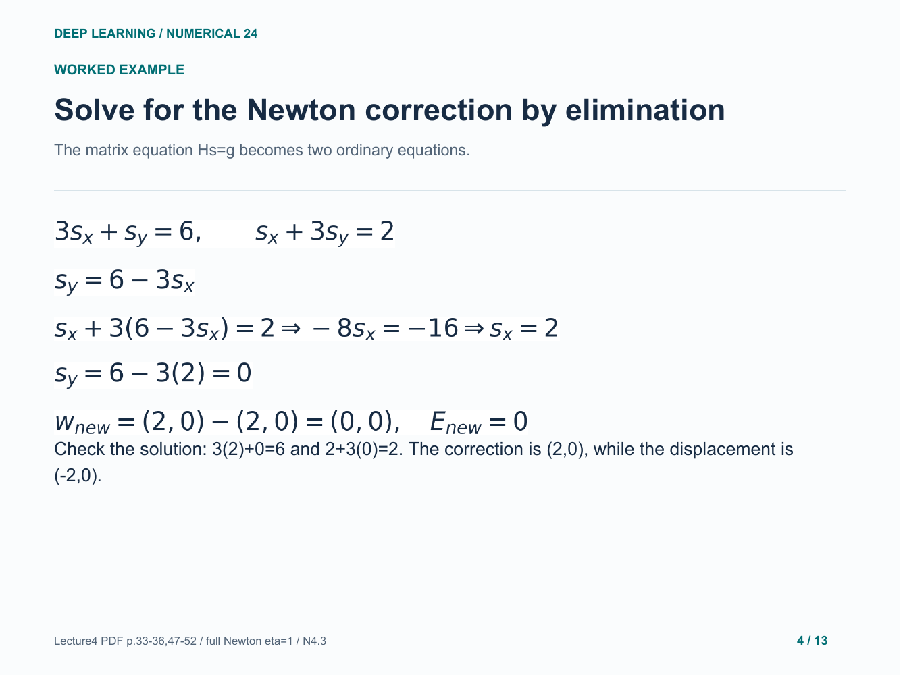

### 5. Optional check: the two-by-two inverse

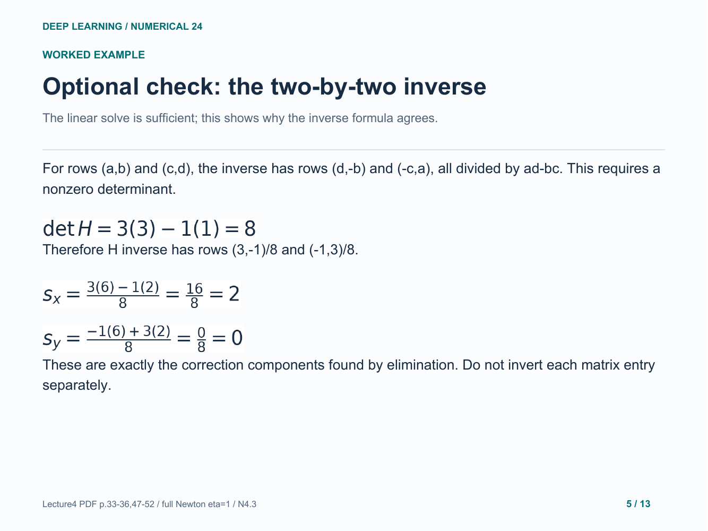

### 6. Compare gradient descent from the same start

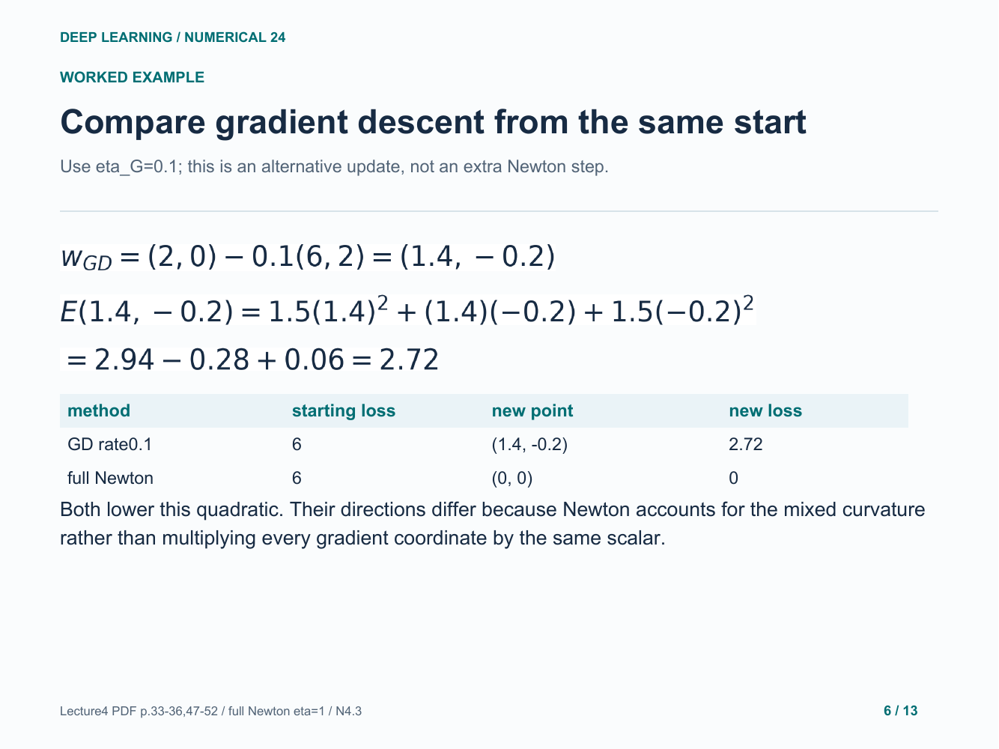

### 7. Two alternative arrows from one starting point

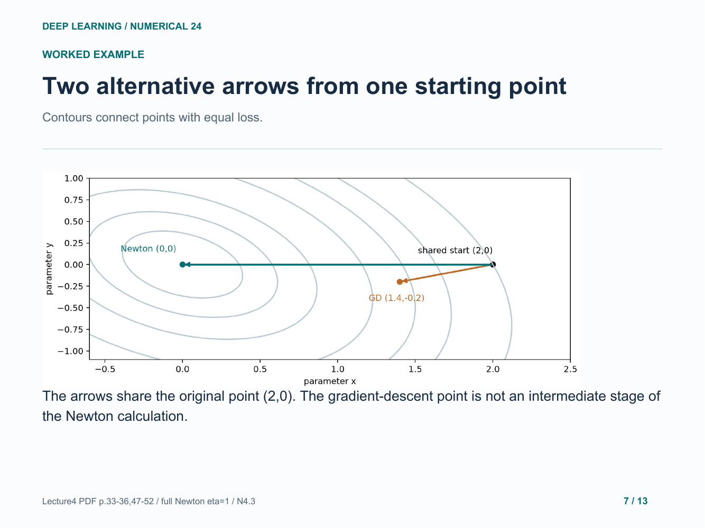

### 8. Why the exact quadratic finishes in one full step

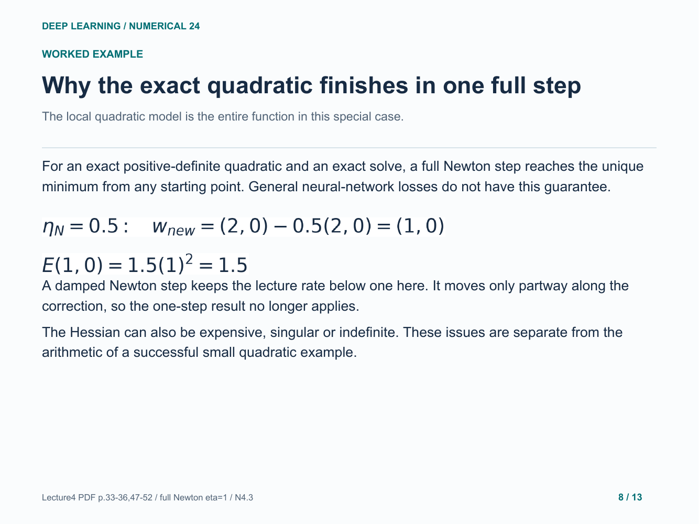

### 9. An invertible Hessian can lead to a saddle

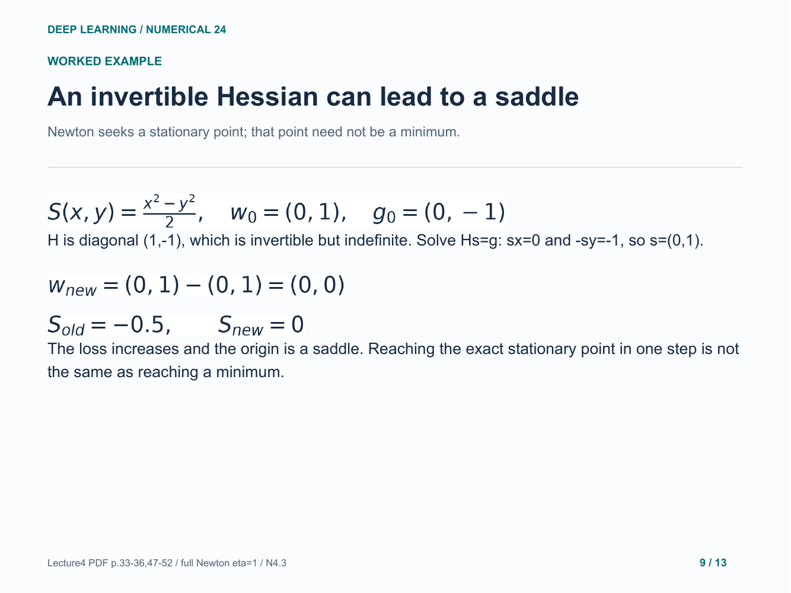

### 10. A singular Hessian makes the raw formula undefined

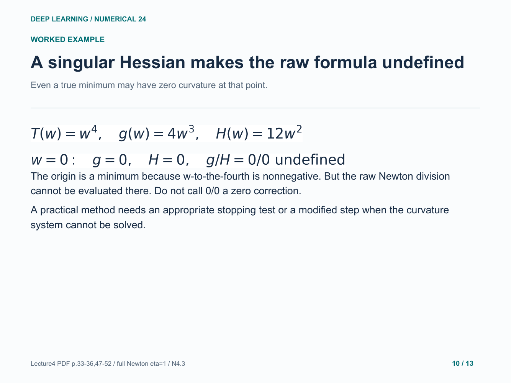

### 11. Your turn: a fresh mixed quadratic

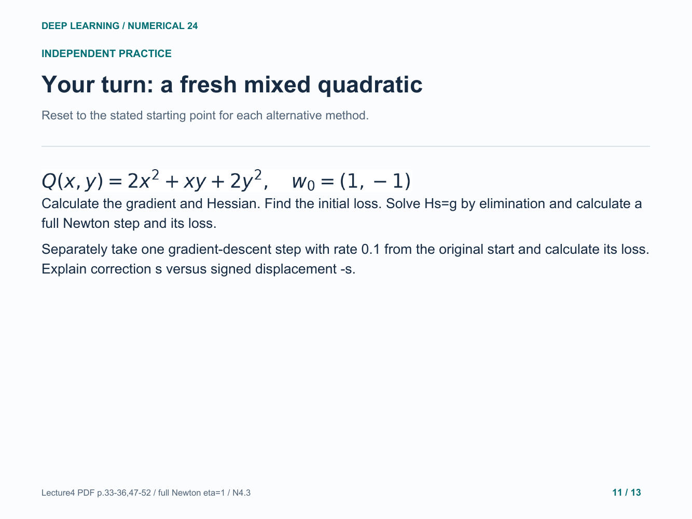

### 12. Practice: ingredients and elimination

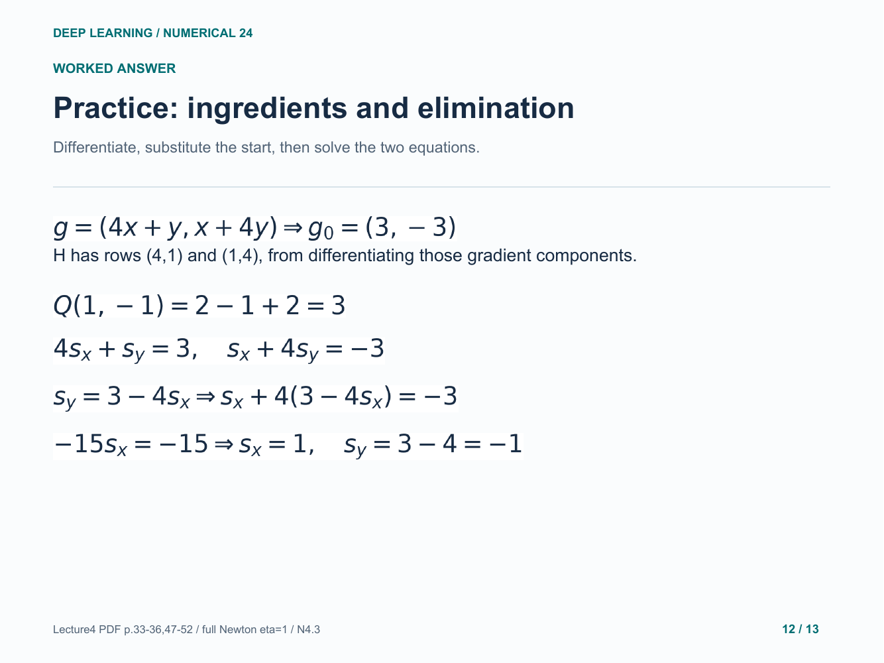

### 13. Practice: both updates and both losses

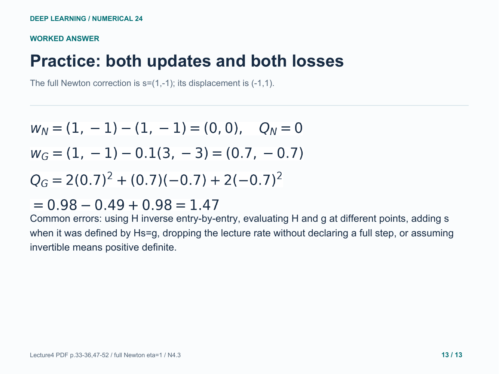

Original study example. Read the practice question before revealing the following answer pages.

[Back to numerical index](../README.md)
