# 25. Learning-rate schedules and indexing

Substitute every schedule index, apply changing rates to gradient descent, trace a plateau rule, and solve fresh practice.

[Open the PDF](lesson.pdf)

Lecture reference: Lecture4 PDF page57: reciprocal-linear, reciprocal-quadratic, exponential and stagnation-triggered multiplicative decay. numerical-practice.md N4.4; precise plateau counter is a labeled study extension.

## Illustrated walkthrough

### 1. Read the exact schedule and its index

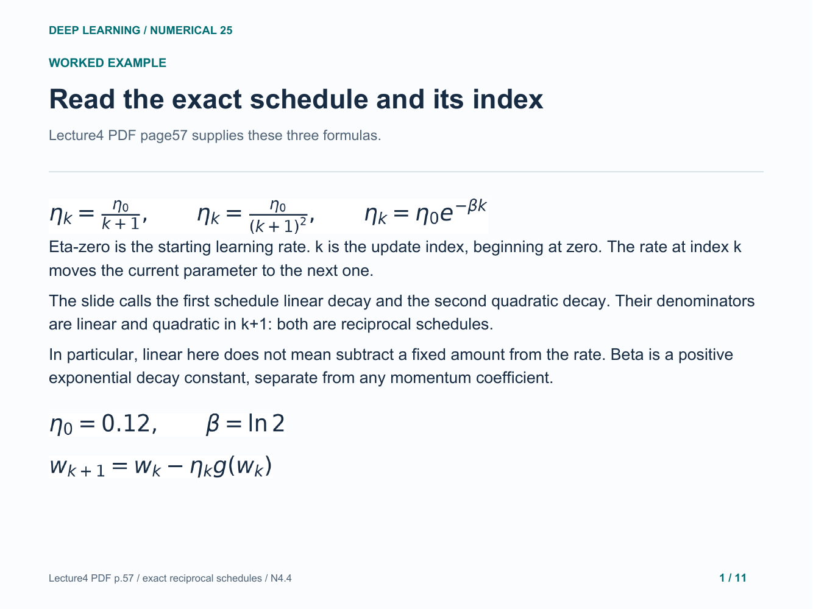

### 2. Reciprocal linear: substitute k before dividing

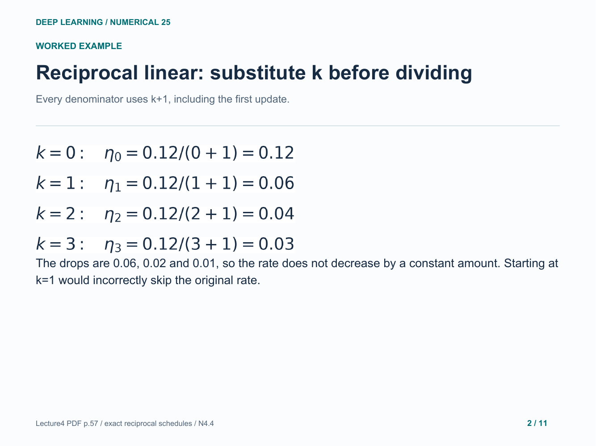

### 3. Reciprocal quadratic: square the whole denominator

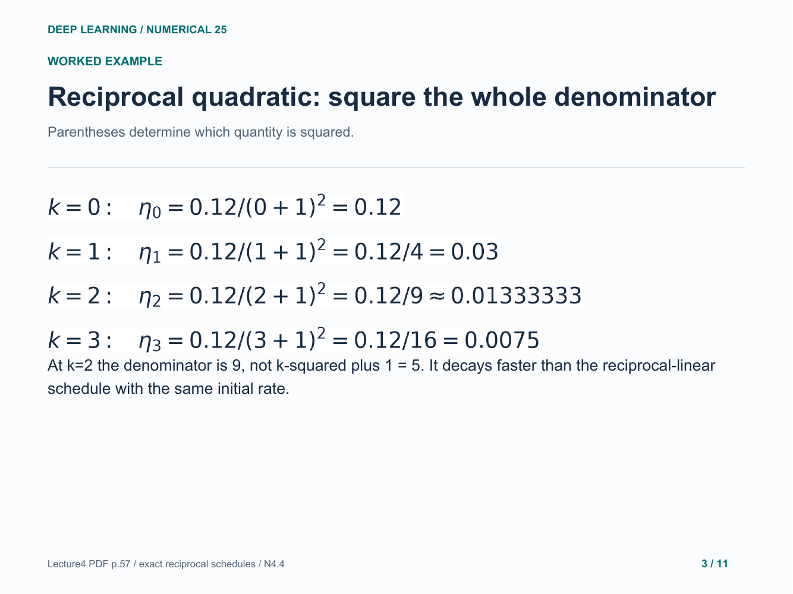

### 4. Exponential: use the logarithm identity

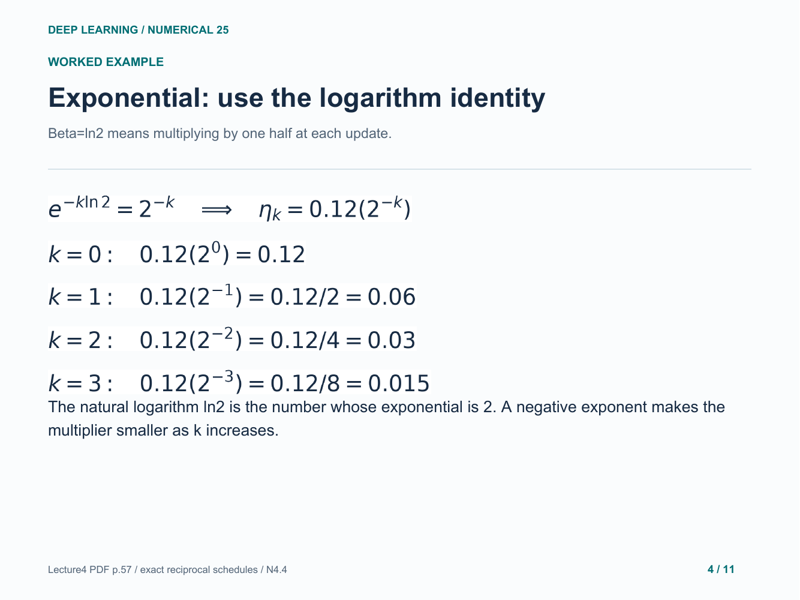

### 5. Compare the first four scheduled rates

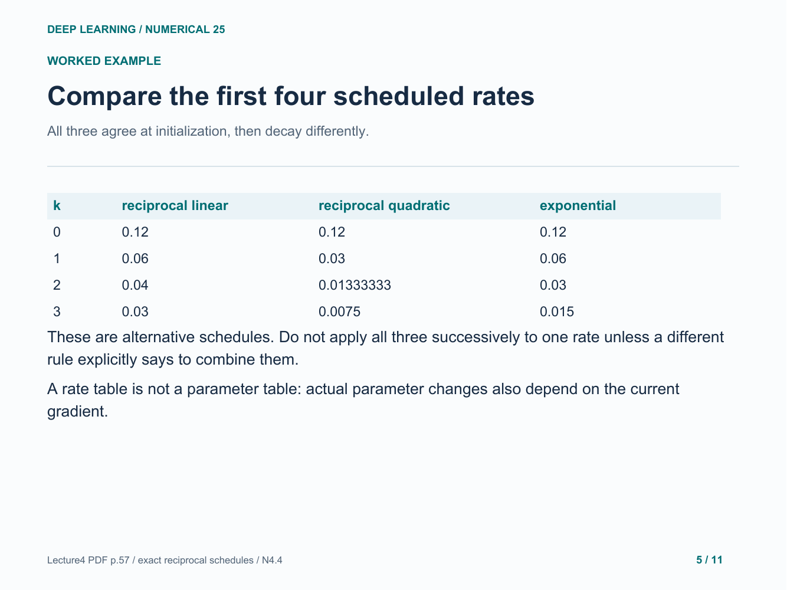

### 6. See the rates over more update indices

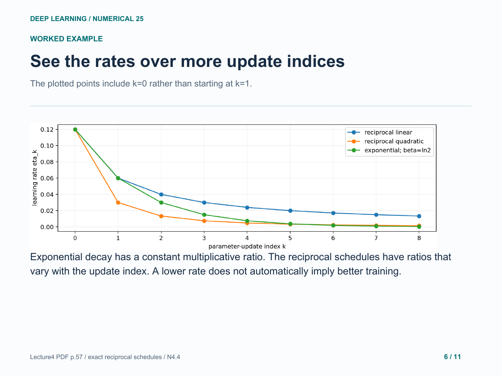

### 7. Apply the rate with the matching current gradient

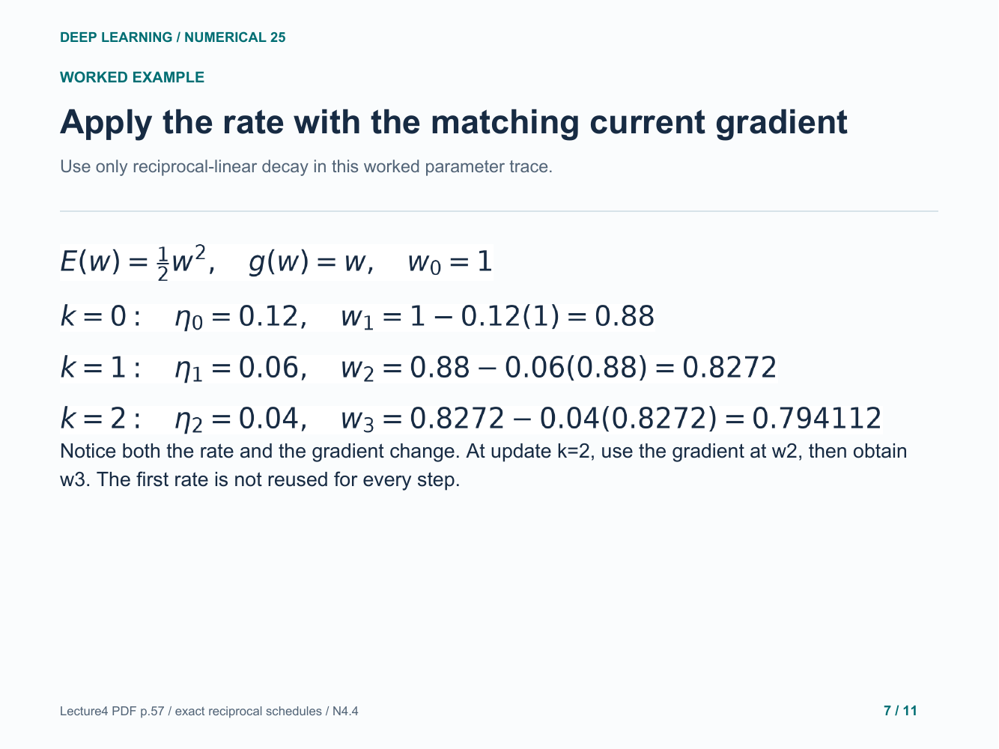

### 8. A plateau rule responds to measured progress

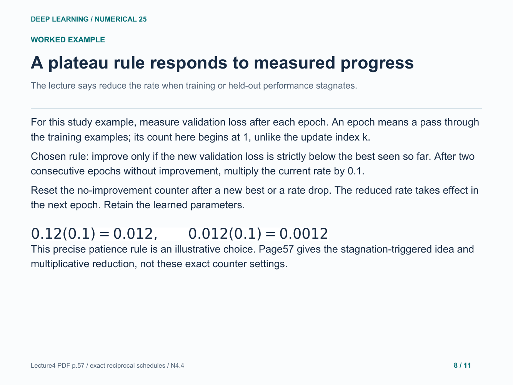

### 9. Trace the plateau decision at every epoch

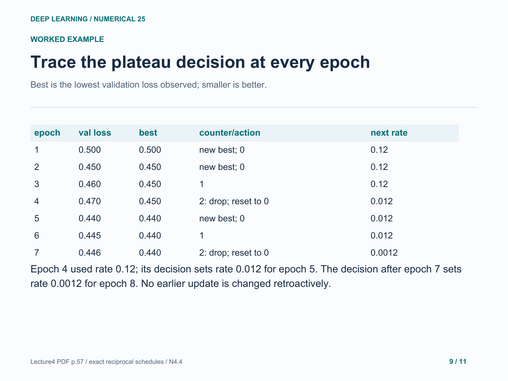

### 10. Your turn: new initial rate and decay constant

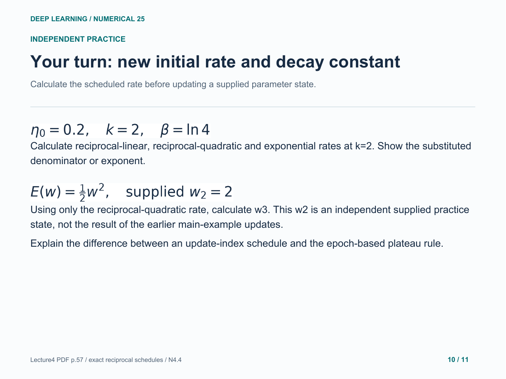

### 11. Practice: rates and the next parameter

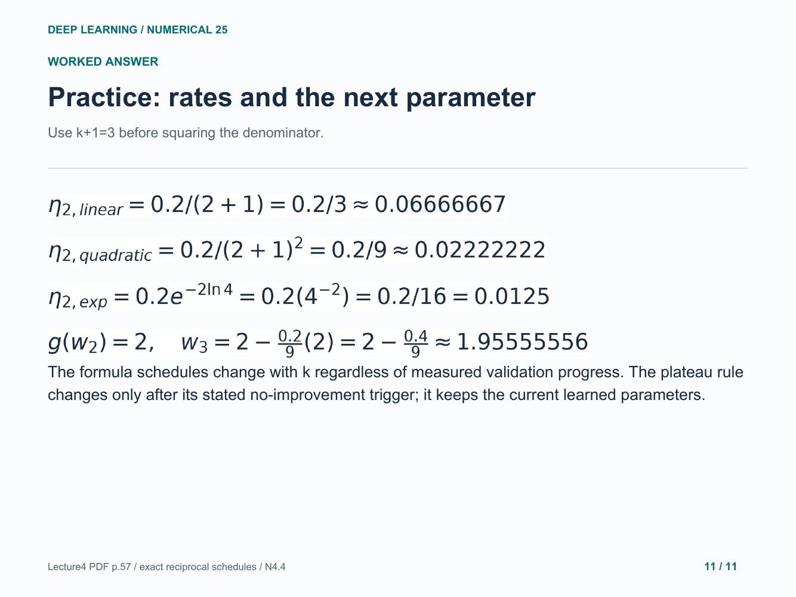

Original study example. Read the practice question before revealing the following answer pages.

[Back to numerical index](../README.md)
