# 26. RProp: signs, rollback and stored state

Trace every attempted move in the lecture rollback variant, distinguish trial and accepted states, and solve a four-attempt practice.

[Open the PDF](lesson.pdf)

Lecture reference: Lecture4 PDF pages64-72, especially page71: simplified RProp. Positive-magnitude bounding clarifies signed pseudocode; exact-zero stop convention stated. numerical-practice.md N4.5.

## Illustrated walkthrough

### 1. RProp follows derivative signs and remembers state

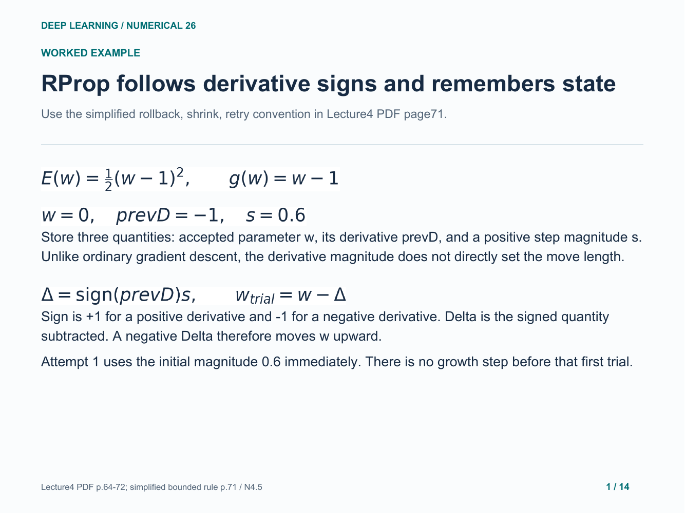

### 2. Decide which state is carried to the next attempt

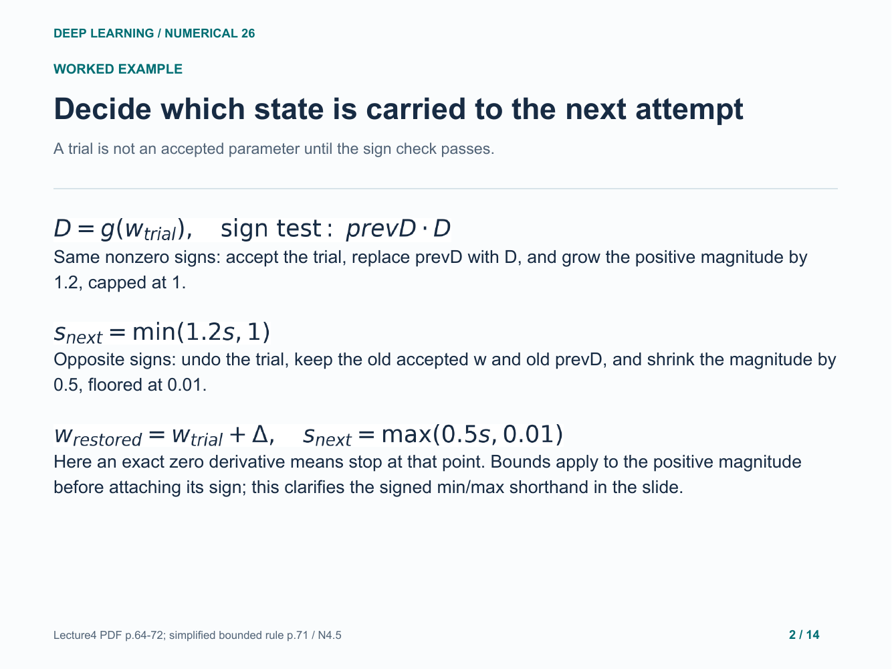

### 3. attempt 1: accept and grow

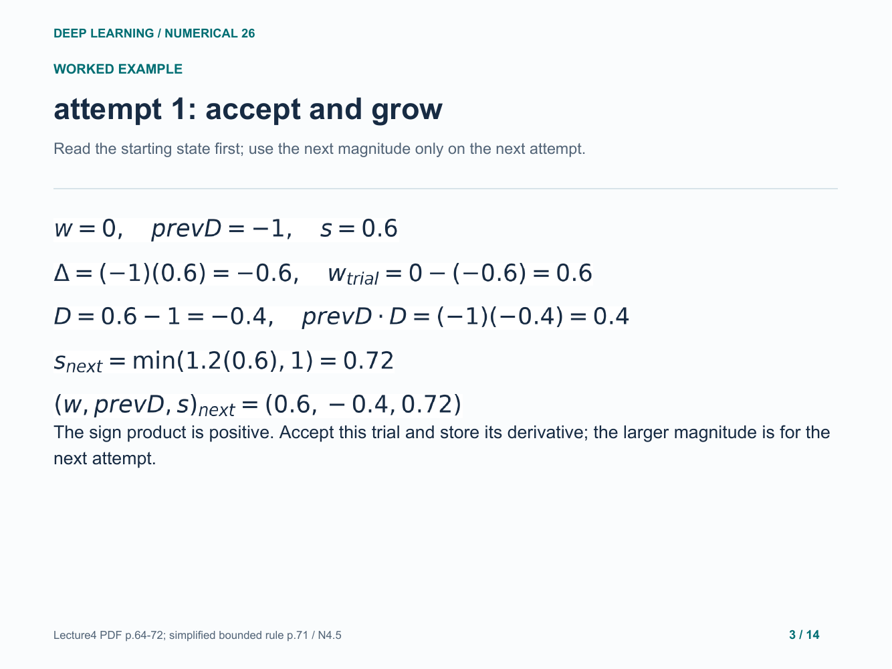

### 4. attempt 2: rollback and shrink

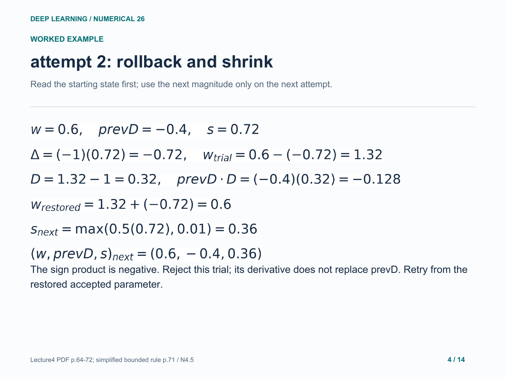

### 5. attempt 3: accept and grow

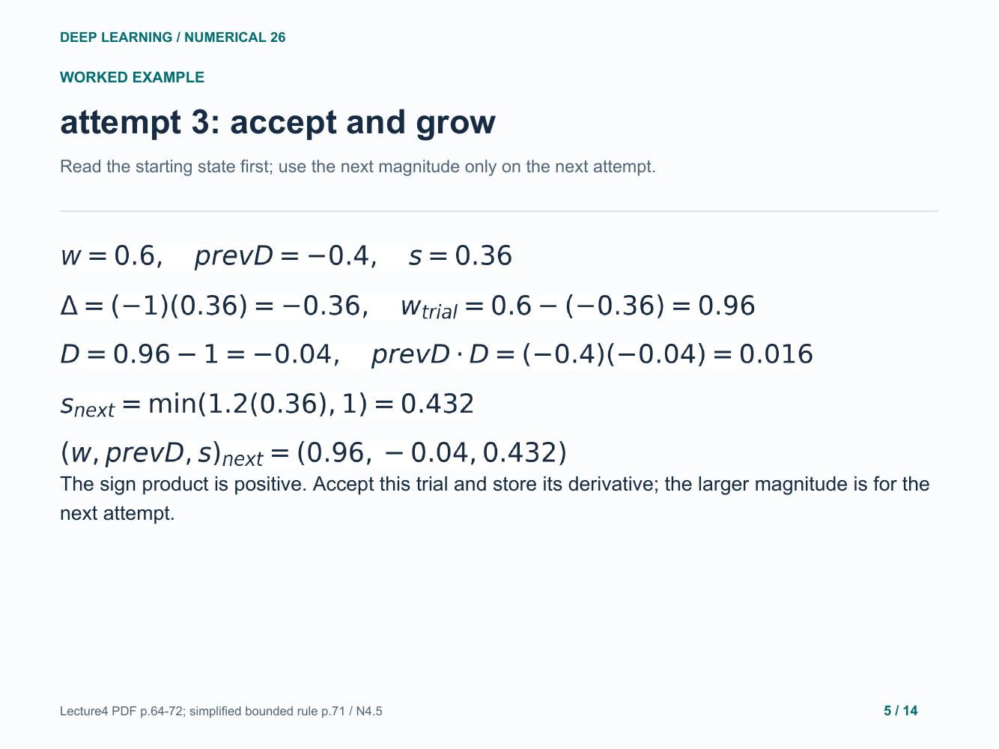

### 6. Why rollback is not a loss-improvement test

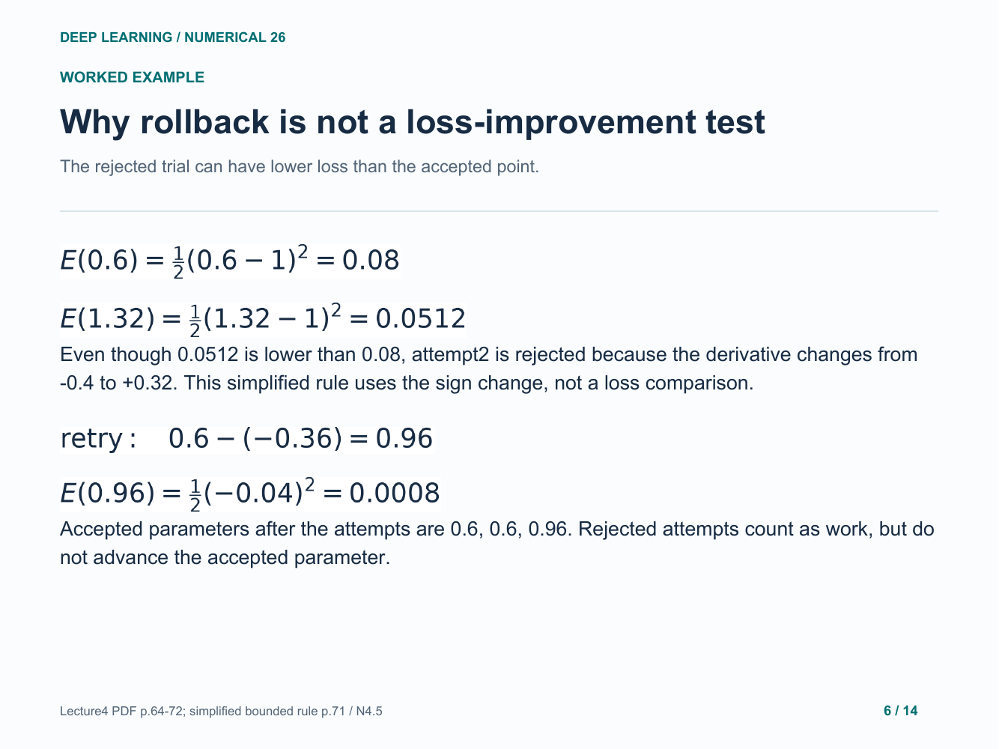

### 7. Separate attempted points from accepted history

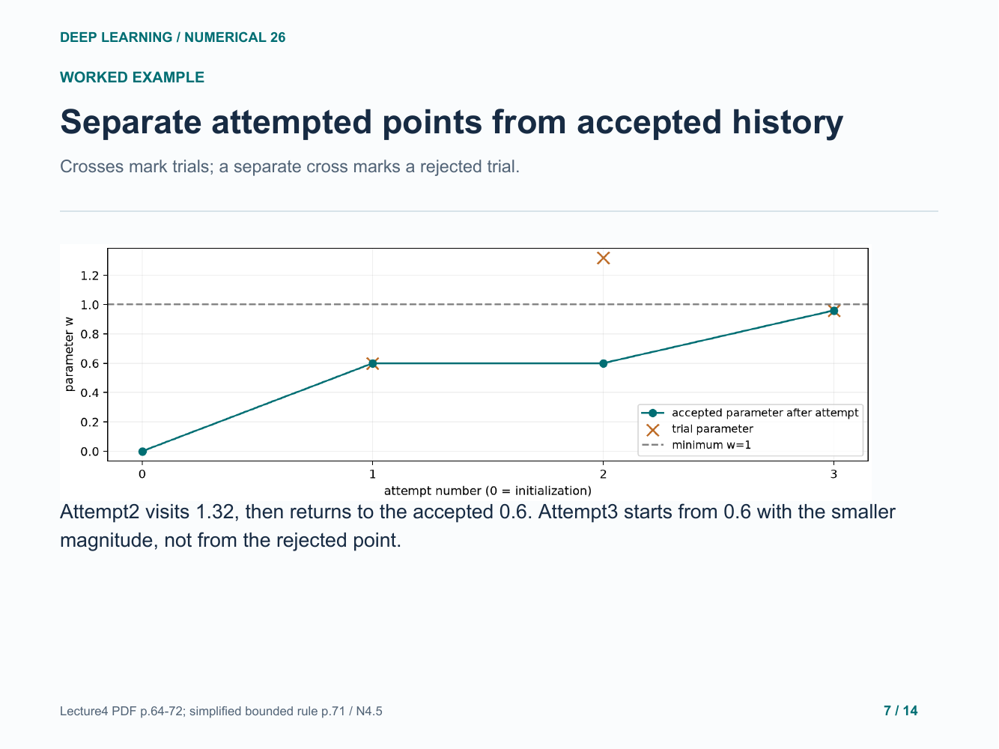

### 8. Clamp a magnitude, then attach its direction

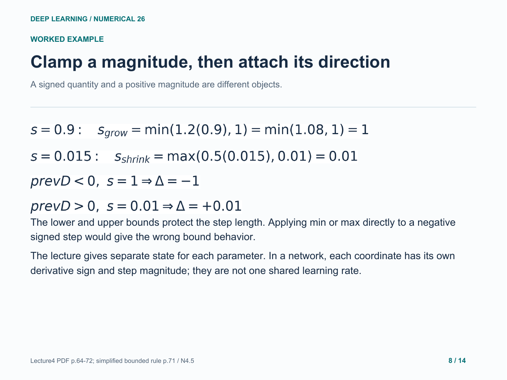

### 9. Your turn: four attempts with two reversals

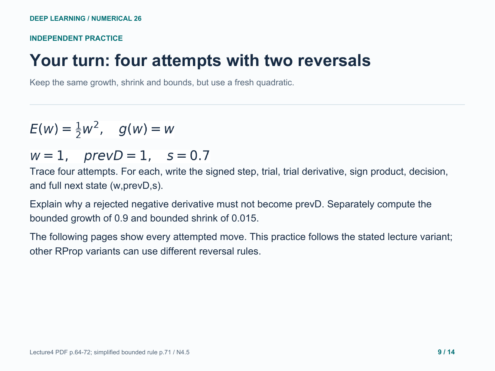

### 10. Practice: attempt 1: accept and grow

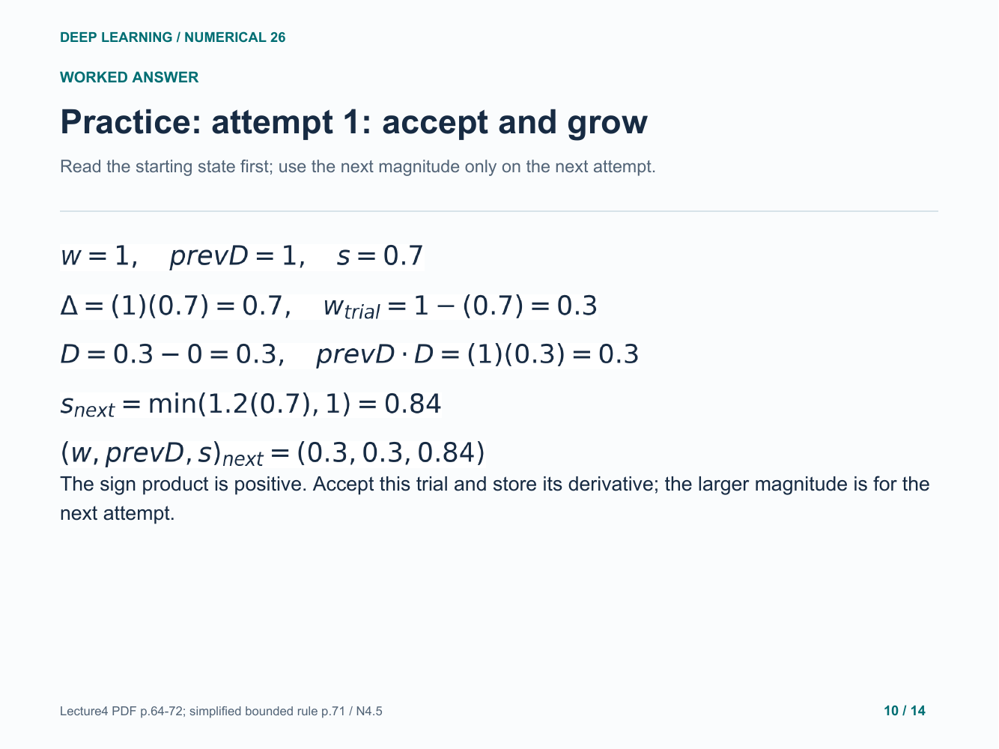

### 11. Practice: attempt 2: rollback and shrink

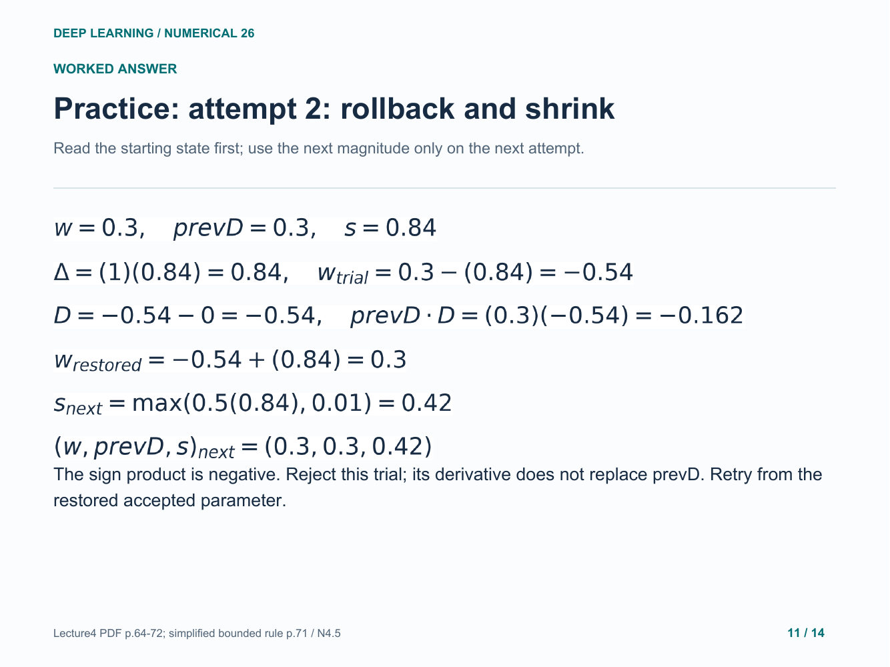

### 12. Practice: attempt 3: rollback and shrink

### 13. Practice: attempt 4: accept and grow

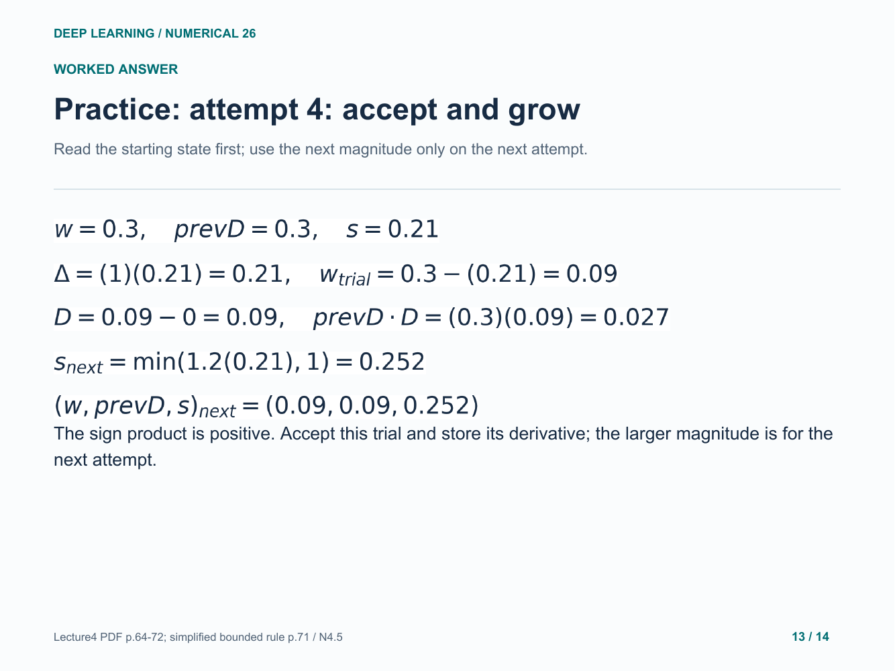

### 14. Practice checkpoint: track accepted state

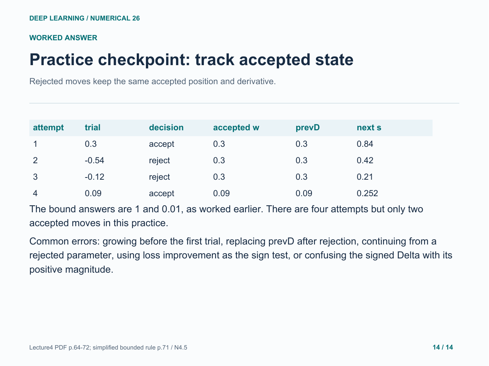

Original study example. Read the practice question before revealing the following answer pages.

[Back to numerical index](../README.md)
