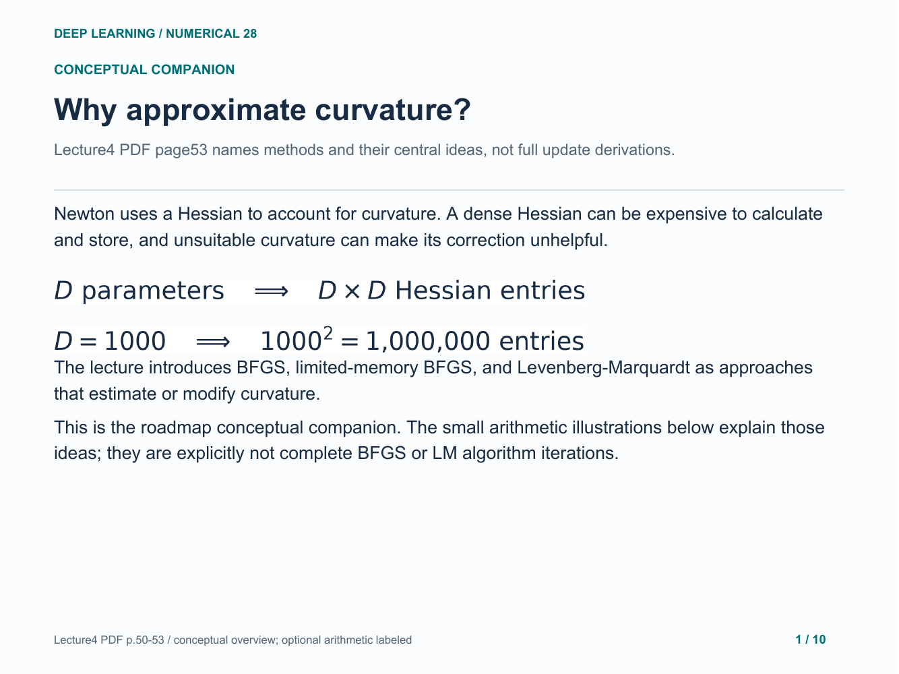
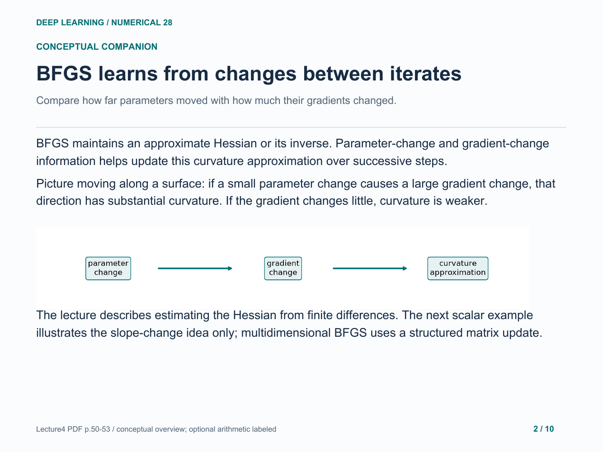
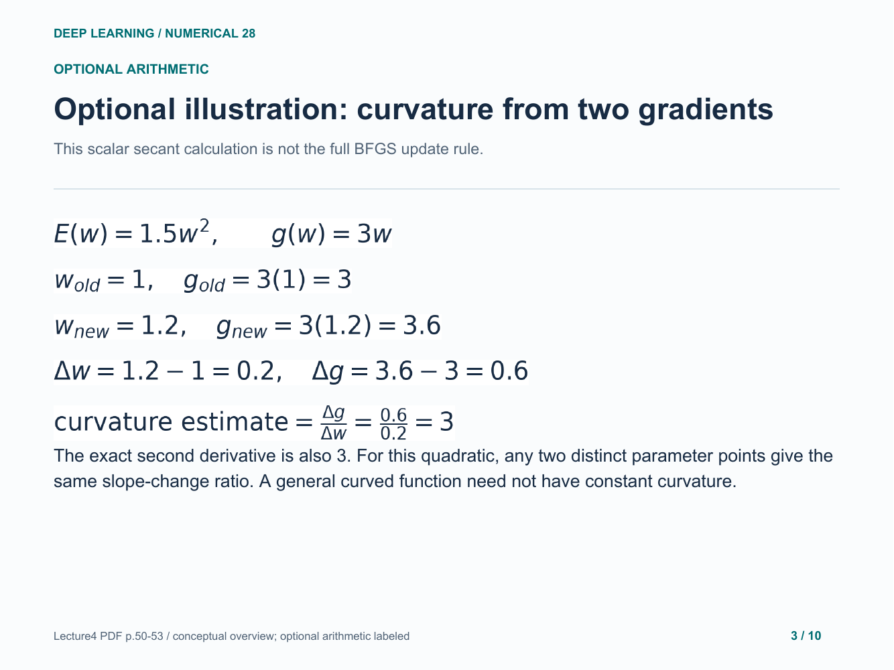
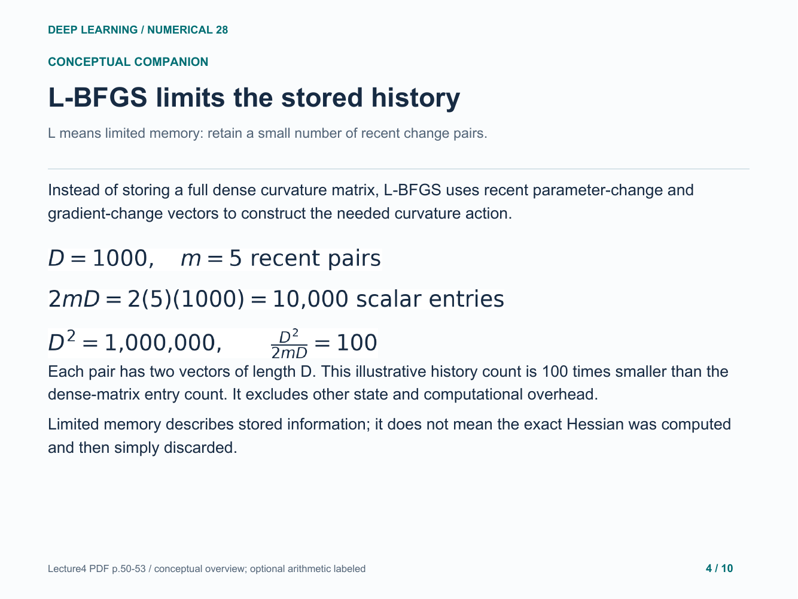
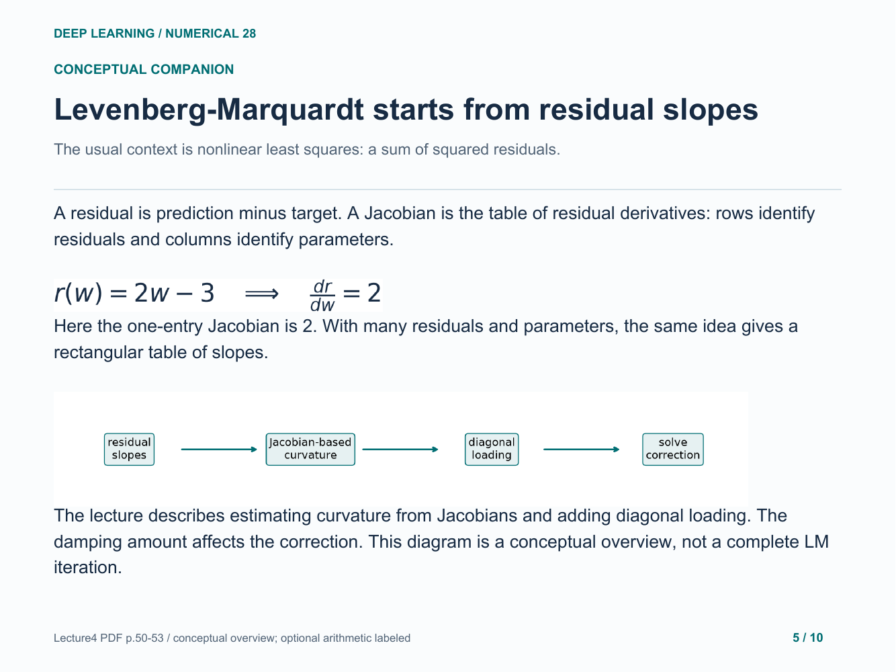
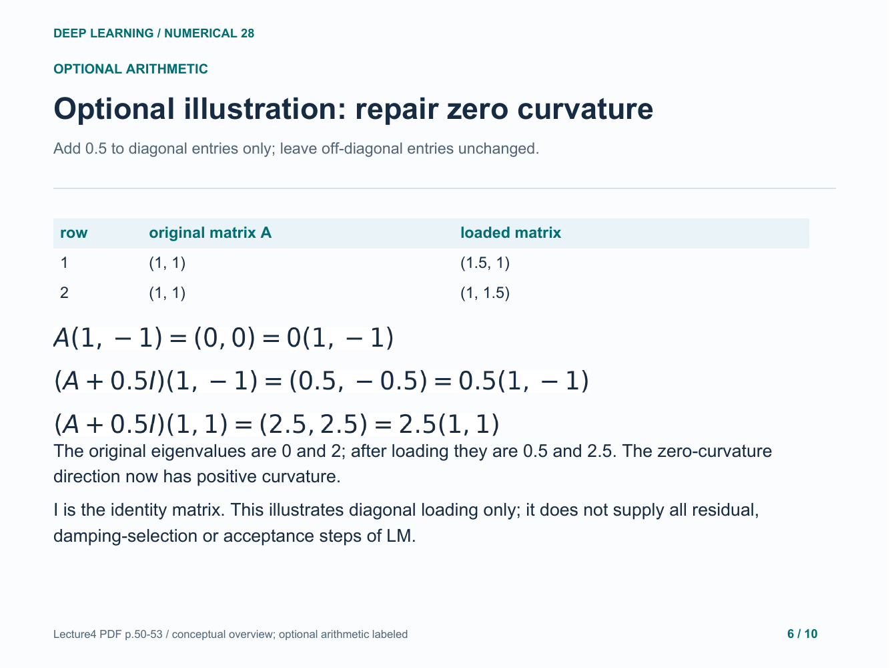
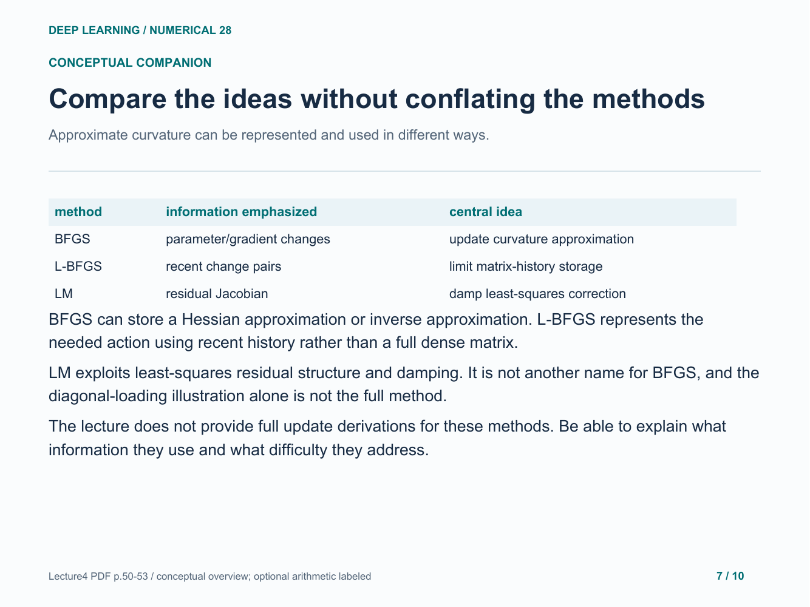
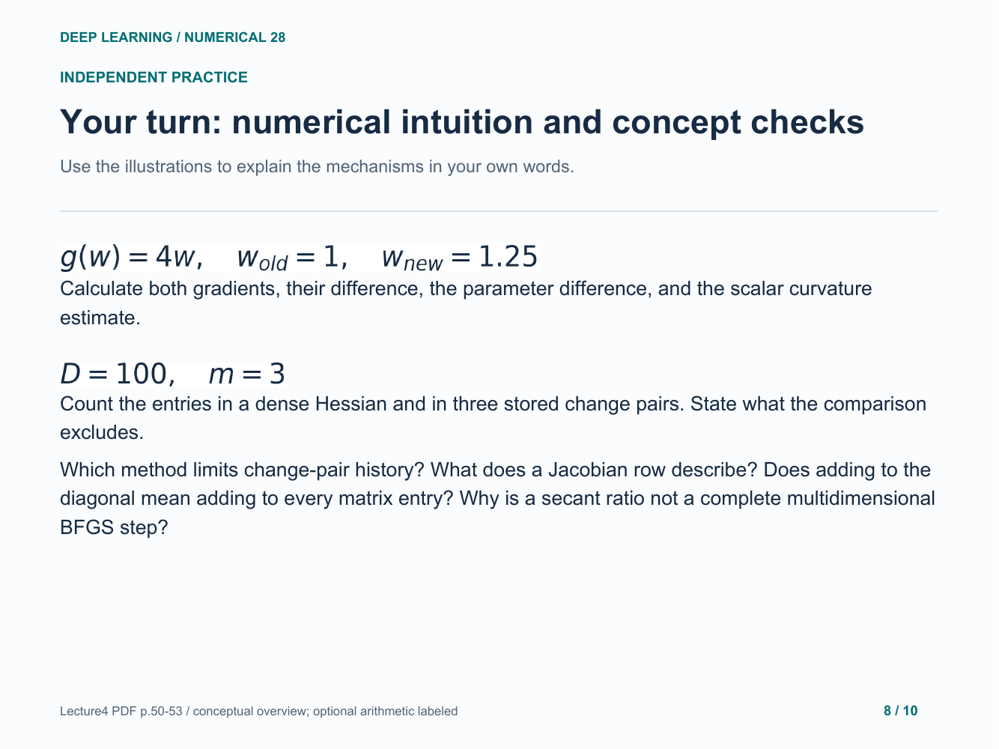
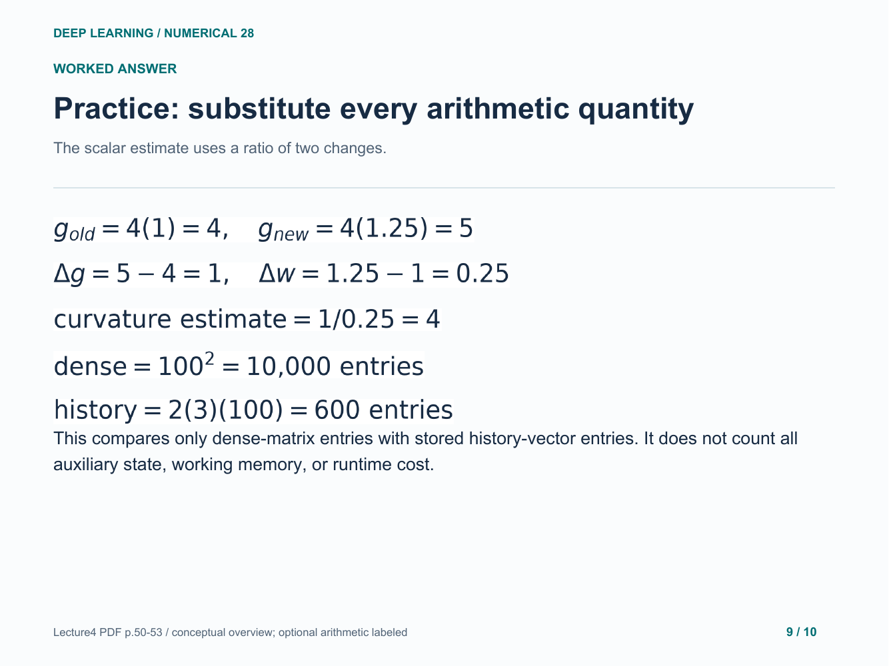
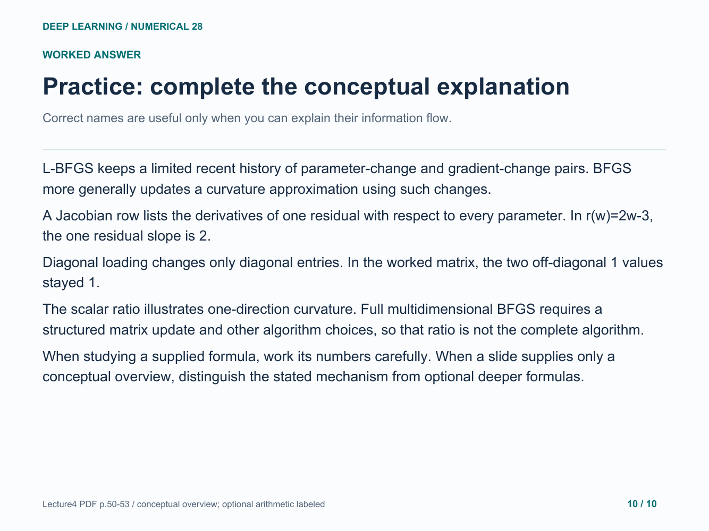

# 28. Curvature approximations: conceptual companion

Understand BFGS, L-BFGS and Levenberg-Marquardt using diagrams and clearly labeled small arithmetic illustrations, with practice answers.

[Open the PDF](lesson.pdf)

Lecture reference: Lecture4 PDF pages50-53, especially page53 overview of BFGS/L-BFGS and Levenberg-Marquardt. Secant, memory-count and loading arithmetic are explanatory extensions, not full update algorithms.

## Illustrated walkthrough

### 1. Why approximate curvature?

### 2. BFGS learns from changes between iterates

### 3. Optional illustration: curvature from two gradients

### 4. L-BFGS limits the stored history

### 5. Levenberg-Marquardt starts from residual slopes

### 6. Optional illustration: repair zero curvature

### 7. Compare the ideas without conflating the methods

### 8. Your turn: numerical intuition and concept checks

### 9. Practice: substitute every arithmetic quantity

### 10. Practice: complete the conceptual explanation

Original study example. Read the practice question before revealing the following answer pages.

[Back to numerical index](../README.md)
