# 36. Coordinate and global-norm gradient clipping

Work the slide ceiling and two signed-gradient extensions, compare vector directions and updates, handle zero, and solve fresh clipping practice.

[Open the PDF](lesson.pdf)

Lecture reference: Lecture 5 PDF page 161 gives the one-sided positive ceiling. Symmetric coordinate and global L2-norm clipping are explicitly labeled supporting extensions; numerical-practice.md N6.9.

## Illustrated walkthrough

### 1. Clip a gradient before using it in an update

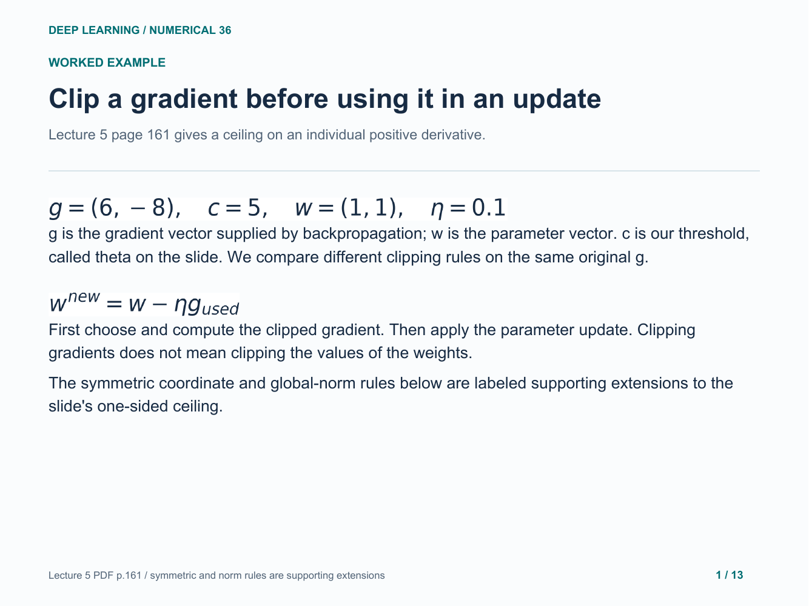

### 2. Work the slide one-sided ceiling literally

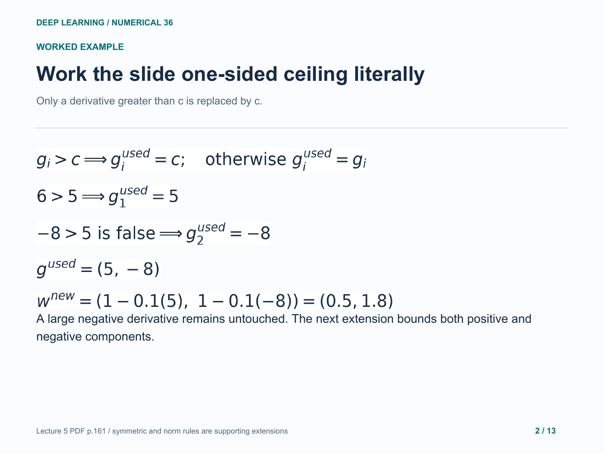

### 3. Symmetric coordinate clipping

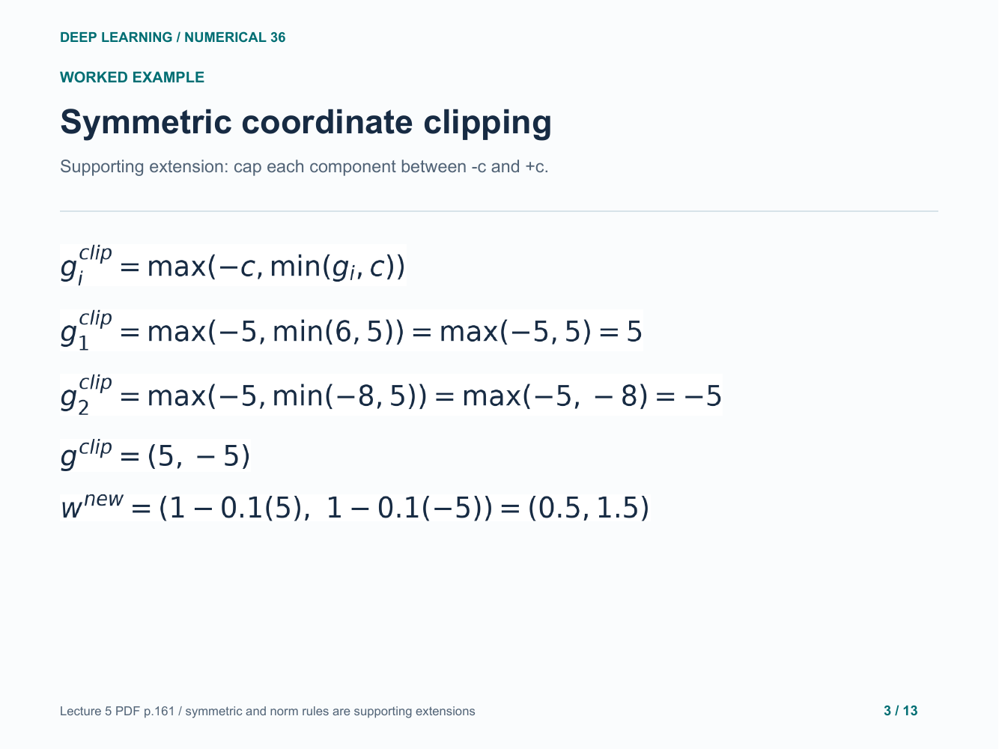

### 4. Global norm clipping: measure the vector length

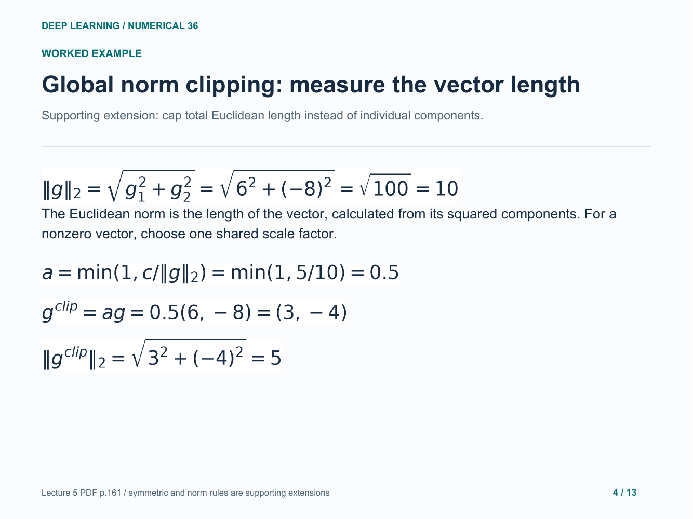

### 5. Use the norm-clipped vector in the update

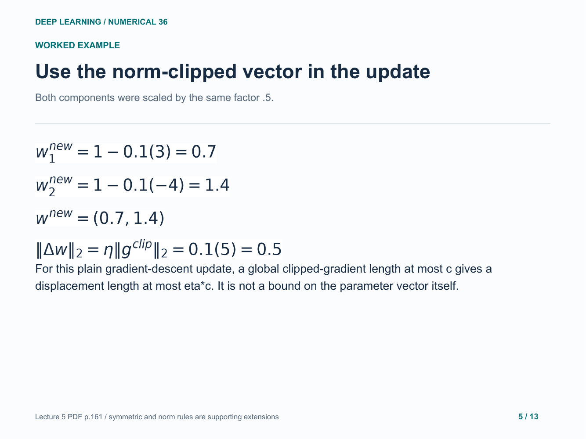

### 6. A component cap is not a length cap

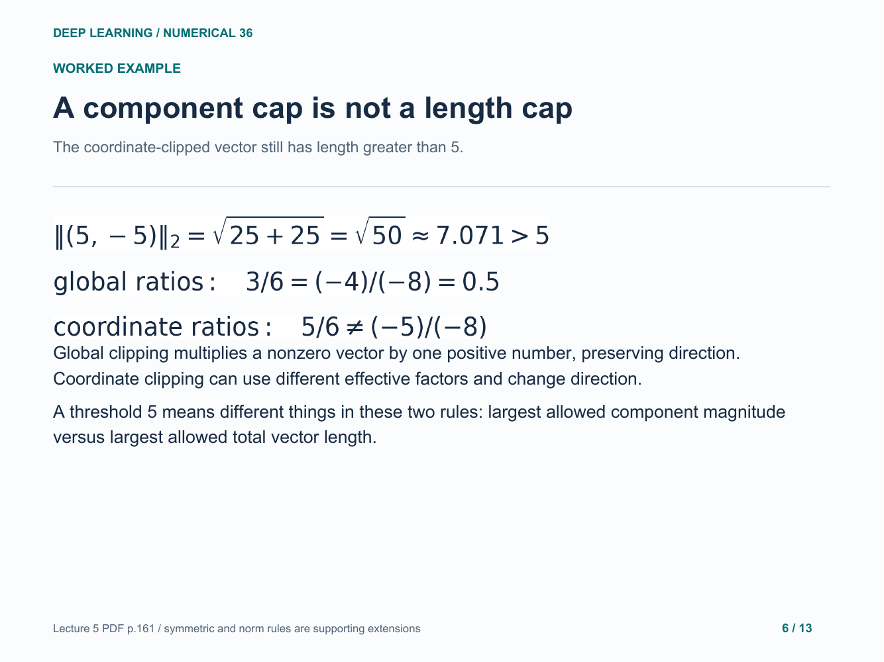

### 7. See the directions and allowed regions

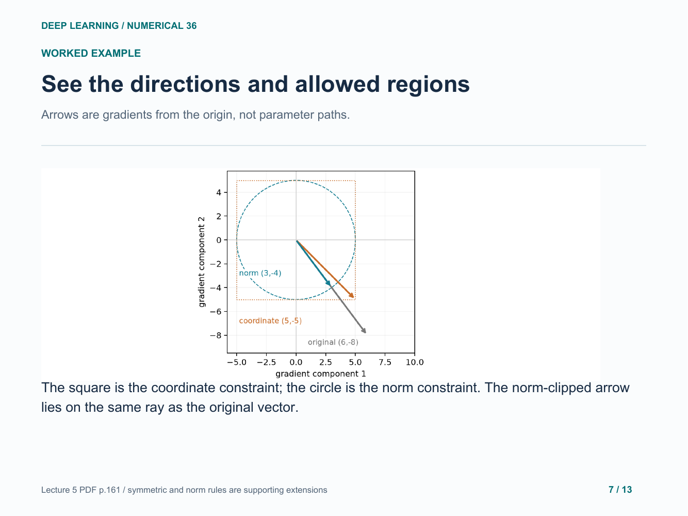

### 8. Compare the resulting parameter states

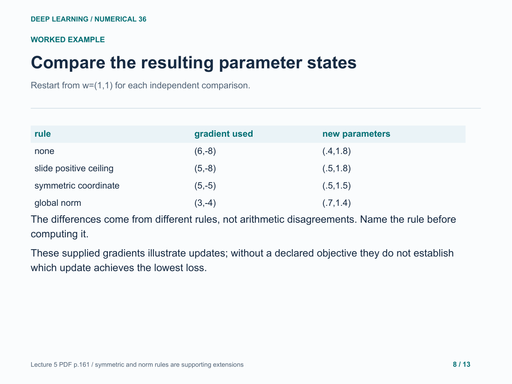

### 9. Handle a small vector, a boundary and zero

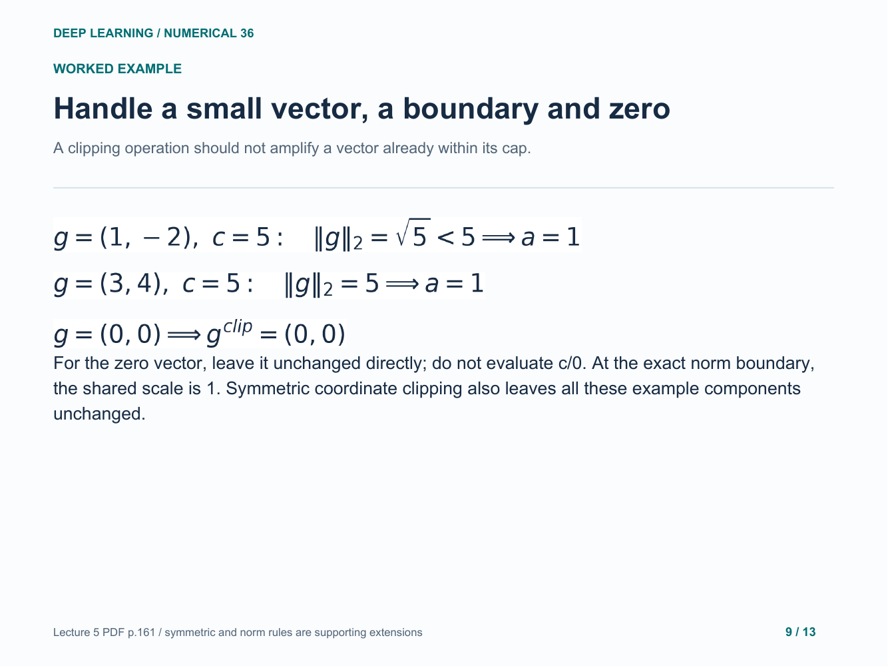

### 10. Your turn: a large negative component

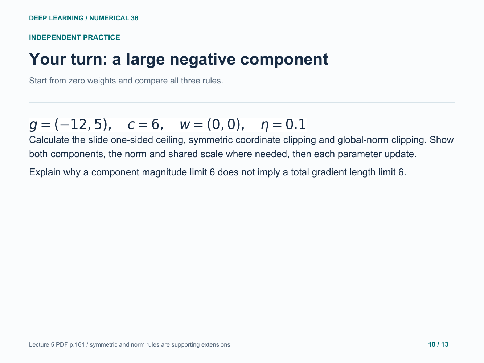

### 11. Answer: one-sided and symmetric coordinate rules

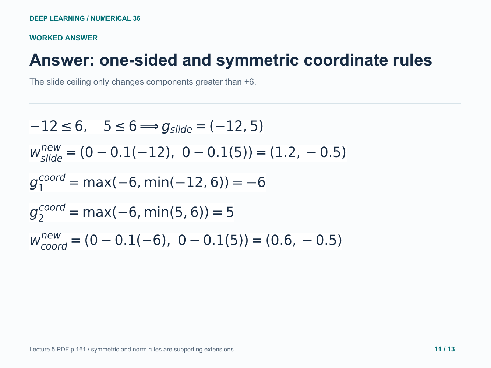

### 12. Answer: norm, scale and clipped components

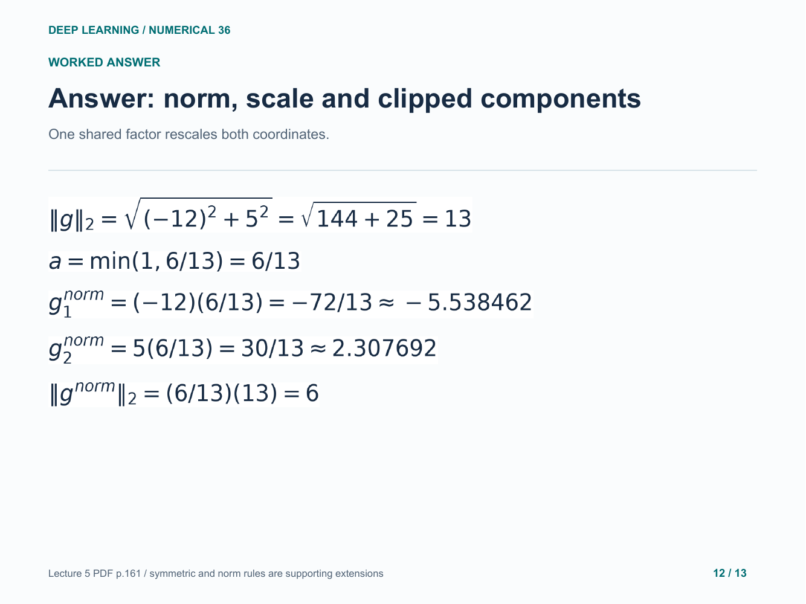

### 13. Answer: the final norm-clipped update

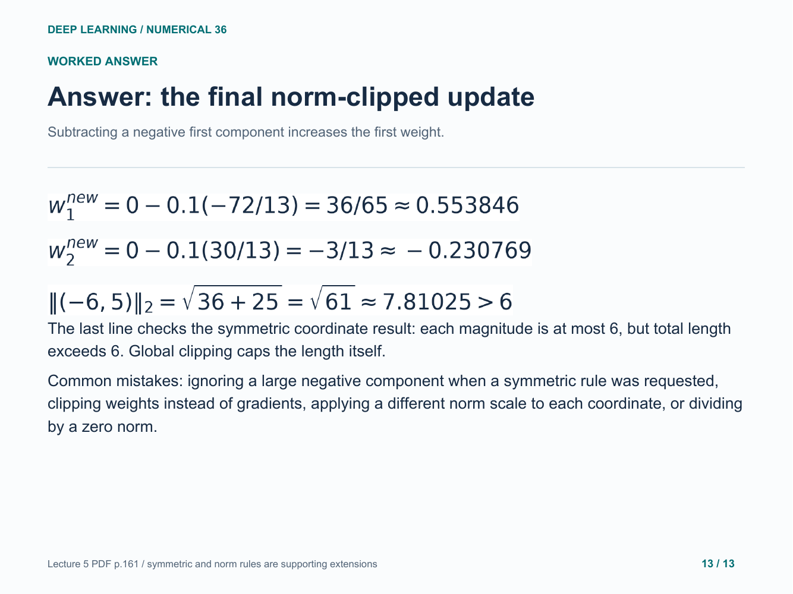

Original study example. Read the practice question before revealing the following answer pages.

[Back to numerical index](../README.md)
