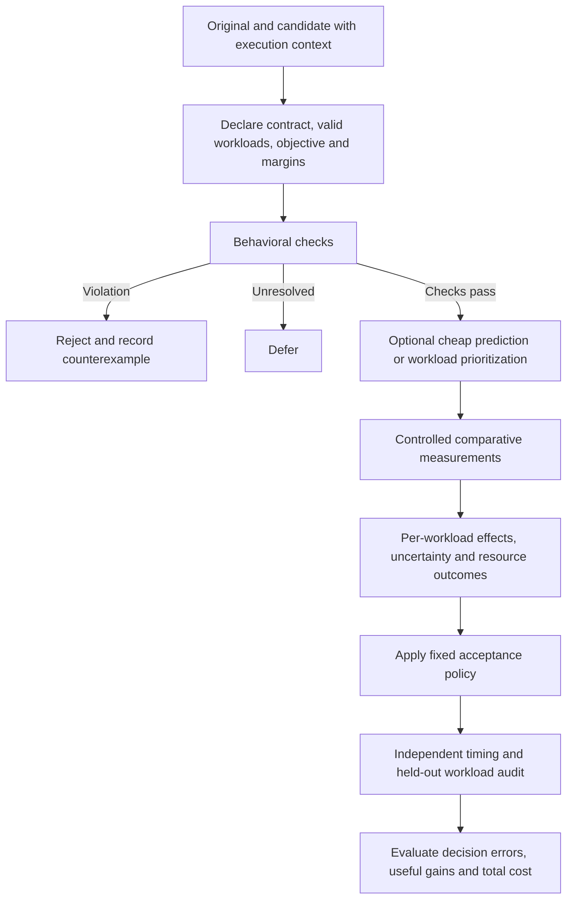

# Classifying Whether a Python Code Change Is an Optimization

**Research report — 15 September 2026**

Read the [short summary](2026-09-15-classification-summary.md) first. This report supports the [current proposal](02-research-proposal.md) and [evaluation protocol](06-evaluation-protocol.md). It is a new, targeted literature review and proposed study design; it does not report completed experiments or replace the existing protocol with an approved one.

## 1. Findings that change the research decision

There are already methods for predicting which code version is faster, measuring whether a change improves runtime, and identifying conflicting outcomes across workloads. A general classifier called “optimized or not,” even with several output labels, would need substantial differentiation.

The most direct prediction precedent is **Minju Seo, Jinheon Baek, and Sung Ju Hwang, _Rethinking Code Refinement: Learning to Judge Code Efficiency_**, Findings of EMNLP 2024. It learns pairwise efficiency classification and relative improvement prediction for Python and C++, including human and machine refinements and multiple refinement steps. Its released implementation is a required comparator for a learned classifier. [Paper](https://aclanthology.org/2024.findings-emnlp.645/), [implementation and data instructions](https://github.com/going-doer/judge_code_efficiency).

The most direct measurement precedent is **SWE-Pro**. Appendix E.5 already defines the categories “Not measurable,” “No signal,” “Improved,” “Regressed,” and “Conflicting,” after measurement-quality and signal filtering. Its classification procedure needs direct comparison before claiming a new execution-based decision method. [Paper, Appendix E.5](https://arxiv.org/html/2606.25530v1#A5.SS5).

Benchmark relabeling and stronger test generation also have close precedent. **_Rethinking Code Performance Benchmarks for LLMs_** re-evaluates Python function benchmarks and proposes agents that generate, diagnose, and repair performance tests. Simply remeasuring code pairs or adding agents to the test generator is insufficient differentiation. [July 2026 preprint](https://arxiv.org/html/2607.07619v1).

**Recommendation, based on this review:** make the first study a comparison of the reliability and cost of existing optimization judgments, particularly when valid workloads change. Build the measurement infrastructure needed to study those judgments. Develop a new classifier or selector only if a reproducible failure remains after strong conventional validation.

## 2. Scope and evidence boundary

Three research agents investigated independent tracks: statistical validation; behavioral checks and workload testing; and static/learned prediction with datasets. The coordinating agent inspected the existing proposal, checked central novelty claims, and synthesized the recommendations. These were AI research roles, not independent human reviewers. Agreement among agents is not independent empirical validation.

We used targeted web searches, primary papers, author repositories, official documentation, and dataset cards. The source register and query log below distinguish full-text sections, abstracts, and artifact descriptions. This is **not a systematic literature review**: we did not exhaust bibliographic databases, reproduce a screening flow, or claim complete search counts. Publication and availability statements apply to the inspected sources as of this review. No candidate programs, benchmarks, trained models, or artifact installations were executed.

The initial practical scope should remain deterministic, CPU-oriented Python functions and source changes within runnable repositories. Python calls into native libraries are part of the execution context. Concurrent services, GPU kernels, distributed systems, energy optimization, and native-source modification add separate measurement problems and should be later extensions.

## 3. Define what is being classified

### 3.1 A comparative, contextual judgment

Use this unit of analysis:

`(original version, candidate version, behavioral contract, workloads, environment, objective)`

The question is whether the candidate improves a declared objective relative to the original under those conditions. “Optimized” should not imply that the code is globally optimal or cannot be improved further.

An isolated block is sufficient only if its inputs, dependencies, outputs, and state can be reproduced faithfully. Otherwise evaluate the enclosing function or repository patch. A change that saves time inside a loop may incur conversion or allocation costs elsewhere. Causal profiling explicitly distinguishes time spent in code from the application-level benefit of improving it; Coz is a native-code precedent, rather than a ready-made Python classifier. [Coz paper](https://arxiv.org/abs/1608.03676), [author implementation](https://github.com/plasma-umass/coz).

For Python, record interpreter and dependency versions, data types, library backend/thread configuration, setup costs, and repeated-call state. Scalene motivates observing the Python/native-library boundary and copying costs when explaining results. Its profiles provide diagnostic evidence; acceptance should use separate timing runs. [Scalene paper](https://arxiv.org/abs/2006.03879).

### 3.2 Keep three outputs separate

The following output design is **our proposed experimental convention**, not a novel published method.

| Output axis | Values | Meaning |
|---|---|---|
| Behavioral evidence | Passes specified checks / violated / unresolved | What was established about required behavior |
| Performance evidence | Improved / regressed / practically equivalent / inconclusive per workload; mixed as a cross-workload pattern | What the measurements establish for specified workloads and metrics |
| Operational action | Accept / reject / defer | Whether that evidence satisfies the user's declared acceptance requirements |

A fast candidate with wrong outputs is rejected. An unstable benchmark is deferred or marked unmeasurable. A mixed result can be acceptable under an explicitly permitted specialization, while violating a policy that protects the slower workload. A practically equivalent change may be useful for readability, but does not meet a requirement for a meaningful speed improvement.

“Passes specified checks” is deliberately a bounded claim. Neither matching a finite test suite nor agreeing with the original program establishes correctness for every input. The original may itself contain bugs. The contract must say whether the task requires behavior preservation or also permits a specified bug fix.

## 4. Methods available for classification

The costs below are relative engineering expectations for this proposed study, not measured comparisons. “Prediction” describes an estimate; “validation” describes evidence from a specified execution experiment.

| Method | Evidence used | What it can contribute | Main limitation | Proposed role |
|---|---|---|---|---|
| Static rules and complexity reasoning | Source, diff, types, operation counts | Flags likely redundant work, algorithm changes, or expensive calls | Workload, constants, libraries, and state can reverse a prediction | Cheap explanatory baseline |
| Prompted LLM judge | Two code versions and supplied context | Predicts a winner or proposes a mechanism | Requires measured calibration; ordering and context can affect answers | Prediction baseline |
| Trained pair classifier or speedup regressor | Labeled code pairs, possibly workload features | Learns relative performance from examples | Training labels and cross-project transfer can fail | Direct prior-art baseline |
| Profiling and cost models | Executed traces, counters, allocation/copy information | Locates costs and explains candidate mechanisms | A hotspot or instruction reduction is not an end-to-end runtime verdict | Diagnosis after classification |
| Fixed-budget repeated comparison | Both versions executed under matched conditions | Estimates runtime changes with uncertainty | Only covers the selected workloads and environment | Core validation baseline |
| Adaptive/sequential measurement | Measurements accumulated under a stopping rule | Allocates more effort to uncertain cases | Stopping assumptions and repeated decisions must be handled explicitly | Strong measurement comparator |
| Stratified multi-workload comparison | Valid input families, sizes, shapes, and configurations | Reveals workload-dependent gains and losses | Coverage is finite; weighting must be declared | Core research comparison |
| Performance fuzzing and stress generation | Search-generated inputs with runtime feedback | Finds counterexamples or costly execution regions | Search success does not estimate typical frequency | Strong targeted-testing comparator |
| Change-aware selection and history replay | Affected code, coverage, past regression inputs | Chooses a smaller relevant workload subset | Previously unseen behavior can be omitted | Low-cost conventional baseline |
| Combined predictor and validator | Cheap predictions followed by selected execution | May reduce total cost while retaining evidence | Combined systems inherit each component's limitations | Conditional later method |

### 4.1 Static reasoning and source-based prediction

Static inspection can recognize a nested scan becoming a lookup, repeated work being cached, or an allocation moving outside a loop. These are hypotheses about cost under assumptions. A lookup has construction costs; caching depends on reuse and invalidation; vectorization may allocate temporary arrays. Complexity reasoning should record its assumptions about input size and data types. Lines changed, shorter source, or a cleaner-looking implementation are weak standalone labels.

Learned source prediction already has both performance-ranking and regression formulations. **_Performance Prediction From Source Code Is Task and Domain Specific_** supplies direct-runtime and pairwise prediction experiments, including different split strategies. It is especially relevant to testing transfer between programming problems and projects. A Python implementation of a predictor does not imply its training programs are Python. [Author replication package](https://github.com/ubisoft/ubisoft-laforge-prediction-performance).

For a feasible first study, compare transparent diff features, a fixed-prompt judge, and an available published pairwise model before considering new training. Give each method a precisely documented information budget. Report source-only predictions separately from predictions supplied with workload and hardware context. Mask patch titles, “gold” labels, measured runtimes, and labels embedded in filenames from the predictor.

Complexity prediction has its own datasets: CodeComplex provides expert-labeled worst-case complexity tasks, including Python. Its target is an asymptotic class, which is different from observed speedup. At another level, Ithemal predicts x86 instruction-block throughput from measured training examples; an assembly basic block is a different object from a Python source block. These are useful method precedents with limited direct transfer. [CodeComplex](https://arxiv.org/abs/2401.08719), [Ithemal, ICML 2019](https://proceedings.mlr.press/v97/mendis19a.html).

Evaluate reversed A/B presentation to expose position bias. Keep every orientation and variant of one underlying task in the same train/test group. A predictor should be permitted to abstain; a forced winner on a nearly equal pair is a different target from reliable acceptance.

### 4.2 Behavioral validation

Use existing repository tests first. Add differential tests that execute both versions on independent copies of the same valid input and compare required observations: returned values, exceptions, mutation, ordering, and relevant state changes. Floating-point tolerances, NaNs, aliasing, and permitted nondeterminism belong in the contract before candidate evaluation.

Property-based generation can expand the exercised input space. Metamorphic testing can check domain-specific relations when an exact expected output is difficult to obtain. These methods detect violations; they do not measure a speedup by themselves. Generated tests must preserve the public interface and valid workload domain.

Concrete options are Hypothesis for generated inputs/action sequences, Mokav for execution-guided distinguishing-input generation, and CrossHair for symbolic behavioral comparison of supported Python functions. CrossHair explicitly does not guarantee equivalence when its search finds no difference. [Hypothesis stateful testing](https://hypothesis.readthedocs.io/en/latest/stateful.html), [Mokav paper](https://www.sciencedirect.com/science/article/pii/S0164121225002407), [Mokav code](https://github.com/ASSERT-KTH/mokav), [CrossHair diffbehavior](https://crosshair.readthedocs.io/en/latest/diff_behavior.html). Metamorphic relations should be justified for the task rather than invented from a generic prompt. [Original metamorphic-testing report](https://arxiv.org/abs/2002.12543).

A performance timeout under a declared resource limit is different from a dependency-install failure. A candidate that reproducibly exceeds a limit while the baseline completes has a bound on its relative performance, not an exact runtime. An out-of-memory result needs its own resource outcome. Failures caused by the harness should remain infrastructure errors rather than being relabeled as code regressions.

### 4.3 Repeated execution and measurement design

Use independent process/session replication and blocked or randomized before/after execution order. Preserve raw observations and their hierarchy. Many loop iterations in one process are not many independent software tasks. Estimate where variability arises before deciding whether extra inner repetitions or fresh outer runs provide useful information. [Kalibera and Jones, _Rigorous Benchmarking in Reasonable Time_](https://kar.kent.ac.uk/33611/).

Useful implementations include pyperf's worker/calibration infrastructure and ASV's comparisons across revisions. ASV can interleave revision runs; its inspected statistics source explicitly distinguishes failure to find a difference from proof of equality. Keep their published/default decision rules separate from any adapted policy. [pyperf architecture](https://pyperf.readthedocs.io/en/latest/run_benchmark.html), [ASV continuous comparison](https://asv.readthedocs.io/en/stable/_modules/asv/commands/continuous.html), [ASV statistics source](https://raw.githubusercontent.com/airspeed-velocity/asv/main/asv/_stats.py).

The timing boundary must include costs required by the intended use. A one-time conversion may be excluded only when the stated deployment model amortizes it. Repeated benchmarking must reset mutated inputs, consume lazy results if consumption belongs to the operation, and define cold versus warm cache behavior. Time correctness instrumentation separately. Measure memory in separate runs if the instrumentation changes execution time.

System control helps but does not erase all bias. Stabilizer demonstrates why layout variation can confound performance comparisons. Its native-code system is historical methodological evidence, not a dependency to apply directly to arbitrary Python code. [Stabilizer implementation and paper link](https://github.com/ccurtsinger/stabilizer).

Use a declared sampling plan for the first pilot. Avoid adopting “30 runs” as a universal guarantee; choose repetitions using observed variability, effect sizes of interest, and available cost. Benchmarking tools support execution mechanics, but a tool's default significance label does not automatically implement our desired practical acceptance policy.

### 4.4 Workload diversity and independent confirmation

There are two different confirmation questions:

1. **Timing replication:** does the apparent gain persist on fresh executions of the same workload?
2. **Workload validation:** does the judgment survive other valid input families or configurations?

These should be separately measured. Independent timing can reveal noise without exposing an untested input-size crossover. A new input family can expose a crossover even when timings are perfectly stable.

Define workload families from the API contract: size, ordering, cardinality, sparsity, dtype, shape, branch conditions, or reuse pattern, as relevant. Hold out some families or regions before predictor/selector development. Ordinary random examples drawn from already-exercised regions test a narrower kind of generalization.

Preserve all workload outcomes when aggregating. An average gain should not silently conceal a prohibited loss, and an unstable protected workload should not disappear from the denominator. Report representative-distribution testing separately from adversarial stress testing: finding one valid failure proves that failure exists, but does not show how often users encounter it.

Hypothesis already exposes targeted search through `target()`, and its documentation distinguishes the valid input domain from the distribution it searches. A practical comparator can search for large relative slowdowns and then remeasure the discovered inputs independently. That scoring adaptation is our proposal; Hypothesis itself does not certify the timing difference. [Target API/source](https://hypothesis.readthedocs.io/en/latest/_modules/hypothesis/control.html), [domain and distribution](https://hypothesis.readthedocs.io/en/latest/explanation/domain.html).

WEDGE synthesizes performance-related input predicates and uses them to guide fuzzing; its PERFFORGE artifact releases stressing inputs. The principal study is largely C++ with a smaller Python investigation. It is direct precedent for input-region guidance, although stressing absolute execution cost differs from finding a relative regression between two versions. [WEDGE paper](https://arxiv.org/html/2505.23471v1), [PERFFORGE artifact](https://github.com/cirrus-uchicago/perfforge).

Version-aware diagnosis is also established: Perun retains performance profiles and detects historical degradation; APOLLO combines database regression search, query reduction, and diagnosis. Adaptations to our Python tasks must be identified as adaptations. [Perun paper](https://arxiv.org/html/2207.12900), [APOLLO, PVLDB 2019](https://www.vldb.org/pvldb/vol13/p57-jung.pdf).

Change-aware microbenchmark prioritization already orders affected benchmarks ahead of unaffected ones. A budget-limited selector must therefore beat conventional affected-first, coverage, and random ordering as appropriate. Replaying previously found counterexamples is another established baseline. [Laaber, Gall, and Leitner, 2021](https://link.springer.com/article/10.1007/s10664-021-10037-x), [Hypothesis failure replay](https://hypothesis.readthedocs.io/en/latest/tutorial/replaying-failures.html).

### 4.5 Profiling and alternate performance objectives

Use profiling to investigate why labels differ. Collect attribution evidence separately from uninstrumented acceptance timing. A useful explanation may concern algorithm choice, conversion overhead, allocation, Python/native transitions, or a change in repeated-call state.

Instruction counts can be useful alongside elapsed time. EvalPerf uses performance-exercising inputs and instruction-based evaluation with a relative ranking score. The selected metric answers a particular question; fewer instructions alone do not establish lower latency in every environment. [EvalPerf project](https://evalplus.github.io/evalperf.html), [paper](https://arxiv.org/abs/2408.06450).

For the first study, choose elapsed runtime as the primary outcome. Treat peak memory as a guard or a separately reported outcome if measurement is reliable. Do not silently combine runtime, memory, energy, and maintainability into one “optimization” score. Define allowed trade-offs first.

## 5. An operational classification scheme to evaluate

This section is a proposed synthesis of established measurement and decision ideas. It is not a proof of statistical validity or a claim of novelty. A final implementation needs a fixed estimand, sampling assumptions, and checked interval procedure.

### 5.1 Per-workload effect

For workload `w` in environment `E`, define the population effect:

`r_w = E[T_candidate | w, E] / E[T_original | w, E]`

Here `w` must identify either a fixed input with a repeated-execution protocol or a declared input distribution with a sampling protocol. The ratio of sample means estimates `r_w`; it is not the unknown effect itself. A ratio below 1 favors the candidate. Choose this estimand deliberately: it differs from the mean of per-run ratios, a ratio of medians, or a geometric mean of paired ratios. Any alternative must be named and used consistently.

Let `[L_w, U_w]` be an interval for that ratio computed under the declared measurement design. Let `delta_gain` be the smallest useful runtime reduction and `delta_loss` the largest tolerated increase. For a single workload, use:

| Evidence label | Proposed condition |
|---|---|
| Meaningfully improved | `U_w < 1 - delta_gain` |
| Meaningfully regressed | `L_w > 1 + delta_loss` |
| Practically equivalent | Entire interval lies within `[1 - delta_gain, 1 + delta_loss]` |
| Inconclusive | None of the above |

These are mutually exclusive evidence rules with strict gain/loss thresholds and inclusive equivalence boundaries. A failure to detect a difference is not a demonstration of practical equivalence. Equality of point estimates is also insufficient.

The interval-containment interpretation follows established equivalence-testing logic. Standard two-one-sided-tests at one-sided alpha 0.05 correspond to a 90% two-sided interval; containment of a 95% interval is a stricter convention, not that same test. Predeclare the confidence level, margins, and multiplicity adjustment. A noninferiority guard only rules out an unacceptable loss; it does not establish useful improvement. [Lakens, _Equivalence Tests: A Practical Primer for t Tests, Correlations, and Meta-Analyses_](https://doi.org/10.1177/1948550617697177).

**Invented numerical illustration; no measurements were collected:** with 5% gain/loss margins, interval `[0.83, 0.89]` supports improvement, `[1.10, 1.18]` supports regression, `[0.98, 1.02]` supports practical equivalence, and `[0.90, 1.07]` is inconclusive. The 5% margins are examples, not validated PhD requirements.

### 5.2 A candidate-level decision

One possible declared aggregate is `G = exp(sum_w a_w * log(r_w))`, with nonnegative weights summing to one. Equal weights express equal importance per chosen workload; they do not automatically approximate production traffic. If total expected execution time is the target, use a ratio of weighted expected runtimes instead. Predeclare the choice and protected workload set.

Estimate the interval for `G` from the joint sampling design, retaining correlations induced by shared inputs, measurement blocks, and sessions. Combining point estimates alone does not produce an uncertainty interval, and independence across workloads must not be assumed without justification.

For an illustrative strict policy, accept only when behavioral checks pass, the upper interval bound for `G` is below `1 - delta_gain`, and every protected workload has an upper bound at most `1 + delta_loss`. Compare to the original baseline as well as recording the immediate parent change during iterative optimization.

Keep a vector of workload labels. Mark a **mixed** pattern when meaningful gains and losses are both established across workloads or protected metrics. This descriptive pattern is separate from the operational decision. A mixed result with a prohibited regression is rejected; an incompletely measured trade-off is deferred. A candidate with no useful gain cannot satisfy an improvement-required policy even if it is harmless.

### 5.3 Statistical safeguards

For fixed-sample experiments, account for the actual independent unit when estimating intervals, including paired blocks and process/session clustering where appropriate. Choose the interval method using pilot diagnostics and its assumptions; naming a bootstrap is not sufficient to establish coverage with a small number of outer clusters.

Relevant foundations include hierarchical intervals for runtime ratios and ordinary paired/block designs. [Kalibera and Jones, 2012 technical report](https://www.cs.kent.ac.uk/pubs/2012/3233/content.pdf), [NIST paired analysis](https://www.itl.nist.gov/div898/handbook/prc/section3/prc311.htm), [NIST randomized blocks](https://www.itl.nist.gov/div898/handbook/pri/section3/pri332.htm).

A joint statement about many workloads needs joint error accounting. A simple conservative starting point is a prespecified allocation across the aggregate and protected-workload claims. The final analysis should state whether it controls a per-comparison, per-candidate, or per-session error rate. These are different guarantees.

Holm and Bonferroni address fixed families under their respective requirements; controlling false discovery rate answers a different question from controlling any false claim in a family. Adjustments do not repair invalid underlying tests or adaptive reuse of evidence. [R statistical-method documentation](https://stat.ethz.ch/R-manual/R-devel/library/stats/html/p.adjust.html).

Repeated inspection of accumulating measurements for one frozen candidate calls for a prespecified group-sequential design, suitable confidence sequence, or another justified stopping procedure. Across changing candidates, additionally specify a family/session error policy and require conditionally valid evidence for each comparison. One candidate's confidence sequence does not solve that second problem. Fresh confirmation freezes the current candidate and limits selection bias, but repeatedly retrying confirmation still creates additional decision opportunities.

Confidence-sequence constructions have explicit distributional or martingale assumptions; an arbitrary dependent, heavy-tailed runtime stream does not automatically qualify. Sequential deployment regression detection supplies another relevant precedent. Neither gives a turnkey guarantee for our adaptive candidate/workload search. [Howard et al., 2021](https://arxiv.org/abs/1810.08240), [Lindon, Sanden, and Shirikian, 2022](https://arxiv.org/html/2205.14762v2).

TT-MDE is an additional stopping-method comparator: its artifact describes A/A, detection, power, and time-saving studies around a Java/JMH implementation with Python analysis scripts. The full paper and core implementation were not retrieved in this review, so a faithful Python adaptation remains unresolved. [TT-MDE artifact](https://github.com/chenzongxiong/ASE-2026), [archived release](https://zenodo.org/records/21760554).

### 5.4 Proposed evidence flow

The independent audit is an evaluation instrument. Its hidden measurements must not be fed back into the method being evaluated on those same final tasks. If the audit remains uncertain, preserve an unresolved reference outcome.

## 6. Data and code that can support the study

Availability here means that the cited paper, repository, or dataset description was inspected. It does not mean the complete artifact was downloaded, licensed for every intended reuse, or reproduced locally. All selected resources need pinned versions, a task manifest, and recorded exclusions.

| Resource | Pair representation and available material | Fit and limitation |
|---|---|---|
| **PIE, earlier Python release** | Explicit `input`/`target` source pairs, problem/submission IDs, timing metadata, linked tests, and evaluation code. [Python release](https://github.com/madaan/pie-perf) | Convenient standalone pilot tasks. Original selection favors improvements; timeout sentinels and new-machine timings require care. |
| **PIE, ICLR 2024 release** | C++ pairs and gem5-based evaluation. [Paper v4](https://arxiv.org/html/2302.07867v4), [code and data links](https://github.com/LearningOpt/pie) | Useful methodological comparator; do not describe its C++ counts or simulated timings as Python measurements. |
| **Learning to Judge Code Efficiency** | Training, inference, and preprocessing resources for a direct efficiency judge. [Official repository](https://github.com/going-doer/judge_code_efficiency) | Needed if evaluating learned pairwise prediction. Reconstruct its split, label, and model assumptions before reproduction. |
| **FormulaCode / FormulaCode-V** | Repository base state plus expert patch, containers, workloads, and correctness checks. The v2 paper reports 957 tasks and 108 verified tasks. [Paper](https://arxiv.org/html/2603.16011v2), [dataset](https://huggingface.co/datasets/formulacode/formulacode-all), [harness](https://github.com/formula-code/fc-eval) | Primary repository source. Live counts differ from the paper; the verified subset is selected and is not a representative sample of all attempted optimizations. |
| **SWE-Pro** | 102 tasks from pandas, scikit-learn, and xarray, repository versions, parameterized workloads, correctness tests, and measurement infrastructure. [Dataset](https://huggingface.co/datasets/probench-swe/SWE-Pro), [code](https://github.com/probench-swe/SWE-Pro) | Secondary source and direct measurement comparator; limited repository diversity. Distinct from SWE-bench Pro. |
| **GSO** | Repository optimization tasks, reference commits, performance tests, and evaluation/collection code. [Repository](https://github.com/gso-bench/gso), [dataset](https://huggingface.co/datasets/gso-bench/gso) | Additional task source if reproducible. Task success on its target test is not evidence for every workload. |
| **SWE-fficiency** | Repository changes, workload scripts, and correctness tests. [Repository](https://github.com/swefficiency/swefficiency), [dataset](https://huggingface.co/datasets/swefficiency/swefficiency) | Optional broader repository source. Count and schema depend on the pinned release. |

For PIE Python specifically, the README's example contains favorable original judge metadata but a remeasured runtime ratio that does not favor the candidate. This is a concrete reason to preserve label provenance and remeasure, not evidence that every pair is unreliable. [Displayed record](https://github.com/madaan/pie-perf).

An additional lead is **EffiCodeBench**, whose card describes runtime-labeled comparisons and mirrored prompt variants. We could not verify an associated paper or official classifier repository. The card/viewer also leave an inconsistency between raw speedup and log-speedup targets. Treat it as a dataset lead requiring a schema/provenance audit, rather than an established baseline. Expanded prompt rows must not be counted as independent code pairs. [Dataset card](https://huggingface.co/datasets/JinNian0072/efficodebench-dataset).

### 6.1 Build a classification population, not just a success collection

Use the following **proposed sampling plan**:

- Start with reproducible real before/after tasks, then retain candidate attempts from a fixed optimizer, including rejected and invalid attempts.
- Add unchanged-code A/A controls to expose false detections, and measured near-neutral changes to exercise abstention/equivalence.
- Include genuine human improvements and naturally occurring failed candidates. Keep artificial slowdowns and reversed pairs visibly separate.
- Preserve all iterative versions and parent links. Do not create fictitious optimization histories by arbitrarily ordering independent patches.
- Deduplicate overlapping tasks across benchmarks by repository, commit/PR, problem identity, and code similarity where appropriate.
- Group splits by task/problem and, where feasible, repository. All mirrored pairs, near-duplicates, prompt variants, and candidate descendants belong to one group.

Report both the deliberately constructed diagnostic mix and the observed candidate mix. Performance in a balanced case-control set cannot directly estimate the frequency of harmful approvals in real optimization traffic. Calculate each population's rates separately.

## 7. A first study that compares the methods fairly

### 7.1 Proposed research questions

**RQ1 — Prediction:** How well do static and learned efficiency judgments identify useful improvements on unseen Python tasks, and how does supplying workload context affect their errors and abstention?

**RQ2 — Validation:** Which apparent improvements survive fresh timing and independently chosen valid workloads after strong conventional measurement and testing safeguards?

**RQ3 — Cost:** At a matched rate of retaining worthwhile improvements, which method avoids harmful approvals with the least total validation cost?

These questions are connected, but running every method is unnecessary for a six-week pilot. Prioritize RQ2 and a small prediction comparison. Let feasibility and observed effects determine whether a full predictor study or selector study is justified.

### 7.2 Comparison groups

The following are proposed experiments, not implementations already present in the repository.

| Group | Comparator | What the comparison isolates |
|---|---|---|
| C00 | Always accept, always preserve baseline, and majority-class prediction | Dataset imbalance and trivial policies |
| C01 | Transparent diff/complexity features | Cheap static signal |
| C02 | Fixed-prompt LLM pair judge, with code-only and context-aware variants | Value of supplied context |
| C03 | Published pairwise classifier/regressor, if reproducible | Direct learned-method prior art |
| C04 | Existing benchmark/tool decision as documented | Starting judgment and its defaults |
| C05 | Fixed-budget repeated effect-interval comparison | Measurement-only baseline |
| C06 | Fresh confirmation plus fixed stratified suite | Conventional timing and workload protection |
| C07 | C06 plus affected-code prioritization, replay, and original-baseline checks | Main strong conventional comparator |
| C08 | Existing performance-guided test generation plus confirmation | Strength of targeted search |
| C09 | Faithful SWE-Pro measurement/classification; TT-MDE if reproducible | Established adaptive measurement |
| C10 | Predictor/selector plus selective execution | Conditional proposed method, only after evidence supports it |

Do not force intrinsically different methods into misleading equivalence. For a statistical-method comparison, share candidates, behavioral gates, workloads, and information. For a workload-selection comparison, share the timing engine and total budget. For complete-system comparison, allow each system its documented information and charge its full costs, while reporting those differences.

Preserve published thresholds and labels in a faithful-reproduction arm. Put any harmonized threshold or shared acceptance policy in a clearly named adaptation arm. For binary judges, retain their native output and define the mapping to our decision target before final evaluation; do not credit them with an abstention mechanism they do not supply.

An optimizer is not automatically a classifier baseline. For example, PerfCodeGen uses execution feedback to refine programs; it can supply candidate-generation prior art, while the judgment under investigation remains a separately specified rule. [PerfCodeGen paper](https://arxiv.org/abs/2412.03578).

### 7.3 Independent reference evaluation

Construct a larger evaluation using frozen candidate versions, fresh measurement sessions, and a protected workload suite. Retain task metadata and raw timing hierarchy so reference uncertainty can be inspected. Call it a **reference evaluation**, rather than perfect ground truth.

Keep three routes separate: routine visible workloads; inputs adaptively discovered by a tested selector; and a frozen hidden audit suite. Use independent confirmation to verify a discovered counterexample. If hidden audit results inform method changes, retire those cases to development and reserve new final cases.

The hidden suite must evaluate the same declared domain, objective, and weighting as the acceptance policy. Adding equally weighted new families can change the objective rather than reveal an erroneous decision. Treat a discovered failure as a policy violation only if the original requirements protected that case or region. Report failures outside those protections separately as broader robustness evidence, and state any distribution-shift claim explicitly.

Replay and history features must use only evidence available before the decision being evaluated. Preserve discovery timestamps or round IDs and reconstruct that permitted history prefix. A pool containing later descendants must not give an earlier decision access to future regression inputs or effects.

Offline evaluation on a frozen candidate pool isolates judgments when all methods can be shown compatible evidence. If acceptances affect the next code version or optimizer feedback, a single recorded trajectory does not simulate every alternative policy. Add a separate live optimization comparison with matched generation budgets only after the offline study is feasible.

### 7.4 Outcomes and analysis

| Metric | Required denominator or interpretation |
|---|---|
| Harm among approvals | Reference-confirmed policy violations / all approvals; report unresolved approvals separately |
| Harm bounds under reference uncertainty | Lower bound counts confirmed violations; upper bound additionally treats unresolved approvals as violations |
| Useful improvements retained | Accepted reference-supported beneficial candidates / available reference-supported beneficial candidates |
| Decision coverage | Non-deferred cases / eligible comparisons |
| Inconclusive/reference-unresolved rate | Keep in reporting; do not delete difficult cases |
| Classification quality | Per-class confusion, precision/recall, macro scores; state which reference cases are eligible |
| Prediction calibration | For outputs that actually are probabilities, calibration and proper scoring measures on a declared test population |
| Cost | Measurement, setup, profiling, test generation, model inference, failed attempts, and confirmation |
| Workload harm | Per-family effect estimates and protected-limit violations alongside aggregate benefit |
| Iterative harm | Sessions with a mistaken approval, and final delivered-patch harm, reported separately |

If there are no approvals, harm among approvals is undefined, not zero. Rejecting everything cannot win a comparison that also requires retaining useful improvements. Compare trade-off curves over fixed budgets or match useful-retention/coverage levels rather than comparing unrelated operating points.

Separate deployable decision cost from research-only reference-audit cost. Charge a method for the generation, measurement, and confirmation it actually requests. Report the common hidden audit's cost as study infrastructure, rather than charging that larger evaluation to every method as if each required it in deployment.

Analyze uncertainty at the task/session/repository levels relevant to the claim. Repeated timing samples and multiple edits from one task are correlated. With only a few repositories, avoid strong population claims supported by an unstable cluster estimate. Report project-specific results, exclusions, and leave-one-project-out sensitivity where feasible. A pilot can reveal mechanisms and costs; it cannot certify a rare-error guarantee.

### 7.5 Verify explanations

For disagreements, test competing explanations: noise, a real input-size crossover, changed semantics, native-library behavior, altered cache/reuse assumptions, or interaction among edits. Use controlled reversions, scaling experiments, and minimized reproducing inputs where meaningful. Reconfirm a minimized case, since shrinking can remove the performance effect.

Have a second human reviewer assess representative mechanism labels when feasible. LLM explanations can propose hypotheses; they should not alone establish the causal category or reference correctness. Report unresolved mechanisms as such.

## 8. Novelty assessment and possible directions

The table states our judgment from this targeted review. “Candidate gap” means a question worth checking; it does not mean no prior paper addresses it.

| Tempting claim | Closest evidence already found | What would need to be demonstrated |
|---|---|---|
| A model can tell which code is faster | Learned pair prediction and relative improvement already exist; older structural models also precede them. [Seo et al.](https://aclanthology.org/2024.findings-emnlp.645/), [Pinnow et al.](https://arxiv.org/abs/2102.07660) | Reliable additional capability on a defined population, with direct comparators |
| Multiple performance labels make the method new | SWE-Pro has explicit multi-outcome classification; the 2024 judge includes near-neutral three-class analysis. [SWE-Pro](https://arxiv.org/html/2606.25530v1#A5.SS5), [judge analysis](https://arxiv.org/html/2410.22375v1) | A substantive decision-quality improvement rather than renamed classes |
| Better test inputs expose missed optimizations | Existing stressing-input and benchmark re-evaluation methods already do this. [WEDGE](https://arxiv.org/html/2505.23471v1), [Rethinking Benchmarks](https://arxiv.org/html/2607.07619v1) | Residual failures or cost improvements beyond strong testing |
| New workloads or repositories make a predictor study novel | Task/domain specificity is already documented. [Böck et al.](https://repositum.tuwien.at/handle/20.500.12708/188031) | A useful explanation, evaluation design, or remedy beyond another transfer failure |
| History and changed-code selection are new | Versioned performance analysis and affected-code prioritization exist. [Perun](https://arxiv.org/html/2207.12900), [Laaber et al.](https://link.springer.com/article/10.1007/s10664-021-10037-x) | Additional benefit at matched information, cost, and useful acceptance |

**Candidate direction A: reliability of existing judgments under workload variation.** Compare source-based judgments and execution-based policies on the same feasible tasks. Separate timing replication from workload changes and quantify both missed harm and discarded benefit. This best matches an empirical first study, but overlap with existing benchmark audits remains substantial.

**Candidate direction B: deciding when measurement is necessary.** Study whether a cheap judge can prioritize execution or abstain while preserving useful improvements. It must outperform straightforward additional measurement or static stratification after inference cost is included. A confidence score alone is not a reliable uncertainty estimate.

**Candidate direction C: persistence across iterative edits.** Investigate whether independent acceptances accumulate workload harm, and whether a modest record of prior failure inputs helps beyond original-baseline checks and replay. This requires genuine candidate histories and careful treatment of policy-dependent future edits. It is more expensive and should follow the pilot.

The 2026 benchmark re-evaluation is particularly close to direction A. It reports that its original test suites often failed to distinguish nominally performant versions, and stronger tests altered conclusions. Our methodological critique is that its non-significant category also absorbs some invalid/timeout cases and should not be interpreted as practical equivalence. Its proportions are conditional on its tasks and protocol; they are not the estimated failure rate of our proposed corpus. [Study design and results](https://arxiv.org/html/2607.07619v1).

**Continue only if** a pilot finds consequential residual errors, feasible independent reference measurements, and an informative comparison against C07/C09 or applicable stronger methods. **Redirect** if existing safeguards resolve the practical issue, the apparent advantage disappears after cost accounting, or task/environment reproduction consumes the study budget. No publication probability is justified by this review.

## 9. Feasible next steps

The following is a proposed six-week investigation, not a commitment that the tasks can be reproduced within that time.

| Period | Deliverable | Decision evidence |
|---|---|---|
| Week 1 | Read and inspect the direct judge and SWE-Pro; reproduce a few task environments | Available artifacts, compatible hardware, credible timing boundary |
| Week 2 | Task adapters and behavioral contracts for a small diverse set | Correct execution, state reset, preserved semantics under checks |
| Weeks 3–4 | Roughly 20–30 feasible tasks, genuine candidates, A/A controls, workload families | Observed variability, measurement cost, meaningful positive and negative cases |
| Week 5 | Small comparison: C02/C03 if feasible, C05, C06, and C07 or C09 | Residual error patterns at matched costs and useful acceptance |
| Week 6 | Independent confirmation, mechanism review, exclusions, pilot report | Continue, narrow, or redirect; main-study sample-size and cost planning |

The task count is a workload estimate, not a power calculation. Main-study thresholds, sample sizes, hypotheses, primary metrics, workload weights, and final held-out sets should be fixed using pilot evidence before final results are inspected. Do not undertake a new large-model training campaign to discover whether the basic measurement problem exists.

## 10. Source register and inspection depth

All sources below were used in this report. Dates distinguish publication from access; live documentation was read on 15 September 2026. “Sections” means relevant full-text portions were inspected, not that every proof or experimental detail was independently audited. Public code was not executed. Author lists use “et al.” where the complete list is unnecessary; titles are provided to support retrieval.

| ID | Reference and primary link | Evidence inspected |
|---|---|---|
| R01 | Seo, Baek, Hwang (2024). [Rethinking Code Refinement: Learning to Judge Code Efficiency](https://aclanthology.org/2024.findings-emnlp.645/). Findings of EMNLP. [Code](https://github.com/going-doer/judge_code_efficiency) | Publication record, full-text methods/analysis, repository README |
| R02 | Sarıkayak et al. (2026). [Evaluating LLMs on Real-World Software Performance Optimization](https://arxiv.org/html/2606.25530v1). SWE-Pro preprint. [Data](https://huggingface.co/datasets/probench-swe/SWE-Pro), [code](https://github.com/probench-swe/SWE-Pro) | Methods and Appendix E, dataset card, README; no complete code audit |
| R03 | Le et al. (2026). [Rethinking Code Performance Benchmarks for LLMs](https://arxiv.org/html/2607.07619v1). Preprint | Methods, results, threats, artifact citation; linked [Zenodo package](https://doi.org/10.5281/zenodo.21227455) not retrieved |
| R04 | Böck, Habchi, Nayrolles, Cito (2023). [Performance Prediction From Source Code Is Task and Domain Specific](https://repositum.tuwien.at/handle/20.500.12708/188031). ICPC. [Code](https://github.com/ubisoft/ubisoft-laforge-prediction-performance) | Institutional abstract and replication README; full paper not inspected |
| R05 | Pinnow et al. (2021). [Comparative Code Structure Analysis using Deep Learning for Performance Prediction](https://arxiv.org/abs/2102.07660) | Abstract only; used for earlier structural-prediction precedent |
| R06 | Baik et al. (2024). [CodeComplex: Dataset for Worst-Case Time Complexity Prediction](https://arxiv.org/abs/2401.08719). [Data](https://github.com/sybaik1/CodeComplex-Data) | Abstract; linked dataset contents not audited |
| R07 | Mendis et al. (2019). [Ithemal: Accurate, Portable and Fast Basic Block Throughput Estimation using Deep Neural Networks](https://proceedings.mlr.press/v97/mendis19a.html). ICML. [Code](https://github.com/psg-mit/Ithemal) | Conference abstract and opening full-text material |
| R08 | Curtsinger, Berger (2015). [Coz: Finding Code that Counts with Causal Profiling](https://arxiv.org/abs/1608.03676). SOSP; arXiv deposit 2016. [Code](https://github.com/plasma-umass/coz) | Author paper opening, abstract, README |
| R09 | Berger (2020). [Scalene: Scripting-Language Aware Profiling for Python](https://arxiv.org/abs/2006.03879) | Paper abstract and opening material |
| R10 | Liu et al. (2024). [Evaluating Language Models for Efficient Code Generation](https://arxiv.org/abs/2408.06450). [EvalPerf project](https://evalplus.github.io/evalperf.html) | Abstract and project methodology; no performance-counter replication |
| R11 | Mokav authors (2025 journal version; 2024 preprint). [Mokav: Execution-driven differential testing with LLMs](https://www.sciencedirect.com/science/article/pii/S0164121225002407). [Code](https://github.com/ASSERT-KTH/mokav) | Publisher abstract/introduction and README |
| R12 | Hypothesis maintainers. [Stateful tests](https://hypothesis.readthedocs.io/en/latest/stateful.html), [domain and distribution](https://hypothesis.readthedocs.io/en/latest/explanation/domain.html), [target API/source](https://hypothesis.readthedocs.io/en/latest/_modules/hypothesis/control.html), [replaying failures](https://hypothesis.readthedocs.io/en/latest/tutorial/replaying-failures.html) | Relevant official documentation and target docstring/source |
| R13 | CrossHair maintainers. [The Details: diffbehavior](https://crosshair.readthedocs.io/en/latest/diff_behavior.html), [limitations](https://crosshair.readthedocs.io/en/latest/limitations.html) | Official documentation; no proof/counterexample run |
| R14 | Chen, Cheung, Yiu (1998 report, 2020 deposit). [Metamorphic Testing: A New Approach for Generating Next Test Cases](https://arxiv.org/abs/2002.12543) | Abstract and publication-date statement; PDF extraction partly unreadable |
| R15 | Kalibera, Jones (2013). [Rigorous Benchmarking in Reasonable Time](https://kar.kent.ac.uk/33611/). ISMM | Full-text design and repetition sections |
| R16 | Kalibera, Jones (2012). [Quantifying Performance Changes with Effect Size Confidence Intervals](https://www.cs.kent.ac.uk/pubs/2012/3233/content.pdf). Kent Technical Report 4-12 | Ratio inference and hierarchical resampling sections |
| R17 | pyperf maintainers. [Benchmark architecture](https://pyperf.readthedocs.io/en/latest/run_benchmark.html), [comparison commands](https://pyperf.readthedocs.io/en/latest/cli.html), [system guidance](https://pyperf.readthedocs.io/en/stable/system.html) | Official documentation; no installed-version audit |
| R18 | ASV maintainers. [Continuous/interleaved comparison](https://asv.readthedocs.io/en/stable/_modules/asv/commands/continuous.html), [statistics implementation](https://raw.githubusercontent.com/airspeed-velocity/asv/main/asv/_stats.py) | Documentation and mutable source; not a pinned implementation audit |
| R19 | Curtsinger, Berger (2013). [STABILIZER: Statistically Sound Performance Evaluation — author repository](https://github.com/ccurtsinger/stabilizer) | README and paper description; no installation |
| R20 | Lakens (2017). [Equivalence Tests: A Practical Primer for t Tests, Correlations, and Meta-Analyses](https://doi.org/10.1177/1948550617697177) | Bounds, interval/TOST interpretation, power discussion |
| R21 | NIST/SEMATECH. [Paired observations](https://www.itl.nist.gov/div898/handbook/prc/section3/prc311.htm), [randomized block designs](https://www.itl.nist.gov/div898/handbook/pri/section3/pri332.htm) | Official statistical-method pages |
| R22 | R Core documentation. [Adjust P-values for Multiple Comparisons](https://stat.ethz.ch/R-manual/R-devel/library/stats/html/p.adjust.html) | Documented correction definitions; no software dependency implied |
| R23 | Howard et al. (2021). [Time-uniform, nonparametric, nonasymptotic confidence sequences](https://arxiv.org/abs/1810.08240). Annals of Statistics | Definition and bounded empirical-Bernstein application; not all proofs |
| R24 | Lindon, Sanden, Shirikian (2022). [Rapid Regression Detection in Software Deployments through Sequential Testing](https://arxiv.org/html/2205.14762v2). KDD | Method context and stated guarantees; no theorem verification |
| R25 | Chen et al. (listed as ASE 2026 to appear). [Stop When It Matters: Detectability-Guided Microbenchmarking for Performance Regression Testing — artifact](https://github.com/chenzongxiong/ASE-2026). [Archive](https://zenodo.org/records/21760554) | README, archive, [author-lab publication listing](https://www.digitalisation-and-science.de/publications/); full paper unavailable |
| R26 | Yang et al. (2025). [Synthesizing Performance Constraints for Evaluating and Improving Code Efficiency](https://arxiv.org/html/2505.23471v1). WEDGE. [PERFFORGE](https://github.com/cirrus-uchicago/perfforge) | Full-text methods/evaluation and artifact README |
| R27 | Fiedor et al. (2022). [Perun: Performance Version System](https://arxiv.org/html/2207.12900). [Fuzzing documentation](https://perfexionists.github.io/perun/fuzzing.html) | Architecture, methods, examples, limitations, documentation |
| R28 | Jung et al. (2019). [APOLLO: Automatic Detection and Diagnosis of Performance Regressions in Database Systems](https://www.vldb.org/pvldb/vol13/p57-jung.pdf). PVLDB 13(1) | Paper overview, methods, conclusion, publication metadata |
| R29 | Laaber, Gall, Leitner (2021). [Applying test case prioritization to software microbenchmarks](https://link.springer.com/article/10.1007/s10664-021-10037-x). Empirical Software Engineering | Full-text methods and evaluation setup |
| R30 | Madaan et al. (2023 release). [Learning Performance-Improving Code Edits — earlier Python repository](https://github.com/madaan/pie-perf) | README, schema example, linked split/test descriptions |
| R31 | Shypula et al. (2024). [Learning Performance-Improving Code Edits](https://arxiv.org/html/2302.07867v4). ICLR. [Code](https://github.com/LearningOpt/pie) | Revised C++ methods and README; distinct from R30 |
| R32 | Sehgal et al. (2026). [FormulaCode: Evaluating Agentic Optimization on Large Codebases](https://arxiv.org/html/2603.16011v2). [Dataset](https://huggingface.co/datasets/formulacode/formulacode-all), [code](https://github.com/formula-code/fc-eval) | Paper methods, live dataset viewer, README; no frozen-count recomputation |
| R33 | GSO authors. [GSO repository](https://github.com/gso-bench/gso), [dataset](https://huggingface.co/datasets/gso-bench/gso) | Author README/project material; used as an artifact lead |
| R34 | SWE-fficiency authors. [Repository](https://github.com/swefficiency/swefficiency), [dataset](https://huggingface.co/datasets/swefficiency/swefficiency) | Author README/project material; used as an artifact lead |
| R35 | JinNian0072. [EffiCodeBench dataset card](https://huggingface.co/datasets/JinNian0072/efficodebench-dataset) | Searchable card/viewer; raw-card routes failed; associated paper/code unverified |
| R36 | PerfCodeGen authors (2024 preprint). [PerfCodeGen: Improving Performance of LLM Generated Code with Execution Feedback](https://arxiv.org/abs/2412.03578) | Abstract; used only to distinguish optimization generation from classification |

## 11. Search trace and unresolved checks

The following are representative **actual queries** issued by the four research roles on 15 September 2026. Direct source opens and within-page searches supplemented them. Query spelling is preserved. Counts of total hits, screened papers, and excluded papers were not collected; none are inferred here.

| Track | Actual queries | Relevant source groups |
|---|---|---|
| Direct judges | `code execution time prediction pairwise ranking Python performance optimization LLM judge paper`; `Rethinking Code Refinement Learning to Judge Code Efficiency CodeJudge efficiency github`; `"Performance Prediction From Source Code Is Task and Domain Specific"` | R01, R04, R05 |
| Static/learned alternatives | `static code runtime prediction Python COSET CodeComplex time complexity research`; `Ithemal learned throughput estimation basic blocks BHive paper` | R06, R07 |
| Pair data | `PIE performance improving edits Python dataset madaan pie-perf`; `FormulaCode SWE-Pro performance optimization dataset benchmark`; `FormulaCode github fc-eval formulacode-all verified 108`; `"SWEfficiency" dataset github benchmark 400`; `"GSO" "Global" "Software" "Optimization" benchmark github` | R02, R30–R34 |
| Unverified resource | `"CodeEffiJudge"`; `"EffiCodeBench" JinNian`; `"CodeEffiJudge" -site:huggingface.co`; `"efficodebench" paper github runtime` | R35; paper/repository identification unresolved |
| Benchmark validity | `"Rethinking" "Code Performance" "Benchmarks" 2607.07619`; `code performance optimization classification speedup prediction benchmark LLM pairwise Python static analysis` | R03 and direct-judge leads |
| Statistics | `Kalibera Jones Rigorous benchmarking in reasonable time 2013 hierarchical bootstrap`; `"Quantifying Performance Changes with Effect Size Confidence Intervals" 2013 Kalibera`; `"Equivalence Tests" "Lakens" 2017 tutorial` | R15, R16, R20; publication dates resolved from sources, not query guesses |
| Measurement tools | `site.pyperf.org compare_to significant system tune`; `site.asv.readthedocs.io interleave rounds regression p value`; `SWE-Pro Evaluating LLMs Real World Software Performance Optimization significance benchmark`; `"Stop When It Matters" Detectability Guided Microbenchmarking` | R02, R17, R18, R25 |
| Sequential decisions | `Howard Ramdas McAuliffe Sekhon time uniform nonparametric nonasymptotic confidence sequences 2021`; `"sequential" "performance regression" "2205.14762"`; `site.stat.ethz.ch R p.adjust Holm Bonferroni`; `site.itl.nist.gov paired comparisons blocking t test` | R21–R24 |
| Behavioral checks | `Mokav differential testing Python code optimization`; `site.hypothesis.readthedocs.io stateful testing strategies shrinking metamorphic`; `site.crosshair.readthedocs.io diffbehavior limitations C Python`; `"Metamorphic testing: a new approach for generating next test cases" pdf` | R11–R14 |
| Workloads/history | `WEDGE PERFFORGE performance regression workload generation Python optimization`; `Perun APOLLO performance regression detection input generation paper`; `microbenchmark prioritization performance regression change aware coverage 2021 paper`; `site.hypothesis.readthedocs.io "target(" performance` | R12, R26–R29 |
| Context/profiling | `"Curtsinger" "Berger" "Stabilizer" 2013 performance evaluation`; `"Coz" "Finding Code that Counts" causal profiling paper`; `"Scalene" "Scripting-Language-Aware" profiling Python paper` | R08, R09, R19 |

Before a novelty or reproduction claim: obtain the complete TT-MDE method; pin and audit the direct judge's data/model splits; verify task licenses and container availability; resolve live versus paper dataset versions; inspect the benchmark re-evaluation's linked artifact; and complete a focused citation search for cost-sensitive/selective performance judgment. These are unresolved evidence needs, not prerequisites for reading or using this report.

The existing documentation-audit reports predate this review and do not certify its literature completeness. This report's source checking supports the described methods and overlaps; it does not establish that our narrower research question is novel or that any proposed system works.
