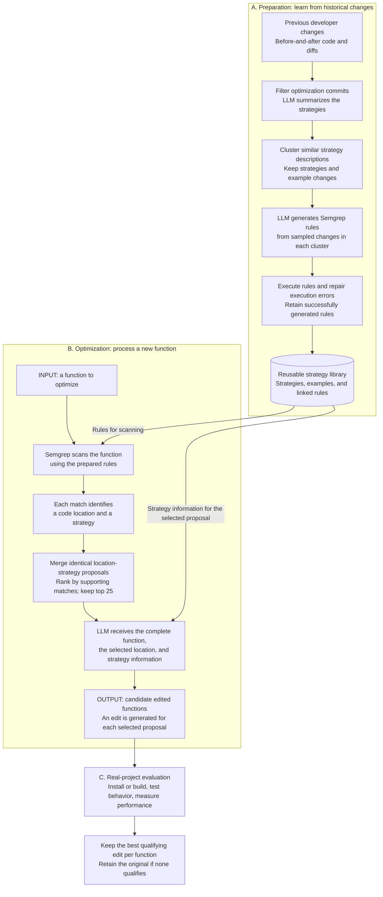
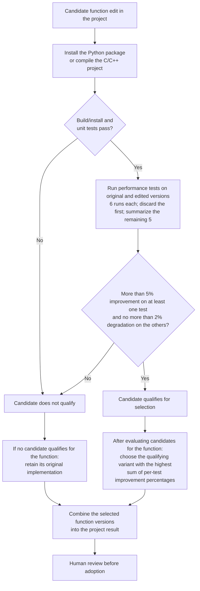

# SemOpt: how history, rules, the LLM, and validation fit together

**Reading guide:** preparation builds a reusable library; optimization uses that library to suggest edits; the real-project experiment checks which edits to retain. The diagrams reconstruct the paper's method rather than reproduce its original figure. Page numbers refer to the 47-page author PDF. [1]

## The whole method

**Sources:** library construction, Section 3.1, pp. 9–11; rule generation, Section 3.2, pp. 11–13; scanning, ranking, and editing, Section 3.3, p. 13; real-project evaluation, Sections 5.1–5.2, pp. 31–33. [1]

## Where each part enters

| Your question | Where it happens | What it actually does |
|---|---|---|
| Where do previous successful changes enter? | Preparation | Historical optimization commits supply before-and-after examples. Their summaries become strategy clusters; sampled examples guide rule generation. Historical success does not guarantee success in a new context. |
| Where does the rule-based part enter? | Before the LLM edits the new function | Semgrep matches source-code patterns and associates locations with strategies. Its rules locate potential opportunities; the LLM performs the concrete rewrite. |
| What does the LLM do? | Several stages | It helps filter/summarize historical changes, generates and repairs rules, and later writes candidate optimized functions. |
| Why rank matches? | Between scanning and rewriting | Several rules can support the same location-strategy proposal. SemOpt prioritizes proposals with more supporting matches, retaining up to 25 per function. This count is a ranking signal, not a calibrated safety probability. |
| Where do we find out whether an edit works? | Real-project evaluation | Install/build and unit tests check observed behavior; repeated performance tests measure benefit on the tested workloads. Human review remains necessary before adoption. |

The Python library contains **55 strategy clusters and 2,097 generated rules**. Multiple rules can represent different code patterns for the same strategy. These are library sizes, not numbers of proven-safe optimizations. [1, p. 13, Table 2]

## How the real-project experiment decides what to keep

This is the paper's **real-project experiment**, not the scoring procedure for every historical benchmark task. In that experiment, profiling first selects functions taking more than 0.1% of the measured runtime. The core optimizer can also accept a user-selected function. [1, pp. 32–33]

For runtime measurements, the paper defines improvement as `(original time - edited time) / edited time`. For throughput, it uses `(edited throughput - original throughput) / original throughput`. Interpret the thresholds using the paper's metric; a percentage speed improvement and a percentage reduction in elapsed time have different denominators. [1, p. 32]

## A concrete way to follow the arrows

**Illustration, not a reproduced SemOpt experiment:** imagine an old developer change moved a cheap condition before an expensive condition in an AND expression.

1. **History:** the old change provides an example of reducing unnecessary condition evaluation.
2. **Strategy:** that idea is grouped with similar optimization descriptions.
3. **Rule:** a generated pattern looks for potentially relevant condition structures in other code.
4. **New input:** a rule matches a location in your function and links it to this strategy.
5. **LLM edit:** the model uses the complete function and the hint to propose a suitable rewrite.
6. **Validation:** tests check observed behavior; measurements determine whether this workload actually benefits.

Reordering is safe only when it preserves the required behavior, including side effects and exceptions. A cheap condition also needs to avoid enough expensive work for the change to help. A rule match alone establishes neither property. This illustration is based on the motivating example in Section 2. [1, pp. 5–9]

## Three distinctions to remember

- **Rules find opportunities; they do not certify improvements.** Successfully executing a generated rule checks that it runs, not that every match is semantically valid. The rule generator has an execution-error repair loop. [1, pp. 11–13]
- **Generation and evaluation answer different questions.** The historical benchmark scores recovery of reference developer edits using exact matching and manual semantic-equivalence assessment. The separate project experiment measures runtime/throughput. [1, pp. 16–18, 31–33]
- **There is no automatic learning-back arrow in this reconstruction.** The described core workflow does not automatically turn every newly accepted edit into a new strategy or repeatedly optimize the accepted version until convergence. Preparing rules, generating candidates, and choosing project edits are distinct stages. [1, Sections 3 and 5]

For our proposed PhD study, the place to investigate is **after an acceptance decision**: independently check whether the accepted edit preserves behavior and retains its claimed benefit on fresh valid workloads. That audit is a proposed extension, so it is not drawn as an existing SemOpt component.

## Source

[1] Yuwei Zhao, Yuan-An Xiao, Qianyu Xiao, Zhao Zhang, and Yingfei Xiong. *SemOpt: LLM-Driven Code Optimization via Rule-Based Analysis*. ACM Transactions on Software Engineering and Methodology, 2026. [Published article](https://doi.org/10.1145/3820167) · [Author PDF](https://xiongyingfei.github.io/papers/TOSEM26.pdf) · [Local source PDF](papers/2026-SemOpt-TOSEM-author-version.pdf).

The Mermaid blocks are editable text and render in Markdown viewers with Mermaid support, including GitHub and Obsidian.
