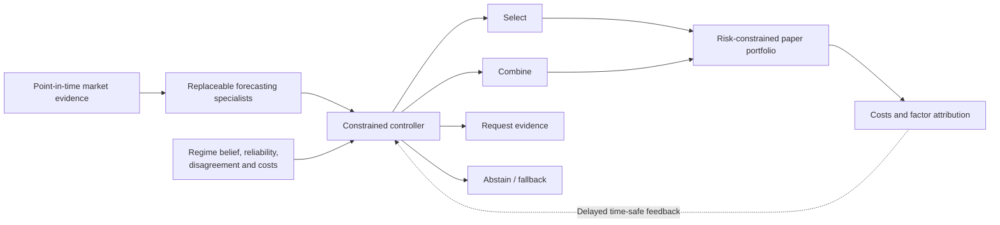

# Advisor Briefing

## Proposed direction

**Attribution-Constrained Online Selective Routing under Latent Regime Shift and Delayed Feedback**

## Plain-language question

Can a small, cautious controller determine which stock-forecasting specialist is currently trustworthy—or decide that none should be used—without benefiting from future information, market luck, or unfair comparison with simpler methods?

## Why the original idea was narrowed

Uncertainty-aware expert routing, regime-gated mixture-of-experts, financial specialist agents, evidence acquisition, and abstention already appear in close prior work. The project therefore cannot claim novelty from combining those components.

The candidate contribution is a more precise deployment problem involving uncertain regimes, delayed labels, selective-risk constraints, implementation costs, factor-attribution constraints, and direct causal tests of whether a stateful controller adds value over equal-information non-agent gates.

## Proposed system

## Decisive academic test

The controller must beat—or explain when it cannot beat—a deterministic gate, supervised gate, conventional mixture-of-experts, AlphaMix-style router, and contextual bandit that receive the same information, action space, tuning budget, and compute.

## Recommended first scope

- one point-in-time, survivorship-aware stock universe;
- five-trading-day residual-return ranking;
- structured price, volume, factor, and fundamental data first;
- three or four heterogeneous specialists;
- daily or weekly paper decisions;
- nested walk-forward testing with purge, embargo, frozen folds, and a later prospective shadow period.

## What must remain true

Any positive result must survive:

- matched-coverage volatility and random-abstention controls;
- spread, slippage, turnover, and liquidity assumptions;
- market, sector, and style attribution;
- masking of ticker, company, date, and recognisable events for LLM components;
- repeated-testing and backtest-overfitting safeguards; and
- an external period, universe, or market.

## Current unresolved items

- systematic novelty-search counts and exclusions are incomplete;
- the data source and exact universe have not been selected;
- the mathematical feasibility of a time-uniform selective-risk or regret result is unknown;
- finance-specific multiplicity and backtest-overfitting procedures need final selection; and
- six critical risks remain open in the generated audit report.

## Full package

- [Layman explanation](01-layman-explanation.md)
- [Research proposal](02-research-proposal.md)
- [Literature and novelty map](03-literature-novelty-map.md)
- [Architecture and methodology](04-architecture-methodology.md)
- [Advisor questions](05-advisor-questions.md)
- [Evaluation protocol](06-evaluation-protocol.md)
- [Three-year plan](07-three-year-plan.md)
- [Generated audit report](audit/generated-audit-report.md)

