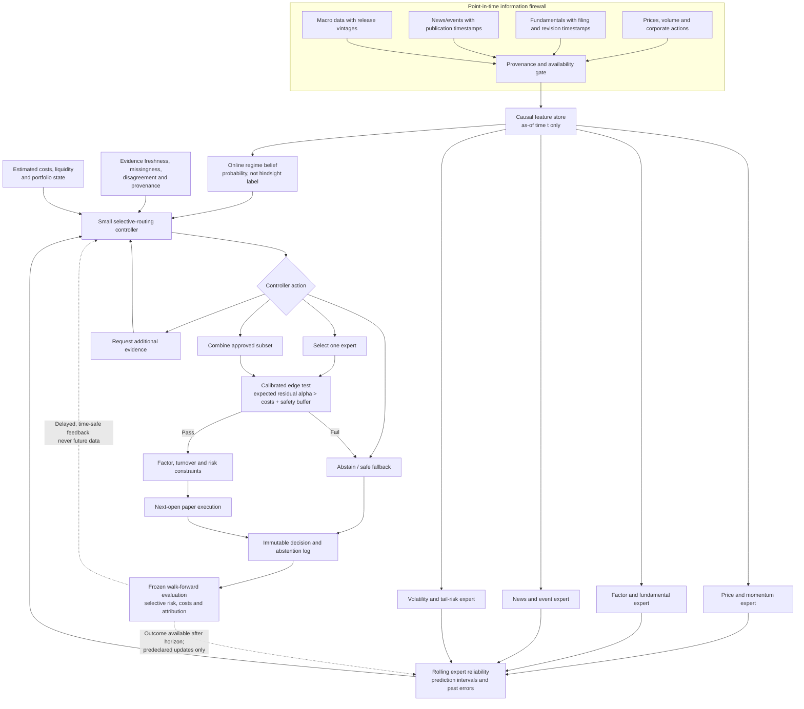
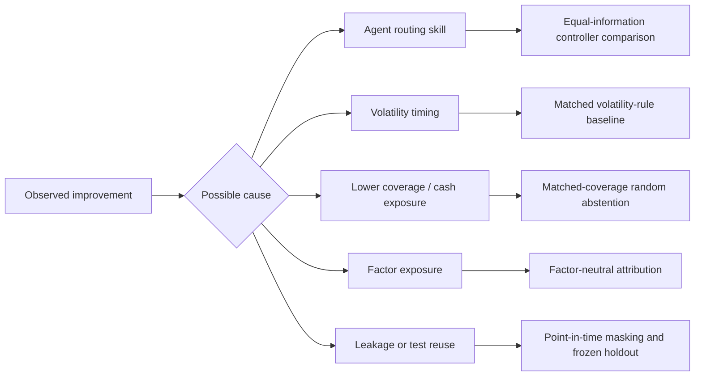

# Architecture and Methodology

## System architecture

The source for this diagram is also stored at [`figures/system-architecture.mmd`](figures/system-architecture.mmd).

## Research logic

## Specialist design

Specialists must be replaceable and demonstrably heterogeneous. Candidate initial specialists are:

- price/momentum: linear, tree, or temporal model using lagged price-volume features;
- factor/fundamental: point-in-time accounting and style features;
- event/news: added only after the structured-data benchmark is correct;
- volatility/risk: conditional volatility and tail-risk estimation.

Expert diversity must be measured using residual-error correlation, failure-period overlap, and conditional performance. Different model names are not sufficient evidence of diversity.

## Controller families to compare

- deterministic hand-written gate;
- supervised logistic/tree gate;
- conventional soft mixture-of-experts;
- AlphaMix-style uncertainty-aware router;
- contextual bandit with delayed feedback;
- constrained stateful agent; and
- hindsight oracle reported only as an unattainable upper bound.

## Dual-timescale validity

The proposed controller separates:

1. **Instance-level validity:** Is this stock forecast sufficiently supported now?
2. **Strategy-level health:** Has the overall forecasting relationship recently degraded after delayed outcomes became observable?

This distinction is intended to prevent per-stock confidence from being treated as proof that the entire ranking strategy remains valid after a silent concept shift.

## Reproducibility requirements

Each decision log must contain:

- event time and data-availability time;
- data snapshot/version and feature code version;
- universe membership as known at that time;
- specialist versions and predictions;
- calibrated uncertainty and reliability inputs;
- regime posterior;
- controller version, state, action, and reason codes;
- model/provider/version, prompt, temperature, and seed for any LLM component;
- estimated costs and portfolio constraints;
- eventual outcome timestamp; and
- whether and when that outcome was permitted to update the system.

